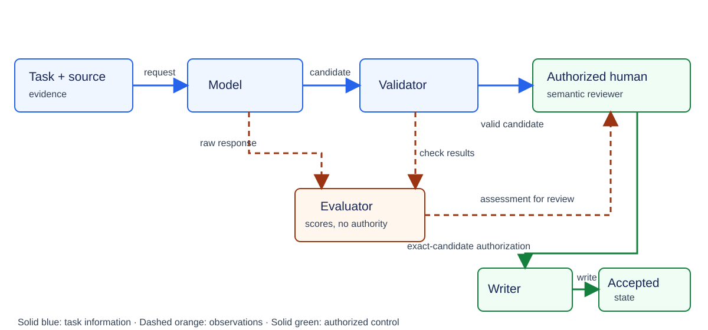
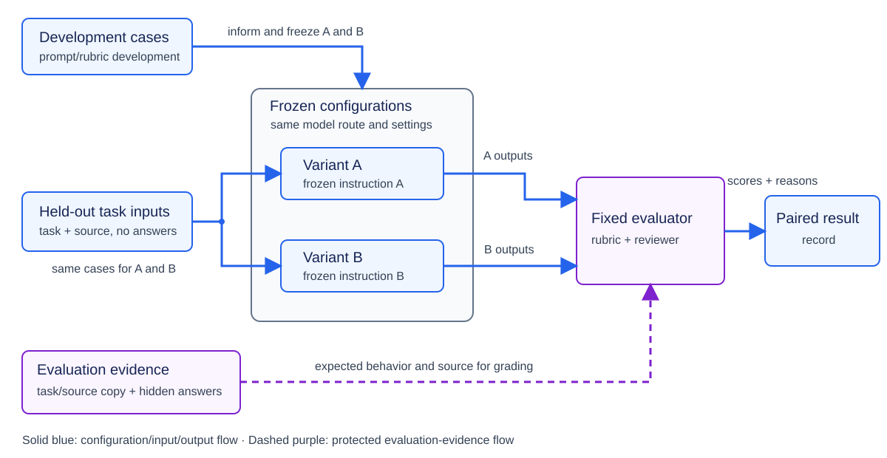
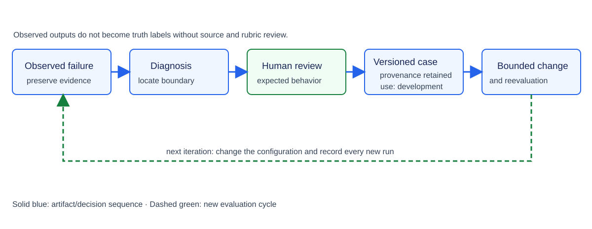

# Module 03: Evaluation and Experiment Design — Theory

> **Status:** Ready for Students — English theory and Ukrainian translation approved by the instructor on 2026-10-04

## Engineering problem: a good-looking response is not evidence of improvement

An AI system *(here: the learning knowledge system)* receives the following source statement:

> *“A source baseline identifies the material against which a proposal is reviewed.”*

The system produces two candidate outputs *(here: two candidate concept definitions)*:

- **Definition A** accurately restates the source: *a source baseline identifies the material a proposal is reviewed against.*
- **Definition B** restates the source correctly, then appends a claim not present in the source: *a source baseline automatically approves all later changes* *(fabricated addition — the reader is not expected to find meaning in this claim; the point is that it does not appear in the source and should not have been generated).*

Both candidate definitions are grammatically correct. Definition A is source-supported and meaning-complete for the requested definition. Definition B is not source-supported because of the fabricated approval claim.

An engineer adjusts the system instruction to suppress the fabricated addition. The adjustment works on this one input. But this does not mean the system improved. The adjusted instruction would govern every input processed by that configuration within the intended operating domain, whereas the engineer has observed only one case. The following are possible adverse effects of the adjusted instruction on other inputs in that domain:

- drop essential meaning from definitions generated on other inputs,
- increase the knowledge owner’s review effort, or
- produce an inaccurate output on a different source statement.

**A fix that works on one case is not evidence of a general improvement.**

---

Module 02 showed that a second request for a definition can return a different answer and that even a controlled model request may not be fully reproducible. Comparing two candidate definitions can reveal variability on that input. It cannot answer the larger question: *is the system reliable and useful across the intended operating domain?*

This module moves from inspecting individual outputs to gathering systematic evidence across many inputs, configurations, and repeated runs [1, Chapters 3–4].

Module 01 established the system boundary, usefulness question, human-authority boundary, and preserved evidence needed to judge an AI application. Module 02 then made model variability, structured candidates, deterministic validation, semantic acceptance, and repeated run evidence concrete. Module 03 uses both prerequisites: it evaluates usefulness across cases while preserving the evidence and authority boundaries already established.

The system capability evaluated in this module is the **model-backed concept-proposal operation** introduced in Module 02. Its model produces candidate text, but the complete operation also includes context construction, model access, and structured-output processing. The text therefore names the concept-proposal operation when discussing its inputs, behavior, or defects, and names the generating model only when model identity itself matters.

An **experiment baseline** is the complete comparison alternative selected for evaluating a proposed change, not an initial score or metric value. For a model-backed operation, its recorded configuration identifies:

- the task instruction or prompt;
- context construction;
- the model and access route;
- generation settings;
- the output contract; and
- parsing and validation behavior.

If the comparison concerns an end-to-end workflow, the baseline also identifies the human steps and resources required to complete the task. The evaluation cases, rubric, acceptance conditions, and repeat policy belong to the shared experiment protocol applied to the baseline and candidate; they are not components of the baseline itself. The experiment baseline must be a plausible way to perform the same task, produce outputs that can be assessed by the same relevant criteria, and account for effort and cost on a comparable basis. An existing configuration, a simple non-AI method, or a human-only workflow can serve as the experiment baseline; a deliberately weak alternative cannot. The experiment baseline is distinct from the **source baseline** in the opening example, which identifies the material against which a proposal is reviewed.

A **candidate configuration** is the complete alternative proposed for adoption instead of the experiment baseline. Both alternatives are configurations; **baseline** and **candidate** name their different roles in one comparison, not two synonyms for configuration. The baseline is the current comparison reference, whereas the candidate is the proposed replacement. The expression *candidate baseline* is therefore not used for the candidate in the current comparison. If the candidate is adopted, its configuration may serve as the experiment baseline in a later comparison, but its role has then changed. The candidate configuration is described through the same kinds of configuration elements as the baseline. The comparison must explicitly identify which element or bounded set of elements differs; all other relevant elements are held fixed or recorded as uncontrolled differences. In this module's instruction comparison, Variant A is the experiment baseline and Variant B is the candidate configuration. Variant B changes the instruction while the context construction, model route, output contract, parser, and validator remain fixed. A candidate configuration is therefore different from a **candidate output**: the configuration is a version of the operation being evaluated, whereas a candidate output is one response produced by that operation on one attempt.

---

**The central question of this module is:**

> What evidence justifies concluding that an AI system is useful enough for its intended task — and that a proposed change improves task performance relative to a named experiment baseline under the relevant quality, cost, and risk constraints?

To answer this question, three decisions must be kept clearly separate:

1. **Scoring a response**: an evaluator — a human evaluator, a deterministic check, or an AI judge — applies a defined measurement procedure or a rubric, meaning written scoring instructions with anchored categories, to determine whether a specific output meets the required criteria.
2. **Choosing a configuration**: an engineering team uses evaluation results across many cases to decide which version of the system to keep.
3. **Authorizing a knowledge entry**: an authorized human reviewer decides whether one specific candidate definition may be added to the accepted knowledge state *(the accepted knowledge base in this example)*.

A response score does not choose a configuration or authorize a knowledge entry. A configuration decision does not determine an individual response's score or authorize an individual entry. Authorization of one knowledge entry does not validate its evaluation score or choose the system configuration. A configuration that performs well on average therefore does not override the authorized human reviewer’s decision on an individual entry.

The running example also uses the role **knowledge owner** for the person who needs the proposed definition and experiences the review effort. One person may act as both knowledge owner and authorized human reviewer, but the roles remain distinct: using the definition does not by itself grant write authority, and write authority does not make an evaluation score correct.

## Learning outcomes

The following outcomes identify reasoning that can be demonstrated on a new task. By the end of the module, a student should be able to:

1. **LO1 — Define the evaluation target:** derive the properties that matter (**criteria**), the defined observations or counts (**metrics**), category examples that anchor the rubric, decision rules (**acceptance conditions**), and the boundary of the system being observed from the system objective and failure consequences.
2. **LO2 — Choose an evaluation method:** state which property is assessed, which comparison material serves as the **reference**, who or what acts as the evaluator, and whether one output or a pair of alternatives is judged. Apply these independent choices without treating similarity, preference, source support, and correctness as interchangeable properties.
3. **LO3 — Construct an evaluation set:** build a versioned collection of cases and record where each case came from; cover typical and difficult cases; separate development cases inspected while changing the system from held-out cases reserved while the comparison protocol is fixed; prevent reserved evaluation information from entering development; and use **slices** that group a shared risk and **controlled perturbations** that change one input feature with an expected relationship to the result.
4. **LO4 — Design a controlled comparison:** specify a decision-relevant experiment baseline, hypothesis, controlled conditions, repeats, and a record of all attempts.
5. **LO5 — Check human-evaluator and AI-judge quality:** apply an anchored rubric, adjudicate disagreement between a human evaluator and an AI judge, and identify systematic preference (**bias**) or changes in behavior across runs or versions (**drift**) for either assessment actor.
6. **LO6 — Interpret evidence:** calculate rates from explicit event counts and eligible-observation totals, examine uncertainty and critical failures, and justify a bounded configuration decision.
7. **LO7 — Maintain evaluation:** verify feedback against the source evidence, convert confirmed failures into versioned **regression cases** that preserve known failures for later checks, and keep unverified feedback as a signal rather than a truth label.

No prior statistics course is assumed: ratios, means, medians, and uncertainty are explained where used. The explanations and examples needed for the module and its laboratory are contained here; references below offer optional additional depth.

## 1. Evaluation objectives, boundaries, and acceptance

This section establishes what the evaluation must help the engineering team decide before the team chooses **metrics**, meaning defined measurements or counts, or runs an experiment. Examples include deciding whether a candidate configuration satisfies the conditions for its intended use, whether the configuration should undergo further testing, or whether the configuration should be rejected. These are human engineering decisions. They are not decisions made by the model, and they do not authorize an individual candidate definition for the accepted knowledge state.

The section therefore explains how to derive observable quality criteria, metrics, rubric anchors, acceptance conditions, and an evaluation boundary from the intended task and the consequences of failure. The section consists of two subsections:

- **1.1** derives the observable quality criteria, their measurements, judging instructions, and acceptance conditions from the task purpose and failure consequences.
- **1.2** defines the response-level, component-level, and end-to-end boundaries at which a result can be observed.

The goal is to learn how to connect each collected result to an explicitly named engineering decision and to avoid claiming more than the result supports.

An evaluation is a procedure for collecting that decision-relevant evidence. A single aggregate score or leaderboard position is insufficient because it can hide:

- which quality criteria were measured;
- which cases and attempts were included in the calculation;
- whether a critical failure occurred;
- which system boundary was observed.

Different claims also require different evidence:

- A **deterministic re-check** can inspect the same preserved response again and return the same result under the same check version.
- An **estimated failure rate** of the variable model-backed concept-proposal operation depends on the observed inputs, runs, evaluator, and period [1, Chapters 3–4].

### 1.1 From purpose to observable quality

In the running example, the learning knowledge system proposes a source-grounded concept definition for a knowledge owner to review. The usefulness of that operation depends on more than fluent language. Three defects have different consequences:

- An **unsupported assertion** can contaminate an accepted knowledge entry.
- A **malformed response** can stop the workflow.
- A **needlessly long response** may impose review cost.

These consequences determine the criteria and the acceptable trade-offs.

Table 1.1 defines the terms used to design an evaluation and gives one example of each term in the learning knowledge system. It distinguishes a quality criterion from its measurement, judging instructions, case material, and a decision rule before those terms are used together.

**Table 1.1 - Evaluation terms and examples for the learning knowledge system**

| Term                 | Meaning in this module                                                                                                                                                                       | Example                                                                                                                                                                 |
| ---------------------- | ---------------------------------------------------------------------------------------------------------------------------------------------------------------------------------------------- | ------------------------------------------------------------------------------------------------------------------------------------------------------------------------- |
| Criterion            | A property important to the decision                                                                                                                                                         | Claims must be supported by the supplied source.                                                                                                                        |
| Metric               | A defined measurement or count of that property                                                                                                                                              | Number of assessable responses containing an unsupported claim, reported together with the total number of assessable responses and the separate count of all attempts. |
| Rubric               | Instructions and anchored categories for applying a judgment consistently                                                                                                                    | “Acceptable”: all material claims supported, essential meaning retained.                                                                                              |
| Reference            | Comparison material fixed before outputs are judged: the engineering team specifies required contract values; a designated human evaluator approves expected meaning statements where needed | A required`case_id` for an exact check or an expected meaning statement for a semantic judgment.                                                                        |
| Evaluation case      | A versioned record with a stable identifier containing the supplied source and task that form the operation input; evaluator-only expected behavior or judging basis; intended risk group; development or held-out membership; and provenance.                | A short source fragment and concept request, together with the evaluator-only expected behavior and the record's risk, membership, and provenance fields.             |
| Run                  | One attempted execution of one configuration on one case                                                                                                                                     | A request with an identifier and either a raw response or failure.                                                                                                      |
| Provenance           | The recorded origin and handling history of an evaluation artifact                                                                                                                           | Whether a case was course-authored, collected from reviewed use, or derived from an earlier failure.                                                                    |
| Evaluation set       | A versioned collection of cases and their provenance                                                                                                                                         | Representative and challenge cases with declared development or held-out membership.                                                                                    |
| Acceptance condition | A decision rule tied to the intended use and consequences                                                                                                                                    | No observed critical unsupported claims on designated challenge cases, plus acceptable review effort; this is a local policy, not a universal guarantee.                |

A metric may summarize quality while an acceptance condition decides whether the observed behavior is useful enough. A high mean score cannot compensate for a critical failure if the decision rule forbids that trade-off. Conversely, an empirically perfect score on a few selected cases does not establish a zero failure probability.

The evaluation and authorization path uses three distinct roles:

- The **human evaluator** assesses generated responses against the source and, where used, the approved reference and rubric.
- A **calibrated AI judge** is an AI evaluator whose judgments have been checked against source-checked human judgments on reviewed cases; Section 3 explains that check. Its assessment may assist the human evaluator but does not decide whether a proposed definition enters accepted knowledge.
- The **authorized human reviewer** checks the exact candidate and its evidence before deciding whether to authorize a write.

One person may perform both human roles, but the evaluation score remains evidence for, not a substitute for, the authorization decision.

Table 1.2 maps each quality criterion for the concept-proposal operation to its evaluator and evidence, unit of observation, failure consequence, and use in a configuration decision. Read across one row to see what that criterion measures; rows are complementary, not interchangeable.

The table uses four observation units:

- An **attempt** is one generation attempt.
- An **assessable response** is one response whose meaning can be judged.
- An **ambiguous or insufficient-evidence case** is one test case built around unclear or missing evidence.
- An **end-to-end operation** is one fully completed user task, including generation, review, any required correction, and authorization.

**Table 1.2 - Criteria, evidence boundaries, and decision uses for concept proposals**

| Criterion               | Evidence and evaluator                                                          | What is assessed or counted?         | Failure consequence                                          | Decision use                                                                                                                                                               |
| ------------------------- | --------------------------------------------------------------------------------- | -------------------------------------- | -------------------------------------------------------------- | ---------------------------------------------------------------------------------------------------------------------------------------------------------------------------- |
| Structural validity     | Parser and deterministic field/invariant checks                                 | Attempt                              | Workflow cannot safely process candidate                     | Report first-attempt failures separately; do not count structurally unusable attempts as semantic successes                                                                |
| Source support          | Human evaluator uses supplied source and rubric; calibrated AI judge may assist | Assessable response                  | Unsupported knowledge may be accepted                        | If the declared policy treats unsupported claims as critical, reject the candidate configuration on the designated cases rather than offsetting failures with other scores |
| Meaning coverage        | Human evaluator compares required meaning and justified uncertainty             | Assessable response                  | Incomplete or misleading note                                | Compare useful outputs                                                                                                                                                     |
| Appropriate uncertainty | Human evaluator checks whether evidence permits a confident claim               | Ambiguous/insufficient-evidence case | Fabricated certainty or unnecessary refusal                  | Inspect dedicated slice                                                                                                                                                    |
| Latency and resources   | Operation log with defined timing and usage boundaries                          | Attempt                              | Delay, quota consumption, reviewer workload                  | Compare feasible configurations                                                                                                                                            |
| Completed user task     | Knowledge owner observes proposal, correction, and authorization workflow       | End-to-end operation                 | Review effort or unsafe outcome despite good component score | Decide application usefulness                                                                                                                                              |

Source support is relative to the evidence provided. It does **not** prove that the source itself is true.

The criteria have different measurement properties:

- **Structural validity** is a deterministic invariant.
- **Meaning coverage** and **appropriate uncertainty** admit graded judgment.
- **Source support** may be a non-negotiable constraint for a particular use.

The engineering team declares which failures block configuration use before interpreting final scores [1, Chapter 4, “Evaluation Criteria” and “Create an Evaluation Guideline”].

### 1.2 Response, component, and end-to-end boundaries

The model response, validator, AI judge, human review, and authorized write operation participate in evaluation at different observation boundaries. This module distinguishes three boundaries:

1. A **response-level** result asks whether one attempted generation is structurally valid and meets the declared semantic criteria for a usable output.
2. A **component-level** test asks whether, for example, the validator rejects a missing field or an AI judge identifies an unsupported statement.
3. An **end-to-end** assessment asks whether the knowledge owner completes the intended task safely and with reasonable effort.

The same component may contribute evidence at more than one boundary, but the boundaries answer different questions [1, Chapter 4, “Evaluate All Components in a System”]. Figure 1.1 shows the information, evaluation, and authorization paths in one illustrative operation so that a human evaluator's assessment cannot be mistaken for write permission.

**Figure 1.1 - Evaluation observations and authorization paths.** Illustrative, not exhaustive, operation. Solid blue arrows carry task information. Dashed orange arrows carry the raw response and deterministic check results to the human evaluator, then carry the human evaluator's advisory assessment to the authorized human reviewer. The authorized human reviewer checks the exact candidate against its source before deciding whether to authorize a write. Solid green arrows carry that exact-candidate authorization to the writer and the resulting write to accepted state. Evaluation never supplies that authorization.

Consider **constructed teaching data** for five user tasks with two generation attempts per task. Every task supplies enough source evidence for a complete definition; none asks for a fact absent from its source. For this example, the declared semantic criteria require every material claim to be source-supported, the essential requested meaning to be retained, and uncertainty to be expressed only when the evidence calls for it. A **usable model proposal** must pass both the structural checks and all of these semantic criteria. The uncertainty-specific criterion remains part of the rubric, but these five sufficient-evidence tasks do not measure performance on insufficient-evidence cases.

Every attempt returns a response. Of the ten responses, two are malformed; among the eight structurally valid responses, two contain unsupported claims and fail the semantic criteria, while the other six meet all the declared semantic criteria. Thus six attempts yield usable model proposals. Four tasks have at least one such proposal. For the fifth task, the knowledge owner must write a corrected proposal from the source. The constructed record stipulates that the authorized human reviewer checks every task and authorizes only a supported model proposal or the corrected human-written proposal. Under that stipulation, all five tasks finish without an unsupported entry being written to accepted knowledge.

Table 1.3 compares the constructed workflow's rates at the attempt, response, and task boundaries so that completed tasks are not mistaken for successful model attempts. Each row names its measured event, eligible observations, and interpretation. In each fraction, the number before the slash counts the event of interest; the number after the slash counts all eligible observations and is the **denominator**.

**Table 1.3 - Constructed response and task outcomes at distinct observation boundaries**

| Measurement                                  | Numerator / denominator | Observation unit and interpretation                                               |
| ---------------------------------------------- | ------------------------- | ----------------------------------------------------------------------------------- |
| Structural pass rate                         | 8 / 10                  | Attempted generations; parsing and invariant checks only                          |
| Semantic acceptability among valid responses | 6 / 8                   | Structurally valid responses; excludes the two malformed outputs explicitly       |
| Usable-output yield                          | 6 / 10                  | All generation attempts; malformed and unsupported outputs remain failures        |
| Tasks with a usable model proposal           | 4 / 5                   | User tasks, not individual responses                                              |
| Completed tasks after human intervention     | 5 / 5                   | End-to-end tasks, including one human-written correction and review of every task |

Suppose the constructed review record also totals 25 minutes, including that correction. Mean human review effort is 25 minutes divided by five tasks, or five minutes per task. A human-only experiment baseline would be needed to determine whether the model reduced the time required to complete the same tasks.

**The conclusion is that a result is meaningful only together with its observation boundary.** In this constructed record, `5 / 5` completed tasks supports only the claim that the complete workflow — including human correction, review, and authorization — completed those five tasks without writing an unsupported entry to accepted knowledge. The `5 / 5` result does not establish that the model-backed concept-proposal operation produced a usable output on every attempt: only `6 / 10` attempts yielded usable output, and only four of five tasks received a usable model proposal. The result also does not establish reduced work because no human-only experiment baseline was measured.

An engineering decision must therefore use evidence from the boundary relevant to its question:

- **Response level:** evidence about the quality of generated outputs.
- **Component level:** evidence about the behavior of a validator or evaluator.
- **End-to-end level:** evidence about task completion, human review effort, and the accepted-state outcome of the complete workflow.

Evidence from one boundary cannot substitute for evidence from another.

> **Further reading:** [1], Chapter 3, “Challenges of Evaluating Foundation Models,” working-copy PDF pp. 234–239, expands the difficulty of open-ended judgments; Chapter 4, “Evaluation Criteria” and “Design Your Evaluation Pipeline,” pp. 316–319 and 393–400, adds examples of task- and component-level evaluation. Working-copy pages are edition-specific.

## 2. Choosing and combining evaluation methods

Section 1 established that evaluation must support a named engineering decision at a named observation boundary. The next problem is to choose how the required evidence will be produced. The purpose of this section is to select and combine evaluation methods so that each result answers the intended question rather than merely producing a convenient score.

Terms such as *exact*, *reference-based*, *human*, and *pairwise* do not name mutually exclusive alternatives. They describe different parts of an evaluation method. For example, selecting a human evaluator does not yet specify which property that person will assess, whether reference material will be available, or whether the person will judge one output or compare two outputs. Treating these labels as competing alternatives can therefore produce evidence that does not support the intended decision.

To prevent that mismatch, this section describes an evaluation method along four independent axes:

1. **Property:** what quality or behavior is assessed?
2. **Reference:** is reviewed reference material supplied?
3. **Evaluator:** who or what applies the measurement or judgment?
4. **Comparison form:** does the result assess one output or compare alternatives?

A human can make a reference-based pairwise judgment; an AI judge can make a reference-free absolute judgment. The resulting evidence has different limitations [1, Chapter 3]. Sections 2.1–2.4 apply the four axes to this module's methods:

- **2.1** examines exact and functional checks for properties with an explicitly defined expected value or inspectable behavior.
- **2.2** separates similarity comparison from source-support judgment as two distinct uses of the reference axis.
- **2.3** specifies human judgment through an anchored rubric with categories, assignment rules, and boundary examples.
- **2.4** distinguishes absolute assessment of one output from pairwise preference between two outputs.

After studying the section, the reader should be able to specify what each method establishes, identify what it does not establish, and combine complementary methods without treating their results as interchangeable.

### 2.1 Exact and functional checks

The engineering team first names the property to assess, then asks whether that property has an explicitly defined expected value or inspectable behavior. If so, the team can specify an exact or functional check on the four axes introduced above; these labels do not replace the axes. Such checks do not evaluate the AI system as a whole, and they do not determine whether an open-ended explanation is true or complete.

An **exact check** compares one observed value with the value required by a contract or case record. The object being compared must be named. Examples include:

- An **identifier** is a value that links a response to a particular request or case. If the input record has the identifier `case-002`, the response field `case_id` must contain exactly `case-002`; `case-003` would identify a different record. These values are example record identifiers, not section numbers.
- A **fixed label** classifies a value using a declared finite vocabulary. If a record's `language` field permits only `en`, `uk`, or `ru`, an exact check can verify that the field contains one permitted label. The check does not establish that the associated text is written or translated correctly.
- A **machine-readable status** is a contract field whose exact value controls software behavior, such as `completed` or `failed`. An exact check can verify the required spelling and permitted value. It does not establish that the underlying task was completed correctly.

Some contracts allow a declared **normalization** before comparison. Normalization removes only differences that the contract defines as irrelevant, such as permitted surrounding whitespace. It must not change meaningful content: trimming whitespace cannot justify replacing the required identifier `case-002` with `case-003`.

The deterministic checks answer two separate questions:

- **Parsing checks** ask whether the response has the declared syntax.
- **Schema and exact field checks** ask whether it has the required fields and values.

Together these implement the syntactic and deterministic-invariant gates introduced in Module 02, not its semantic-acceptance gate. None establishes that claims inside the fields are source-supported.

A **functional check** evaluates executable behavior rather than exact text. In a different task from the running concept-definition example, a test runner can execute generated code on specified inputs and compare its observed outputs with expected outputs. Passing supports the claim that the code behaved as expected on those tested inputs; it does not establish correctness for every possible input [1, Chapter 3, “Exact Evaluation” and “Functional Correctness”].

Table 2.1 maps the exact-field and generated-code checks to property, reference, evaluator, and comparison form. It shows why a check's name alone does not specify a complete evaluation method. Here, the reference axis contains the expected contract value or test outcome fixed by the engineering team, rather than a human-approved meaning statement. Deterministic software applies each check to one output; its result does not authorize any write to accepted knowledge.

**Table 2.1 - Four evaluation-method axes for exact and functional checks**

| Check                           | Property                                                             | Reference                                                      | Evaluator                                                          | Comparison form                                                                                |
| --------------------------------- | ---------------------------------------------------------------------- | ---------------------------------------------------------------- | -------------------------------------------------------------------- | ------------------------------------------------------------------------------------------------ |
| Exact`case_id` check            | Whether the response identifies the requested case                   | Required`case_id` fixed in the recorded task input or contract | Deterministic validator compares the field values                  | One response field against one required value                                                  |
| Functional generated-code check | Whether code produces the expected behavior on specified test inputs | Input–expected-output pairs defined for those tests           | Test runner executes the generated program and records its outputs | One generated program's observed outputs against the expected outputs for the specified inputs |

The same concept proposal still receives parsing, schema, and exact checks for its structured fields; assessing the meaning of its open-ended definition additionally requires source comparison and an anchored rubric. Two wordings can preserve the same meaning, so an exact-string comparison can reject a valid paraphrase. Conversely, the invalid claim “the source baseline automatically approves changes” can appear beside an exact copy of a correct phrase. An exact match of a fragment of text therefore does not establish source support or meaning completeness.

**The conclusion is that exact and functional checks are appropriate only for a named value or behavior with an inspectable expected result.** Their result is deterministic evidence about required fields or tested behavior. These checks complement rather than replace the source comparison in Section 2.2 and the anchored semantic rubric developed in Section 2.3.

### 2.2 Reference comparisons and their limits

This subsection separates two operations that use different comparison material:

- A **similarity comparison** measures how close a generated answer is to a pre-approved expected-meaning statement. That statement is a separate evaluation aid: the designated human evaluator approves it, and an evaluation procedure or human evaluator may use it after generation, but it is not included in the concept-proposal operation's input.
- A **source-support judgment** checks the answer's claims against the task's supplied source. The source is included in the operation's task input.

Both materials can therefore fill the **reference** axis of a method description, but for different operations. Similarity to the expected-meaning statement cannot substitute for checking the source, because the statement may omit a relevant qualification or contain a mistake.

**Lexical similarity** measures overlap in words and short word sequences; **semantic similarity** estimates closeness of meaning. This constructed example uses two distinct materials for comparison:

- **Supplied task source:** “A reviewer checks supporting evidence and then authorizes a proposed change.”
- **Evaluator-only expected-meaning reference:** “A reviewer authorizes a proposed change.” A designated human evaluator approved this shorter statement before seeing generated answers, but overlooked its omission of the evidence check.

Three constructed generated answers illustrate what each comparison can and cannot show:

- **Supported paraphrase:** “A reviewer examines the evidence before approving the change” preserves the source's required order.
- **Unsupported claim:** “A reviewer authorizes a proposed change without checking evidence” shares much of the reference's wording but contradicts the source's stated order.
- **Unsupported negation:** “A reviewer never authorizes a proposed change” also shares many words with the reference while contradicting the source.

In this example, the unsupported claim contains the entire short expected-meaning statement, whereas the supported paraphrase replaces much of its wording. A word-overlap comparison can therefore favor the unsupported answer; this is a comparison of the displayed strings, not a measured model score. The “never” answer also differs from the short statement by only one decisive word. A meaning-closeness procedure that fails to detect that negation could rate the “never” answer close to the statement; no such score has been computed here. A similarity measurement may help locate unusual wording for closer inspection, but neither kind of similarity establishes source support or decides whether a configuration is acceptable [1, Chapter 3, “Similarity Measurements Against Reference Data”].

The similarity comparison in this example has four axes:

1. **Property:** lexical overlap or estimated meaning closeness to the approved reference, not source support.
2. **Reference:** the evaluator-only expected-meaning statement; this is not the supplied task source.
3. **Evaluator:** a specified, versioned comparison procedure computes the chosen similarity measurement.
4. **Comparison form:** one generated answer is compared with the reference and receives a similarity measurement, not a write decision or a pairwise preference between two generated answers.

Source-support judgment for the same answer is a complementary operation, specified on the same four axes:

1. **Property:** whether each material claim is supported by the supplied task source; support relative to a source does not prove that the source itself is true. Meaning coverage is a related but distinct criterion in Table 1.2.
2. **Reference:** the supplied task source. It is the comparison material for this judgment, not the separate evaluator-only expected-meaning statement used for similarity. The rubric supplies judging instructions, not a substitute source.
3. **Evaluator:** a human evaluator inspects the generated answer and the supplied source and applies the judging instructions introduced in Table 1.1 and developed in Section 2.3.
4. **Comparison form:** one answer is judged against its task source; the result is a source-support judgment, not a similarity measurement, a pairwise preference, or a knowledge-write authorization.

For open-ended concept definitions, the human evaluator judges each **assessable response** against the supplied task source, whether or not the team also chooses to measure similarity. An output whose meaning cannot be assessed, such as a malformed response, remains an attempt counted as a structural failure rather than being assigned a source-support judgment; Section 1.2 keeps those observation units separate. In the constructed example, the short approved statement omits the evidence check that the source requires. Therefore, similarity to that statement cannot establish whether an assessable answer retains the evidence check: the evaluator must inspect the answer and the source directly. Earlier approval does not make the expected-meaning statement complete, and neither a similarity measurement nor a source-support judgment authorizes a knowledge write.

### 2.3 Human judgment and an anchored rubric

Human evaluators also need instructions, access to evidence, and a way to handle disagreement. An **evaluation rubric** is a written set of categories, rules for assigning those categories, and examples that show the boundaries between them. Before evaluation begins, the engineering team defines the categories, assignment rules, and examples. The human evaluator applies the rubric to a response and records one category; the evaluator classifies responses, not the categories themselves.

The human rubric judgment can be specified on the four axes introduced at the start of Section 2:

1. **Properties:** source support, meaning coverage, and appropriate uncertainty.
2. **Reference material:** the supplied task source and the case-specific expected behavior.
3. **Evaluator:** a human evaluator applies the rubric.
4. **Comparison form:** one response is judged at a time; the evaluator does not choose between two responses.

The rubric supplies instructions for these judgments; it is not a competing method or a source document. The human evaluator can inspect the task, supplied source, case-specific expected behavior, generated response, and rubric. The concept-proposal operation receives the task and source, not the evaluator-only expected behavior. This assessment concerns proposed text, not authorization to write it to accepted knowledge.

The running learning-knowledge-system example uses six categories, defined with examples in Table 2.2. They are a design choice for this example, not a universal taxonomy. Source support, meaning coverage, and appropriate uncertainty remain distinct criteria from Table 1.2 even when one category records the outcome for a response.

To make the category boundaries concrete before applying the rubric to the complete running example, the following two constructed task records specify different judging situations:

- **Source-baseline definition task.** The constructed task record contains the source sentence “A source baseline identifies the material against which a proposal is reviewed” and a request for the system to explain what a source baseline identifies. A complete response must preserve the relation between the source baseline and the material used to review a proposal.
- **Retention-duration task.** The constructed task record contains only the source sentence “Review records are stored in the knowledge system” and a request for the system to state how long those records are retained. The source does not specify a duration, so the expected response states that the duration is unspecified instead of inventing one.

Each task therefore has an explicit expected response: preserve the source-baseline relation in the first task, and state that the retention duration is unspecified in the second. These expected responses let the human evaluator inspect which rubric category applies instead of deciding intuitively whether a response is “complete.” Table 2.2 then pairs each rubric category with an actual example response and states what that category means for the proposal's evaluation; it does not record a write authorization.

**Table 2.2 - Anchored semantic-rubric categories for two constructed tasks**

| Category                                  | Anchor and actual example                                                                                                                                                                                                                                    | Decision for this proposal                                                    |
| ------------------------------------------- | -------------------------------------------------------------------------------------------------------------------------------------------------------------------------------------------------------------------------------------------------------------- | ------------------------------------------------------------------------------- |
| `S` — Supported and complete             | On the source-baseline definition task, “The baseline identifies the material used to review a proposal.” All material claims are supported and the required relation survives.                                                                            | Rubric-acceptable; authorized human review is still required before any write |
| `I` — Supported but incomplete           | On the source-baseline definition task, “The baseline identifies material.” This retains a supported fragment but omits what makes that material relevant: its role in proposal review.                                                                    | Needs revision; an omission is not an invented claim                          |
| `U` — Unsupported                        | On the source-baseline definition task, “The baseline identifies the material a proposal is reviewed against and automatically approves later changes.” The added approval claim has no source support even though the definition contains a correct part. | Critical source-support failure                                               |
| `Q` — Justified uncertainty              | On the retention-duration task, “The source does not specify a retention duration.” The response identifies the missing information rather than inventing a duration.                                                                                      | Rubric-acceptable where the expected behavior is bounded uncertainty          |
| `R` — Unnecessary refusal or uncertainty | On the source-baseline definition task, “I cannot provide a definition.” No unsupported factual claim is made, but the response withholds an answer the supplied evidence permits.                                                                         | Not rubric-acceptable; distinguish it from justified uncertainty              |
| `X` — Unassessable                       | No response, unreadable proposed text, or missing recorded source needed to judge it; a present source that does not state the requested fact is not missing evidence for`X`.                                                                                | Record the cause separately; never count it as acceptable                     |

The human evaluator checks the questions from top to bottom and stops when a rule assigns a category. This precedence matters when a response has several defects: for example, a response that is both incomplete and materially unsupported receives `U`, not `I`. The following four numbered checks form a decision procedure for assigning one category to a response, not four stages that modify the response.

1. **Can the response be assessed?** If the response or required evidence cannot be read, assign `X` and stop. A source that is present but genuinely insufficient does not make the response unassessable; continue to the next checks because the correct response may be `Q`.
2. **Does the response contain a material unsupported assertion?** If yes, assign `U` and stop, even if the response is also incomplete or contains a disclaimer.
3. **Does the response handle the available evidence appropriately?** If the task requires uncertainty or qualification and the response states it correctly, assign `Q` and stop. If the evidence supports an answer but the response refuses or expresses unjustified uncertainty, assign `R` and stop.
4. **Is the supported answer complete?** For the responses not classified above, assign `I` when required meaning is absent and `S` when it is complete. A vague “unknown” that fails to identify the requested uncertainty is therefore `I`, not `Q`.

The validator records structural outcome separately from semantic assessment. If the proposed-text field remains readable while another field is malformed, the human evaluator may record a semantic category for diagnosis, but the structurally invalid response remains unusable and cannot enter the semantic-acceptance numerator. If the response or required evidence cannot be read, the semantic category is `X`. The human evaluator records the category, cited evidence, reason, and any secondary defects. The category codes are not an ordinal scale: averaging numeric substitutions for `S`, `I`, `U`, `Q`, `R`, and `X` would have no justified interpretation.

The categories answer different questions about the response:

- **`S` versus `I`:** whether supported content retains the required meaning.
- **`U`:** whether the response adds a material claim unsupported by the supplied source.
- **`Q` versus `R`:** whether uncertainty or refusal is justified by the available evidence.
- **`X`:** whether the response and evidence permit semantic assessment at all.

A case is rubric-acceptable only when it receives the category declared by that case's expected behavior: normally `S` for sufficient-evidence cases and `Q` for cases that require justified uncertainty or qualification. No single category proves that every other criterion or the end-to-end task succeeded.

When two human evaluators disagree on one response, they each retain the proposed category and the exact source passage and response claim used as evidence. They then compare those records against the same task source and rubric. If the source resolves the claim, the evaluators record the agreed category and rationale. If a category boundary is ambiguous, the engineering team revises the rubric with a boundary example and has the affected responses rejudged; an unresolved case remains marked as disputed rather than silently receiving a majority label or entering a settled category count. This process resolves evaluation evidence only. The authorized human reviewer independently decides whether a specific candidate may be written to accepted knowledge.

### 2.4 Absolute assessment and pairwise preference

An **absolute assessment** applies a declared criterion to one output, such as assigning one rubric category using its task source and expected behavior. A **pairwise comparison** presents two outputs for the same task to an evaluator, who judges which better meets a named criterion. This subsection uses a human pairwise evaluator; Section 3 discusses what changes when an AI model is used as an evaluator.

The engineering team specifies the criterion and the material available to each evaluator before the comparison. Pairwise presentation order may influence the evaluator, so anonymous labels for the two outputs and reversed presentation order offer a bias check, not a correctness guarantee [1, Chapter 3, “Ranking Models with Comparative Evaluation”].

These judgments have separate outcomes. The engineering team assigns a human pairwise evaluator to the relative judgment and a different human rubric evaluator to the individual judgments in this example. After the eligibility check, the team presents anonymous A/B texts and the pairwise question to the first evaluator if the pair qualifies. It gives the second evaluator each response separately, the task source, case-specific expected behavior, and the rubric. The team records both human evaluators' outputs separately. The following three steps describe the chronological procedure for one pair: check whether both responses qualify, record a relative preference only for an eligible pair, and record an absolute rubric outcome for each response regardless of pairwise eligibility.

1. **Check eligibility before comparing.** The team checks that both responses and their required task evidence can be read and records any structural failure. A missing response, unreadable proposed text, or absent recorded source receives `X` for the affected answer under the absolute rubric. A readable answer with a different malformed field may receive a diagnostic semantic category, but it remains unusable. If either answer is unassessable or structurally unusable, record no pairwise result, skip step 2, and continue to step 3 to record both absolute outcomes.
2. **Record the relative result only for an eligible pair.** The human pairwise evaluator compares A and B on the declared criterion and records preference for A, preference for B, or a tie. This ranks them on that criterion; it does not establish whether either meets an acceptance standard.
3. **Record absolute results separately.** The human rubric evaluator applies the Section 2.3 rubric to every answer whose meaning can be judged against its source and expected behavior. The team retains `X` for any answer that cannot be judged and records the category of the other answer even when step 2 was skipped. For a readable but structurally invalid response, a category is diagnostic only; that response is not acceptable. The team records which answers are acceptable under their case's expected behavior. If neither is acceptable, it explicitly records “neither acceptable” whether or not a pairwise result exists. Apparent detail supplies no acceptance threshold.

For example, if A is unreadable and B is readable with its source present, A receives `X`, B receives its own rubric category, and the pair receives no relative preference. If the task's source is missing for both, both receive `X` and no relative preference is recorded.

Thus two unsupported responses may have a relative winner for detail while both remain `U` and unacceptable. Neither a relative winner nor two absolute labels authorizes a knowledge write.

For the source-baseline task from Section 2.3, two constructed proposals make the distinction visible. Both are stipulated to pass the same parser and required-field checks; their displayed text is the part evaluated for meaning. The following list presents the texts of Proposals A and B and identifies the claim that separates them:

- **Proposal A:** “The baseline identifies the material used to review a proposal and automatically approves later changes.” The added approval claim is absent from the supplied source.
- **Proposal B:** “The baseline identifies the material used to review a proposal.” The required relation is retained without the added claim.

An approved expected-meaning statement containing Proposal B's sentence would share many words with Proposal A; no similarity score is computed here. In this constructed record, the team confirms that A and B are eligible. The human pairwise evaluator sees only their texts and the question “Which sounds more detailed?” and records **preference for A** on apparent detail. The separate human rubric evaluator sees each response one at a time with the task source, case-specific expected behavior, and rubric; the human rubric evaluator assigns `U` to A and `S` to B. The team records both results: the pairwise preference is A, while B alone is rubric-acceptable. Apparent detail does not repair A's unsupported claim. The pairwise method alone has these four axes:

1. **Property:** apparent detail, not source support.
2. **Reference:** none supplied to the human pairwise evaluator; the preference is based on the two displayed texts, not a source or expected answer.
3. **Evaluator:** the human pairwise evaluator given only the two proposal texts and the detail question.
4. **Comparison form:** A versus B for the same task, with preference for A, preference for B, or a tie when both are eligible; otherwise no pairwise result is recorded.

Even a pairwise preference based on the source would remain a comparison of two answers, not authorization to write either answer to accepted knowledge.

**An evaluation method is suitable only when its four axes match the claim the engineering team needs to assess.** In this example, parsing establishes representation, similarity concerns shared wording, absolute rubric categories judge each answer's content against the source, and pairwise preference compares A with B on the declared criterion. These results answer different questions; one cannot rescue the unsupported claim by averaging them. The method-selection rule is to name the property, reference, evaluator, and comparison form, state what each result does not establish, and combine complementary evidence without treating it as interchangeable.

> **Further reading:** [1], Chapter 3, “Exact Evaluation,” “Functional Correctness,” and “Similarity Measurements Against Reference Data,” working-copy PDF pp. 252–266, develops task-dependent proxies; “Ranking Models with Comparative Evaluation,” pp. 295–311, gives additional comparative designs. Working-copy pages are edition-specific.

## 3. AI-as-a-judge is itself an evaluated component

Section 2 treated the evaluator as one axis of an evaluation method. Selecting an AI model for that role does not establish that the selected AI model's judgments are correct or suitable for the intended decision. The purpose of this section is to show how the AI judge itself must be specified, calibrated, and monitored before the AI judge's output can be used as evaluation evidence.

The section examines the AI judge in three steps:

- **3.1** identifies the AI-judge configuration and the evidence that must be preserved for each judgment.
- **3.2** calibrates AI-judge predictions against source-checked human judgments.
- **3.3** examines bias, variability, version changes, and safeguards.

After studying the section, the reader should be able to define a bounded role for an AI judge, evaluate that judge against reviewed cases, and distinguish judge evidence from configuration selection and authorization.

An **AI judge** is not a model name alone. Its configuration includes:

- a model and access route;
- an instruction and rubric;
- supplied context and examples;
- generation settings.

The AI judge's output is an observation to preserve and test. A fluent rationale may cite evidence that does not support the assigned category [1, Chapter 3, “AI as a Judge”].

### 3.1 Inputs, outputs, and configuration

For source-support judgment, the AI judge configuration must state its output contract. This subsection uses **binary source-support screening**: the AI judge flags a response as **unsupported** or **not unsupported**, identifies the claims responsible for the flag, and records a reason. It does not assign the six `S`, `I`, `U`, `Q`, `R`, and `X` categories from Table 2.2. A configuration that asks the AI judge to assign those rubric categories is a different output contract and must be evaluated as such; category anchors then define the category boundaries, while a binary screen uses the boundary between “contains a material unsupported claim” and “does not contain one.”

For the binary screen, the AI judge receives:

- the task;
- the source evidence;
- the candidate response;
- the binary rubric boundary between “contains a material unsupported claim” and “does not contain one”;
- the request to identify the claims responsible for its decision.

The configuration record makes four further distinctions:

1. **Binary input boundary:** the binary AI judge does not receive the six category anchors from Table 2.2 and is not asked to assign those categories.
2. **Alternative contract:** if a full-category AI judge is configured instead, that separate configuration receives the relevant category anchors and produces one of the six category outputs.
3. **Preserved record:** the evaluation record stores:
   - the full judge output as one preserved object;
   - the extracted flag, responsible claims, and reason;
   - the model and access route as exposed;
   - the instruction and rubric versions;
   - generation settings where known;
   - the time or version needed to identify the AI judge configuration.
4. **Reference separation:** when the binary result is **not unsupported**, the preserved `responsible_claims` field is an empty list because no unsupported claim is responsible for the result; claims considered during the review are not entered into that field. An evaluator-only expected answer is not an input to this source-support screen. It may be supplied only when a separately declared reference-based evaluation method requires it. In either case, the expected answer must never leak into the task input of the model that generates the candidate response. Few-shot examples included in the AI judge instruction are configuration examples; they are distinct from the separately reviewed calibration set and must not silently be reused as calibration evidence.

Sending source text to an external AI judge—that is, a judge model or service operated outside the system under evaluation—has privacy and resource implications. The engineering team must check whether such disclosure is permissible before using it.

The calibration set is labeled before the AI judge is compared:

- A source-checked human evaluator applies the Section 2.3 rubric.
- The binary reference label is **unsupported** for `U`.
- The label is **not unsupported** for assessable `S`, `I`, `Q`, or `R`.
- An `X` response or a structurally unusable attempt is ineligible for the four metric cells and is reported separately.

The four counts therefore use the same eligible, source-reviewed observations for the human reference and the AI prediction:

- A **true positive (TP)** is an unsupported output that the AI judge flags.
- A **false negative (FN)** is an unsupported output that the AI judge does not flag.
- A **false positive (FP)** is an output without an unsupported claim that the AI judge flags.
- A **true negative (TN)** is an output without an unsupported claim that the AI judge does not flag.

Recall of unsupported outputs is `TP / (TP + FN)`. The false-positive rate is `FP / (FP + TN)`.

Expense does not establish evaluator quality. Before comparing configurations, the engineering team names the comparison AI judge and declares the false-positive, privacy, and resource limits. A candidate AI judge is better than that comparison judge for this screening task only if it improves recall without exceeding those limits. This is a necessary screening condition for the engineering team's configuration decision, not authorization to adopt the AI judge and not authorization to write a knowledge entry.

### 3.2 Calibration against reviewed judgments

A small calibration set for this binary source-support screen should include supported, incomplete, and unsupported responses, together with cases whose source evidence is insufficient or ambiguous.

The six constructed outputs used in Table 3.1 have these human-reference labels:

- One supported, one incomplete, one insufficient-evidence, and one ambiguous-evidence output contain no material unsupported claim and receive **not unsupported**.
- Two unsupported outputs receive **unsupported**.

Their constructed matrix outcomes are:

- the opening-source output with the added approval claim: false negative;
- the other unsupported output: true positive;
- the incomplete output: false positive;
- the supported, insufficient-evidence, and ambiguous-evidence outputs: true negatives.

The human reference judgment is reviewed with the source, not merely voted into existence. The AI judge's purpose in this subsection is the binary screening task defined in 3.1: screening for critical unsupported claims, not replacing final human authorization.

Table 3.1 displays each of the six constructed, source-reviewed outputs with the human reference judgment and the AI judge's prediction. The two unsupported outputs supply the true-positive and false-negative outcomes. The supported, incomplete, insufficient-evidence, and ambiguous-evidence outputs supply the false-positive and true-negative outcomes. The complete rows reveal missed unsupported claims and incorrect flags that a finished count alone would hide. The *positive class* is “unsupported”; a judge predicting positive flags the response. This is a calibration example, not measured performance.

**Table 3.1 - Constructed AI-judge screening outcomes against human-reviewed labels**

| Response                       | Constructed response text                                                                                          | Human reference | AI-judge prediction       | Outcome        |
| -------------------------------- | -------------------------------------------------------------------------------------------------------------------- | ----------------- | --------------------------- | ---------------- |
| Supported definition           | “The baseline identifies the material used to review a proposal.”                                                | Not unsupported | Does not flag unsupported | True negative  |
| Incomplete definition          | “The baseline identifies material.”                                                                              | Not unsupported | Flags unsupported         | False positive |
| Unsupported approval claim     | “The baseline identifies the material a proposal is reviewed against and automatically approves later changes.”  | Unsupported     | Does not flag unsupported | False negative |
| Unsupported retention claim    | “Review records are retained indefinitely.”                                                                      | Unsupported     | Flags unsupported         | True positive  |
| Insufficient-evidence response | “The source does not specify a retention duration.”                                                              | Not unsupported | Does not flag unsupported | True negative  |
| Ambiguous-evidence response    | “The source leaves the baseline scope unresolved between the source excerpt and the entire-repository snapshot.” | Not unsupported | Does not flag unsupported | True negative  |

The AI judge agrees on four of six outputs. The AI judge's **precision for the flag** is one correct flag divided by two flags, or 1/2. The AI judge's **recall of unsupported outputs** is one correct flag divided by two actually unsupported outputs, also 1/2. The false negative is dangerous because an unsupported response escapes this screen, but absence of a flag is not a full acceptance decision. The false positive incorrectly alleges an unsupported claim in a response without that defect. It creates unnecessary investigation of that alleged defect; the response may nevertheless need review for incompleteness or another problem. Agreement alone could conceal this pattern, especially when critical failures are rare. Category definitions and denominators must accompany any precision or recall statement.

For example, one of the two unsupported outputs is the opening generated candidate that adds the claim “automatically approves later changes” to the source definition. The source-checked human evaluator assigns the human-reference label **unsupported**, while the AI judge does not flag the claim because it reasons that “baseline” implies approval. The claim is absent from the source, so the engineering team records this same constructed output in the false-negative cell of Table 3.1. The source-checked human evaluator remains the reference labeler. When the human reference and the AI prediction differ, the engineering team reviews the calibration record.

1. If the disagreement is an AI-prediction error, the engineering team retains the human label and records the prediction error.
2. If the disagreement exposes an unclear source or rubric boundary, the engineering team follows the human–human disagreement procedure below.
3. Adjudication does not change the human reference label merely to agree with the AI judge.
4. If two qualified human reviewers disagree, the engineering team checks whether the source resolves the claim. If the source resolves the claim, the engineering team records the agreed human category and updates the binary reference label.
5. If the category boundary is ambiguous, the engineering team revises the rubric with a boundary example and has the affected outputs rejudged.
6. An unresolved case remains disputed and is excluded from the four metric cells until the reference judgment is settled.

### 3.3 Bias, variability, and safeguards

AI-judge failures can arise from different causes, and a check must match the AI judge's declared comparison form. This section distinguishes two forms:

- A **pairwise AI judge** receives two eligible outputs for the same task and returns preference for A, preference for B, or a tie on a named criterion. Section 2.4 introduced the same comparison form with a human evaluator.
- The **binary source-support AI judge** from Sections 3.1–3.2 receives one candidate and returns a flag, responsible claims, and a reason.

Position preference applies only to the pairwise configuration. Verbosity and self-preference can affect either form, but their checks must use outputs whose reviewed labels are already known.

In this subsection, **variant identity** means the generating model and configuration that produced each candidate. Hiding that identity prevents the AI judge from being told which generating model produced A or B. An output counts as the AI judge's own when the same model and relevant configuration produced the candidate and later evaluated it.

Table 3.2 names possible distortions and the controlled comparison that can expose each one. A changed result under the stated control is evidence of the named risk; an unchanged result on a small check does not prove that the risk is absent.

**Table 3.2 - AI-judge failure modes and targeted checks**

| Cause                   | Applicable AI-judge task   | Possible distortion                                                                                                            | Controlled check and diagnostic result                                                                                                                                                                                                                                                                                             |
| ------------------------- | ---------------------------- | -------------------------------------------------------------------------------------------------------------------------------- | ------------------------------------------------------------------------------------------------------------------------------------------------------------------------------------------------------------------------------------------------------------------------------------------------------------------------------------ |
| Position bias           | Pairwise only              | Prefers the first or second displayed answer                                                                                   | Present the same eligible A/B outputs in reversed order while holding the criterion and context fixed. A preference that follows display position is evidence of position bias; the same content preference after reversal is stable on that check.                                                                                |
| Verbosity bias          | Binary or pairwise         | Treats detail as quality even when the added content is unsupported                                                            | Use source-reviewed cases that contrast concise supported output with verbose output containing an unsupported claim. Failure to flag the verbose unsupported output in the binary task, or preference for it in the pairwise task, is evidence of verbosity bias. These are calibration cases, not few-shot instruction examples. |
| Self-preference         | Binary or pairwise         | Treats outputs from its own generating model or a similar style more favorably                                                 | Hide generating-model identity, group preserved decisions by generating model, and compare each group with source-reviewed human labels. Better treatment of the AI judge's own outputs without corresponding human-reference support is evidence of self-preference.                                                              |
| Rubric ambiguity        | Binary or full-category    | Applies a boundary inconsistently                                                                                              | Inspect human-evaluator–AI-judge and human–human disagreements against the same source and rubric anchors. If the boundary remains unclear, the engineering team revises the relevant anchor and has affected outputs rejudged before using their counts.                                                                        |
| Generation variability  | Binary or pairwise         | Changes its judgment between runs                                                                                              | Repeat the identical AI-judge input under the same recorded configuration. Different flags, responsible claims, or A/B/tie decisions are observed run-to-run variability; unchanged outputs are stable only across the recorded repeats.                                                                                           |
| AI-judge-version change | Any declared AI-judge task | Changes the error pattern after the model, access route, instruction, rubric, examples, context, or generation settings change | Run the old and new configurations on the same preserved, source-reviewed calibration cases. For the binary screen, compare the TP, FN, FP, and TN counts and their declared limits; a changed error pattern is evidence that the new configuration requires a new decision.                                                       |

The engineering team designs and runs these checks, preserves their inputs and outputs, and compares judge decisions with the source-checked human reference judgments from Section 3.2. Human evaluators review disputed source and rubric boundaries; the engineering team revises the configuration or limits its intended use. If a detected distortion causes the AI judge to exceed a declared error limit, the team must not use that configuration for the affected screening, ranking, or configuration-comparison decision until mitigation and recalibration bring it within the limit. A failed pairwise position check invalidates that pairwise use; it does not by itself establish that the separately calibrated binary screen has failed. Anonymous labels, evidence citations, and human review of disagreements support these checks but do not eliminate the risks.

[1, Chapter 3, “AI as a Judge”; Chapter 4, “Evaluate your evaluation pipeline”] motivates checking judge variability and limitations rather than treating one configuration as infallible. The course derives two safeguards from that principle:

- Low temperature does not guarantee deterministic service behavior, so repeated judgments must still be compared.
- A second AI model may share training data, design biases, or failure patterns with the first model, so agreement between two models is not automatically independent evidence or a correctness guarantee.

A **relevant change** is a change to the AI judge identity recorded in Section 3.1—the AI judge's model or access route, instruction, rubric, supplied context, examples, output contract, or generation settings—or a service or task change that may alter judgments. Recalibration repeats the Section 3.2 comparison against source-checked human labels, recomputes the applicable error counts and rates, and applies the declared limits before the engineering team uses the changed configuration. Preserved cases permit a direct old-versus-new comparison; newly reviewed cases are also needed when the intended task or encountered situations have changed.

The binary AI judge may place flagged cases before unflagged cases for human inspection. Any more detailed priority order requires a separately declared output and calibration contract. This ordering does not authorize a knowledge change. Rubric assessment by a human evaluator, configuration selection by the engineering team, and exact-candidate authorization by the authorized human reviewer remain separate even if the AI judge's screening becomes reliable.

**The conclusion is that an AI judge contributes bounded evaluation evidence only after the AI judge's complete configuration and task are named and the AI judge's errors are measured against reviewed judgments.** Agreement or a fluent rationale alone does not establish correctness. The result of this section is an operating rule: preserve the AI judge input and output, evaluate false negatives and false positives for the intended screening task, interpret controlled bias and variability checks, recalibrate after a relevant change, and never convert a judge result into configuration authority or write authorization.

> **Further reading:** [1], Chapter 3, “AI as a Judge,” working-copy PDF pp. 271–294, expands judge limitations, positional effects, and model-selection considerations; Chapter 4, “Evaluate your evaluation pipeline,” pp. 407–408, connects calibration with the wider pipeline. Working-copy pages are edition-specific.

## 4. Evaluation data and the coverage of situations

Section 3 established how an AI judge can be checked. Even a well-calibrated AI judge produces misleading evidence when the evaluation cases omit important situations, expose reserved answers during development, or count repeated versions of one situation as broader coverage. The purpose of this section is to design evaluation data whose content, separation, and exposure history support the scope of the intended claim.

The section builds the evaluation set in four steps:

- **4.1** defines the case record: the information preserved for each evaluation case and the separation between concept-proposal-operation inputs and evaluator-only material.
- **4.2** distinguishes representative cases, challenge cases, and slices, and shows the constructed coverage matrix.
- **4.3** separates development cases from held-out cases and explains leakage risks: the ways reserved evaluation information, such as held-out answers, near-duplicate cases, or evaluator-only expected labels, can reach the development process and inflate apparent performance.
- **4.4** defines controlled perturbations with invariance and directional expectations, and explains why repeating the same input measures variability rather than broader coverage.

After studying the section, the reader should be able to construct a versioned evaluation set, explain which situations it covers, and state which claims its cases cannot support.

An evaluation set is a designed sample of situations, not a bag of attractive examples. The cases must expose both typical use and failures that matter, with clear separation between information available to the model-backed concept-proposal operation and information reserved for the evaluator [1, Chapter 4, “Define Evaluation Methods and Data”; 2, Chapter 6, “Evaluation Methods”].

### 4.1 Cases, references, and expected behavior

An **evaluation case** is a versioned record with a stable identifier. It contains a supplied source and task that together form the input to the concept-proposal operation; evaluator-only expected behavior or judging basis; an intended risk group used for slice reporting; development or held-out membership; and provenance for the task, source, evaluation-only material, and reviewer who approved the expected behavior.

The engineering team creates the evaluation-case record before the case is used. The record connects one evaluation situation to the decision-relevant condition it is intended to examine. Its fields have separate owners and visibility:

- **Input:** the task request or instruction that the engineering team will give the concept-proposal operation.
- **Supplied source evidence:** the source fragment required to perform that task. The engineering team includes this fragment in the operation input and records its source identity and version.
- **Expected behavior or reference:** a case-specific evaluator-only statement of what a supported response must do. A designated human evaluator reviews and approves it. The statement may cite the shared rubric and its anchors, which the engineering team defines for multiple cases; the shared anchors are not a substitute for the case-specific expectation.
- **Intended risk group:** the named condition that the case is designed to examine, such as insufficient evidence, ambiguous evidence, or an unsupported added claim. The engineering team assigns this field so related cases can later be reported as a slice; assigning the label does not prove that the set adequately covers the risk.
- **Development-or-held-out membership:** the engineering team's advance designation of whether the case may be inspected while the system is changed or is reserved from that process for a later comparison. Section 4.3 defines the exposure rules in detail.
- **Provenance:** the origin and version of the task, source, and evaluation-only material, together with the reviewer needed to identify what was actually evaluated.

The case record supports three views with different visibility. Keeping these views separate prevents evaluation-only information from leaking into generation:

- **Operation view:** the concept-proposal operation receives only the task input and supplied source evidence. The intended risk group, split membership, provenance metadata, hidden expected behavior, approved reference, and evaluator-only rubric result are not operation inputs. If a real task independently contains one of those facts, the record must state that exposure; the case then cannot test whether the operation preserves the exposed condition unaided.
- **Evaluation view:** during initial scoring, the human evaluator receives the task, supplied source, response, expected behavior or approved reference, and rubric required by the declared evaluation method.
- **Reporting and traceability view:** the engineering team keeps the risk-group and split labels outside the evaluation view, joins those labels to the result for grouped reporting, and retains provenance for traceability.

The expected behavior expresses the evidence boundary that the response must preserve. The following two examples show how that boundary changes with the source condition:

- For an insufficient-evidence case, the expected behavior can require a bounded statement that authority or another fact is absent from the source.
- For an ambiguous-evidence case, the expected behavior can require the response to name the plausible interpretations rather than guess.

Constructed development case **D2** applies this separation. D2 asks who may approve a proposal, supplies a source fragment that names no approval authority, and uses the evaluator-only expectation “state that the authority is not specified.” The engineering team records **insufficient evidence** as the hidden risk group and **development** as the split. The provenance identifies the source record and version and the designated human evaluator who approved the expectation.

Two kinds of preserved output can be associated with a case. They differ by how the output was produced and therefore by what the output can establish:

- **Authored fixture:** an output deliberately written by the engineering team, including an intentionally bad output, to test the parser or evaluator. An authored fixture is not evidence that a model generated that behavior.
- **Recorded live response:** the preserved output of an actual earlier concept-proposal-operation attempt under a recorded configuration and conditions.

Replay and new live inference are operations performed on a case, not additional kinds of preserved output. They support different claims:

- **Replay:** submits either kind of preserved output to downstream software or evaluation without invoking the model. Replay can test parser and evaluator behavior and can repeat scoring on the same output, but it cannot measure current model-backed-operation quality or live latency.
- **New live inference:** invokes the model through the concept-proposal operation under a recorded current configuration and conditions. A declared set of new live attempts can measure current response quality and observed latency at the stated boundary; one attempt does not certify future behavior.

### 4.2 Representative cases, challenge cases, and slices

The small matrix below is a **constructed teaching design**, not a representative sample of real user traffic. It shows which situations are covered and how each case is classified.

Table 4.1 identifies the constructed cases by source situation and expected behavior and classifies each case along three axes:

- **Split:** the development-or-held-out membership from 4.1. A development case may be inspected while the system changes; a held-out case remains reserved while the final comparison protocol is fixed.
- **Design role:** the distinction between representative cases intended to resemble expected use and challenge cases deliberately chosen to expose important failures.
- **Slice:** the intended risk group from 4.1. A slice groups cases that share a risk or evidence condition so that the group can be reported separately from the overall result.

The engineering team assigns the split, design role, and slice. A designated human evaluator approves each case-specific expected behavior.

**Table 4.1 - Constructed evaluation-case coverage and expected behaviors**

| Case | Split       | Design role    | Slice                 | Source evidence situation                                                                  | Expected behavior                                  |
| ------ | ------------- | ---------------- | ----------------------- | -------------------------------------------------------------------------------------------- | ---------------------------------------------------- |
| D1   | Development | Representative | Sufficient evidence   | Source: “A source baseline identifies the material against which a proposal is reviewed” | Preserve the source-baseline relation              |
| D2   | Development | Challenge      | Insufficient evidence | Source does not state who may approve                                                      | State that the authority is not specified          |
| H1   | Held-out    | Representative | Sufficient evidence   | A distinct source passage that expresses the source-baseline concept in different wording  | Preserve the source-baseline relation              |
| H2   | Held-out    | Challenge      | Distractor            | Source includes an irrelevant approval sentence about a different process                  | Do not attach that approval to the source baseline |
| H3   | Held-out    | Challenge      | Insufficient evidence | Source does not state a retention duration                                                 | State that the duration is unspecified             |
| H4   | Held-out    | Challenge      | Ambiguous evidence    | Two plausible scopes for “baseline”                                                      | Name the plausible interpretations                 |

The matrix is deliberately tiny and must be interpreted with four limitations:

- **Coverage:** a production-oriented set would expand coverage according to actual use:
  - relevant traffic patterns;
  - languages;
  - source lengths;
  - rare failures;
  - provenance checks.
- **Traffic interpretation:** challenge cases intentionally overrepresent difficult behavior, so their combined score is not a normal-traffic performance estimate.
- **Slice membership:** each row shows one primary slice, but a case can belong to more than one group when it exposes more than one risk.
- **Reporting unit:** an overall or slice result counted by distinct cases differs from the same result counted by attempts. Section 1.2 introduced this case-versus-attempt distinction.

Reporting slice results alongside the overall result can reveal a failure hidden by easier cases.

### 4.3 Development and held-out evidence

Development and held-out cases obey three separation rules:

- **Development exposure:** development cases may be inspected while the system changes, whether the change affects a prompt, rubric, model, decoding setting, or another configuration detail. Held-out cases remain reserved for a final comparison after the protocol is fixed.
- **Related-scenario grouping:** paraphrases and near-duplicates of the same source scenario must stay in the same split; otherwise the prompt developer may learn a held-out answer from a near-copy.
- **Distinct-source allowance:** two cases that test the same concept through distinct sources are not paraphrases of one scenario and may legitimately occupy different splits. In Table 4.1, D1 and H1 both concern the source baseline, but H1 uses a distinct source passage rather than a paraphrase of D1's sentence, so their different splits do not violate the grouping rule.

Three different mechanisms can compromise the separation:

- **Public-benchmark contamination:** a model may have seen evaluation data during training.
- **Local prompt overfitting:** the team repeatedly tailors a prompt to evaluation cases inspected while prompts or rubrics are changed.
- **Evaluator-answer leakage:** the concept-proposal operation receives an answer or rubric-only expected label.

Each mechanism can inflate apparent performance, but the mechanisms are not identical. Source [1], Chapter 4, supports the public-benchmark and evaluation-data separation concerns. Source [2], Chapter 5, uses **data leakage** for machine-learning cases in which label or test information enters model features or the training and development process, including repeated use of the test split for tuning. Applying the same separation principle to prompt selection and evaluator-only answers is a course extension, not a claim that prompt editing retrains the model.

If a held-out result drives another revision, it has become development feedback for that revision. Report the reuse honestly and collect genuinely unseen cases before calling the next comparison final. A case is genuinely unseen when it was not inspected during that revision and is not a paraphrase or near-duplicate of a case that became development feedback. Version case content, the approved reference and its reviewer, and split membership so apparently identical scores do not silently refer to different sets.

### 4.4 Perturbations and repeated input

A **controlled perturbation** alters one input feature with an expected relationship to the result. Replacing “identifies the material against which a proposal is reviewed” with a faithful paraphrase should leave the supported concept intact: an invariance expectation. Removing the sentence that establishes an approval authority should move the correct answer toward uncertainty: a directional expectation. Adding irrelevant approval text about a different process, as in case H2, should also leave the source-baseline relation unchanged and unattached to the distractor: an invariance expectation. A changed answer is not inherently bad; it is bad when the change violates the declared expectation. If the answer attaches the distractor to the source baseline, it violates the invariance expectation and the perturbation has exposed the failure it was designed to find.

Repeating a case runs the same input again to observe run-to-run variability; it does not add a new source situation. For example, repeating H2 three times would probe variability on H2 without adding three independent source situations or enlarging scenario coverage. This is a different design decision from the routine two attempts per case already used in Section 1.2: three repeats of one case give a stronger variability signal for that single case but still cover only H2, while two attempts per case apply the same recording rule to every case. Record run identifiers to avoid mistaking repeated observations for independent evidence.

**The conclusion is that the scope of an evaluation claim is determined by case design, separation, and exposure history rather than by the number of recorded responses alone.** Representative cases support evidence about expected use, challenge cases and slices expose named risks, controlled perturbations test declared relationships, and repeated runs examine generation variability on the same situation. The result of this section is a data-design rule:

* keep related cases together,
* move inspected cases into development or regression use,
* reserve genuinely unseen evidence for a final comparison, and
* never treat repeated outputs as independent scenario coverage.

> **Further reading:** [1], Chapter 4, “Data contamination with public benchmarks” and “Define Evaluation Methods and Data,” working-copy PDF pp. 388–392 and 400–407, adds benchmark and sampling considerations; [2], Chapter 5, “Data Leakage,” pp. 171–175, and Chapter 6, “Evaluation Methods,” pp. 220–228, give leakage and slice-based examples. Working-copy pages are edition-specific.

## 5. Baselines and controlled experiments

Section 4 established which cases may be used and what coverage they provide. The next problem is to compare configurations without attributing every observed difference to the factor the engineering team intended to change. The purpose of this section is to design a controlled comparison with a decision-relevant experiment baseline, a testable hypothesis, declared controls, and a complete record of attempts and failures.

The section designs the controlled comparison in three steps:

- **5.1** states the decision question and the alternatives being compared.
- **5.2** states the hypothesis and separates the intended factor from fixed and not fully controllable conditions.
- **5.3** defines the repeat, retry, failure, and record-keeping rules.

After studying the section, the reader should be able to specify what a comparison can attribute to the intended factor, what remains a configuration-level difference, and what evidence must be preserved for later inspection.

Before defining the comparison, the following reminder fixes the terms and their roles in the running example:

- A **configuration** is a complete way to perform the task. For this model-backed operation it includes the prompt, context construction, model and access route, generation settings, output contract, parser, and validator.
- The **experiment baseline** is the configuration used as the current comparison reference. In the running example this is **Variant A**. Its supplied instruction says to answer the task about the supplied source and return one JSON object containing exactly `case_id` and a one-paragraph `proposed_text`. It does not explicitly require every claim to remain within the supplied source or require the response to state that requested information is absent or ambiguous.
- The **candidate configuration** is the complete proposed replacement. In the running example this is **Variant B**. B retains A's task, model route, context construction, generation settings, two-field output contract, parser, and validator. It changes one instruction property: it additionally requires source-bound claims and an explicit statement when the supplied source does not establish the requested fact. B is therefore a candidate configuration, not a *candidate baseline*.
- A **model under consideration** is only a possible model component. Combining it with the other declared elements produces a complete configuration; the model alone does not become either the baseline or the candidate configuration.
- A **candidate output** is one response produced in one attempt. It does not become a configuration, an experiment baseline, or accepted knowledge.
- A **source baseline** is the fixed source version or state against which material is reviewed. It does not become an experiment baseline because it is source material, not a way to perform the task.
- The **shared experiment protocol** is the common assessment apparatus applied to both configurations. It contains the evaluation cases and evaluator-only expected behaviors, rubric, acceptance conditions, repeat policy, and designated evaluator. These elements assess both configurations equally and are not part of either configuration.

The roles can change only across comparisons. If Variant B is accepted, the same complete configuration may serve as the experiment baseline in a later experiment. Within the current comparison, however, A remains the experiment baseline and B remains the candidate configuration. The shared experiment protocol remains outside both configurations.

**Table 5.1 - Configuration versus shared experiment protocol**

| | **Configuration** (Variant A or Variant B) | **Shared experiment protocol** |
| --- | --- | --- |
| Role | How the system performs the task and produces a response | How both alternatives are assessed and compared |
| Belongs to | Exactly one side of the comparison (A or B) | Both sides equally |
| Typical contents | Prompt/instruction, context construction, model and access route, generation settings, output contract, parser, validator; for end-to-end work, also human steps and resources | Evaluation cases, rubric, acceptance conditions, repeat policy; when used, AI-judge instructions and AI-judge model; evaluator identity and scoring-setup revision |
| What a change means | A different way to perform the task | A different way to judge or select the same pair of configurations |
| Must not be confused with | The shared scoring setup or the case set | The prompt, model, or other elements of configuration A or B |

An experiment therefore compares plausible complete ways to perform the same task under a declared protocol. An experiment baseline could be an existing model-backed configuration, a simple non-AI extraction heuristic, or a human-only workflow. It must be meaningful for the decision and have comparable output and effort accounting; a deliberately useless opponent exaggerates improvement [2, Chapter 6, “Baselines”]. Public benchmark results can narrow the set of models considered for local evaluation, but a general benchmark ranking does not establish fitness of a complete configuration for a source-grounded concept task [1, Chapter 4, “Navigate Public Benchmarks”].

### 5.1 Decision question and alternatives

The decision here is whether B's one added evidence-discipline rule improves source-grounded proposals over A's existing instruction. In concrete terms, A may answer a request for a retention period even when the supplied source does not state one, because A requires only a response in the prescribed two-field JSON structure: `case_id` and `proposed_text`. B receives the same request and source but is instructed to use only the supplied source and to say that the retention period is not established when the fact is absent. The intended difference is therefore the evidence-discipline rule, not the task, model, route, context, output structure, parser, validator, rubric, or cases. The rubric and evaluator-only expected behavior or approved meaning statement remain in the evaluation view and never enter the concept-proposal-operation input. B may reduce unsupported claims but increase length, latency, or unnecessary refusals. This is a trade-off to measure rather than assume.

### 5.2 Hypothesis and controlled conditions

A protocol set before looking at final results makes a specific causal claim testable: whether an observed difference between A and B can be explained by the one intended change—the added evidence-discipline rule—rather than by another difference between the configurations or by an uncontrolled condition. Table 5.2 therefore states the hypothesis, the intended factor, the conditions kept fixed, the conditions not fully controllable, and the comparison procedure for Variants A and B. If the relevant conditions remain comparable, the evidence may support a bounded conclusion about the instruction change. If they do not, the evidence supports only a comparison of the complete configurations, not a conclusion that the instruction change caused the observed difference.

**Table 5.2 - Controlled-comparison protocol for instruction variants A and B**

| Protocol element       | Declared treatment                                                                                                                                                                                                                                                                                         |
| ------------------------ | ------------------------------------------------------------------------------------------------------------------------------------------------------------------------------------------------------------------------------------------------------------------------------------------------------------ |
| Hypothesis             | B reduces unsupported assertions on held-out cases without losing necessary meaning or exceeding the chosen review/latency limits.                                                                                                                                                                         |
| Intended factor        | Instruction text A versus B; both versioned before held-out execution.                                                                                                                                                                                                                                     |
| Fixed                  | Same case inputs and source, output contract, model/access route as observed, human evaluator's rubric and instructions, and bounded repeat policy. Every scheduled attempt remains in the record in scheduled-attempt order; scheduled-attempt outcomes and after-retry outcomes are reported separately. |
| Not fully controllable | Provider-side changes, stochastic generation, network delay, undocumented routing, and human judgment variability; record what is observable.                                                                                                                                                              |
| Comparison             | For each case, compare the result from A with the result from B on that same case; report individual attempts and slices; assess critical failures before an overall summary.                                                                                                                            |

Figure 5.1 shows where held-out task inputs and evaluator-only expected answers travel in this comparison; its separate paths explain why the concept-proposal operation must not receive the hidden answers. If any factor other than the declared intended factor changes between variants, the evidence supports a **configuration comparison**, not a causal claim about the intended factor alone. Model selection uses the same protocol with the model as intended factor. In this section, an **offline comparison** runs both configurations on the same prepared evaluation cases—each case already stores the task and source used in the experiment—and evaluates each response separately under the shared rubric. **Offline** means the comparison does not use tasks that arrive from real users while the system is in service. Running each configuration on the same case makes the two results comparable without asking an evaluator to choose one response over the other; the comparison is therefore distinct from the **pairwise comparison** defined in Section 2.4. A production **A/B experiment** instead randomly assigns real users' tasks to alternatives while the system is in service and measures real outcomes with appropriate safeguards. Running A and B on the same prepared evaluation case with the same model and protocol is an offline comparison, not a production A/B experiment [2, Chapter 9, “Test in Production” and “A/B Testing”].

**Figure 5.1 - Controlled comparison and separation of held-out answers.** Illustrative experiment flow. Development cases inform the frozen configuration group; each variant contains its fixed instruction. Held-out task inputs flow to both variants. A separate evaluation view supplies the same task/source evidence plus hidden expected answers only to the fixed human evaluator. Both output paths enter that human evaluator, whose scores and reasons enter the paired record. The record retains attempts, disagreements, slices, and failures; there is no hidden-answer path into generation.

### 5.3 Repeats, failures, and experiment records

Before running the comparison, set two finite budgets separately:

- **Attempts per case:** an attempt is a scheduled generation for the case. Every scheduled attempt is preserved and reported in scheduled-attempt order as the first attempt, the second attempt, and so on.
- **Retries per case:** a retry is a recovery generation permitted only after a failed attempt, such as a malformed output, timeout, or quota error. Each retry consumes one unit of that case's retry budget.

The two budgets compose. A case scheduled for two attempts may additionally spend retry units when one of those attempts fails, but the retry budget is never spent on a successful attempt and never turns a scheduled attempt into a retry.

A retry may improve eventual completion but consumes time and resources. Report scheduled-attempt outcomes and after-retry outcomes separately; an after-retry outcome is any recovery generation that followed a failed attempt. Never select the best of several responses as if it were the only response.

The experiment record needs enough detail to recompute and qualify its claims. Its fields have different roles:

1. **Intent:** objective, hypothesis, acceptance conditions, case-set version, split and slice definitions.
2. **Configurations:** experiment baseline and candidate instructions, source-context construction, output contract, observed model/access identity, and available generation settings.
3. **Execution:** run, attempt, and retry identifiers, raw output or error, timestamps, timing boundary, and usage or quota evidence where available.
4. **Assessment:** validator version, rubric and evaluator identities/versions, per-case labels, evidence citations, and adjudications.

Unavailable model details, token usage, or monetary costs are **unknown**, not zero and not inferred. A preserved response can be re-scored and audited under an identified rubric version, although human evaluators or AI judges may still disagree; regenerating the same response through a remote probabilistic service is not guaranteed. Keeping raw outputs and error attempts makes later scoring corrections possible without rewriting history [2, Chapter 6, “Experiment Tracking and Versioning”].

**The conclusion is that a controlled experiment supports only the comparison defined by its frozen protocol and observed conditions.** A difference can be attributed to the intended factor only when the other relevant conditions remain comparable; otherwise the evidence supports a broader configuration comparison. The result of this section is an experiment-design rule: choose a decision-relevant baseline with comparable task, assessment, effort, and cost boundaries; before final evaluation, record the hypothesis and identify which conditions must remain the same between A and B—such as the cases, source, model and access route, output contract, rubric, and repeat policy—and which conditions cannot be fully controlled but must be observed; preserve every scheduled attempt and every retry; report retries separately; and limit every causal conclusion to the factors actually held constant or observed.

> **Further reading:** [2], Chapter 6, “Experiment Tracking and Versioning” and “Baselines,” working-copy PDF pp. 199–203 and 217–220, adds tracking practices and baseline types; Chapter 9, “Test in Production,” pp. 335–338, extends the offline/online distinction. [1], Chapter 4, “Model Selection Workflow,” “Navigate Public Benchmarks,” and “Iterate,” pp. 356–358, 377–392, and 408–409, extends model shortlisting and iteration. Do not use the numerical p-value interpretation in [2]'s A/B-testing passage. Working-copy pages are edition-specific.

## 6. Interpreting results and making decisions

Section 5 defined the protocol and record needed for a controlled comparison of two complete configurations: the **experiment baseline** and the **candidate configuration**. In the running example those configurations are **Variant A** and **Variant B**. Once that comparison has been run, its counts and scores still do not select either configuration by themselves. The purpose of this section is to establish how per-case observations from Variant A and Variant B must be reported and interpreted before they can support a **bounded configuration decision**, without hiding failures, overstating uncertainty, or ignoring workload and resource constraints.

The section interprets the recorded results of that comparison in three steps:

- **6.1** explains per-case and aggregate reporting for Variant A and Variant B and the five successive counts a report must state for each configuration—each count a subset of the previous.
- **6.2** separates sampling, generation, and evaluator uncertainty that limit what those counts establish about either configuration.
- **6.3** combines quality evidence with resources, critical failures, and frozen acceptance conditions, and states the **bounded configuration decision** that the evidence supports for the experiment baseline and the candidate configuration.

After studying the section, the reader should be able to determine which observations belong in each calculation for Variant A and for Variant B, identify what remains uncertain, and state which bounded configuration decision the reported evidence could justify for the evaluated use:

- adopt the candidate configuration (Variant B);
- retain the experiment baseline (Variant A);
- reject both configurations;
- or seek more evidence.

That decision is the engineering team's configuration choice from the start of the module. It is limited to the evaluated use and does not authorize a particular concept proposal for accepted state.

Results become evidence only when a report shows, for the named configuration and observation boundary, the event count, the total set of observations eligible for the calculation, and the treatment of failures. In this section, a **rate** is a named proportion used to summarize how often a defined event occurs among a defined set of eligible observations of one configuration under the shared experiment protocol. The event count is the **numerator**; the eligible-observation total is the **denominator**. The two numbers must name the same observation boundary. “Three valid responses out of four attempted operations” differs from “three acceptable responses out of three valid responses,” because the denominators count different sets of observations.

Report five successive counts separately for the experiment baseline and for the candidate configuration. Start from all scheduled attempts and narrow to the responses the rubric accepts. Each count is a subset of the previous one:

1. **Attempted operations:** all scheduled attempts, including timeouts, quota errors, and malformed output.
2. **Returned responses:** attempted operations that produced a response body. A timeout or quota error counts as attempted but not returned.
3. **Structurally valid responses:** returned responses that parse and satisfy the output contract.
4. **Assessable responses:** structurally valid responses whose required evidence is present. A structurally valid response that lacks the source or expected-behavior evidence needed for scoring is excluded here.
5. **Accepted-by-rubric responses:** assessable responses that the rubric accepts.

Each outcome of a configuration is counted at every step it still satisfies. The last step it reaches shows where it drops out of the next narrower count, so no outcome is silently skipped.

The **accepted-by-rubric rate** of a configuration is its accepted-by-rubric responses over its assessable responses. The **return rate** of a configuration is its returned responses over its attempted operations.

Consider this constructed example with ten scheduled attempts of one configuration:

- **10** scheduled attempts in total.
- **1** times out, so it produces no response body.
- **1** returns a malformed body.
- **9 / 10** responses are returned: every attempt except the timeout.
- **8 / 9** returned responses are structurally valid: the malformed body is excluded.
- **7 / 8** structurally valid responses are assessable: one valid response lacks the evidence needed for scoring.
- **6 / 7** assessable responses are accepted by the rubric.

The report therefore states these rates together for that configuration, not only the innermost fraction:

- accepted by the rubric: **6 / 7** assessable responses;
- structurally valid among returned responses: **8 / 9**;
- returned among attempted operations: **9 / 10**.

The same five successive counts are computed separately for the other configuration in the comparison. A raw **error count** counts explicit operation or validation failures. A **response-body count** counts response bodies over attempts without judging them. A generated response may be malformed, and a valid response may be unassessable because evidence is missing [1, Chapter 4; 2, Chapter 6].

### 6.1 Per-case and aggregate evidence

Section 5 defined an **offline comparison**. **Offline** means the comparison uses prepared evaluation cases—each already storing the task and source for the experiment—rather than tasks that arrive from real users while the system is in service. In that procedure:

- both complete configurations run on the same prepared evaluation cases;
- each response is scored separately under the shared rubric;
- the results are then compared case by case.

That procedure is not a production A/B experiment, which would randomly assign real users' tasks to alternatives while the system is in service and measure real outcomes. It is also not the **pairwise comparison** of Section 2.4, in which an evaluator chooses which of two outputs is better.

Under that offline comparison, each held-out case is therefore run once under the experiment baseline (Variant A) and once under the candidate configuration (Variant B). For each such case, record both configurations' raw outcomes and absolute rubric categories before aggregating.

Numeric measurements and rubric categories need different summaries.

For numeric measurements such as latency, when the timing boundary is consistent across the compared attempts, two summaries may be used:

- The **mean** is the ordinary arithmetic average: add the measured values and divide by how many values there are. For latencies `2 s`, `3 s`, and `7 s`, the mean is `(2 + 3 + 7) / 3 = 4 s`.
- The **median** is the middle value after the measured values are listed from smallest to largest. For an odd number of values, take the one value in the middle: for `2 s`, `3 s`, `7 s`, the median is `3 s`. For an even number of values, take the two middle values and average them: for `2 s`, `3 s`, `4 s`, `10 s`, the median is `(3 + 4) / 2 = 3.5 s`.

The median is less pulled by one extreme value than the mean is. In the four-value example, the mean is `4.75 s`, while the median stays at `3.5 s` despite the `10 s` outlier. These summaries therefore belong to latency and similar numeric measurements of a configuration.

Rubric results are different. The labels `S`, `I`, `U`, `Q`, `R`, and `X` are class names for one response, not quantities that can be added. Summarize them with the successive counts and rates already defined for each configuration—for example how many assessable responses received each category—not by replacing the labels with digits and averaging those digits.

Before computing rates, means, or medians for a configuration, declare how missing or incomplete observations will be treated. The rules below are the default for this module:

- A timeout counts as an attempted operation of that configuration and therefore stays in that configuration's return-rate denominator. It produced no assessable response, so it is excluded from the assessable and accepted-by-rubric rates. It still appears in the report next to those rates so it cannot quietly vanish from the quality summary.
- A missing latency measurement is marked unknown rather than zero. The mean and median are computed only over the latency values that were actually measured.
- Latency is the elapsed time over one named interval—for example, from the start of the attempt to the moment a response is returned. Two latency figures may be compared only when both were measured on that same interval. Measuring one attempt from request send to first token and another from request send to full response produces different quantities; their mean or median must not be mixed. A few timings also do not establish reliable worst-case latency or **tail latency**, meaning latency among the slowest operations.
- If a separate pairwise preference judgment from Section 2.4 is also recorded for the two responses on one case, a preference tie is reported as a tie rather than half a win unless that convention was explicitly declared. That preference result remains distinct from the absolute rubric categories of Variant A and Variant B.

The successive counts and rates above say how many attempts of a configuration returned, parsed, were assessable, or were accepted. They do not say which defects appeared. For diagnosis, also keep a **failure checklist** for each response. The checklist is separate from two other records already defined:

- the single rubric category of that response (`S`, `I`, `U`, `Q`, `R`, or `X`);
- the five successive counts of the configuration (attempted operations, returned responses, structurally valid responses, assessable responses, accepted-by-rubric responses).

Mark every defect that applies; one response may carry several marks at once:

- A **syntax error** is a response that does not parse or satisfy the output contract.
- An **unsupported claim** is an assertion the source does not support.
- **Omitted meaning** is required meaning that is absent.
- **Miscalibrated certainty** is certainty or uncertainty the evidence does not warrant, including fabricated certainty or an unnecessary refusal as the uncertainty criterion in Section 2.3 describes.
- **Evaluator disagreement** is a dispute between evaluators that is recorded for adjudication rather than treated as a generated-output defect.
- A **workflow error** is an operational failure such as a timeout or quota error.

Example: one response can be a syntax error and also contain an unsupported claim. Both marks stay on that response. The rates still count the attempt once under the rules already stated; the checklist only explains what went wrong.

### 6.2 Variability and uncertainty

Three sources of uncertainty require different evidence:

1. **Sampling uncertainty** — only some evaluation cases from the intended population of situations were observed.
2. **Generation variability** — the same evaluation case can produce different responses across runs under one fixed configuration.
3. **Evaluator variability** — different human evaluators, different AI-judge runs, or different named revisions of the shared scoring setup can judge the same preserved response differently.

Here **sampling** means selection of cases from the intended population, not token sampling during generation. **Uncertainty** means limits on what the observations establish about the experiment baseline or the candidate configuration, not the `Q` or `R` response categories from Section 2.3. The three sources in more detail:

1. **Sampling uncertainty** arises because only some evaluation cases from the intended population of situations were observed. Evidence about it requires additional independently selected cases from that population; a new sample of cases can produce a different quality estimate even when the same configuration and the same evaluator are used.
2. **Generation variability** arises when the same evaluation case produces different responses across runs. Evidence about it requires repeated generation on that same case under the same named configuration—the experiment baseline or the candidate configuration—with its prompt, model and access route, and generation settings held fixed.
3. **Evaluator variability** arises when different human evaluators, repeated AI-judge runs, or different named revisions of the shared scoring setup assign different judgments to the same preserved response. The shared scoring setup belongs to the **shared experiment protocol**, not to Variant A or Variant B: it includes the rubric and, when used, the AI-judge instructions and AI-judge model. A named revision is a change to that setup—for example a revised rubric, a changed AI-judge prompt, or a different AI-judge model—not a “version of a person.” Evidence about evaluator variability requires re-judging that response while recording who or what judged it and which named scoring-setup revision was used. This is variability among **evaluators** who score responses, not among the **authorized human reviewer** who decides whether a candidate may enter accepted knowledge.

Repeating one evaluation case under one configuration reduces ignorance about run-to-run variability on that case under that configuration, but it does not add new independent cases from the intended population.

More independent representative evaluation cases can strengthen a descriptive comparison; a larger biased sample can still mislead. Observing diverse situations helps avoid missing important kinds of cases, but diversity alone does not prove reliability. Repeated outputs on one case under one configuration remain tied to that one case, so counting them as many independent new cases exaggerates how much is known.

The small classroom set, including the hand-picked H1–H4 cases in Table 4.1, therefore supports a transparent **descriptive comparison** of the experiment baseline and the candidate configuration on the observed cases. It does not support a precise claim about population reliability for either configuration. Laboratory 03 uses the same descriptive limit: the designed set is not treated as a population sample for formal statistical inference.

An observed improvement of the candidate configuration over the experiment baseline on this set is not a universal model ranking. A lack of clear difference between Variant A and Variant B is not proof of equivalence. Zero observed critical failures of either configuration on a small set is a reason to continue checking, not evidence of zero failure probability. Even when one configuration is preferable on this set, the ranking can change on other evaluation cases—for example cases whose sources are thinner, more ambiguous, or drawn from a different document family—or when a different evaluator judges the same responses [1, Chapter 4, dataset sizing; 2, Chapter 6, slice-based evaluation].

Formal confidence-interval methods from mathematical statistics are outside the required scope of this module and are not used in Laboratory 03.

> **Further reading:** [3], Section 1.3.5.2, “Confidence Limits for the Mean,” explains the repeated-sampling meaning of a confidence level and works a numerical mean-interval example. The web edition has no stable page numbers.

### 6.3 Quality, resources, and critical failures

**Acceptance conditions** state what must hold before the engineering team may adopt the candidate configuration (Variant B) or retain the experiment baseline (Variant A) for the evaluated use: the model-backed concept-proposal operation of the learning system. The conditions are derived from three concrete inputs, not from a universal percentage invented for every task:

- **Where the outputs go.** An accepted response becomes a proposed definition that the knowledge owner reads and that the authorized human reviewer may write into accepted knowledge. Once written into accepted knowledge, an erroneous definition looks no different from a verified one: a later reader cannot see the error, trusts the entry, and relies on it as true.
- **What a defective output causes.** An unsupported claim accepted into knowledge gives the knowledge owner a statement the source does not support. When the team declares such a defect a **critical failure**, that failure is a blocking error: one critical failure blocks the decision even when that configuration's overall rate of accepted responses is higher than the other's.
- **How both configurations behave before the final comparison.** Section 4.1 split the versioned evaluation set into two parts. **Development cases** — D1 and D2 in the running example — may be inspected and run while the team is still changing the system. **Held-out cases** — H1–H4 — stay reserved and untouched until the frozen comparison of Variant A and Variant B. The team uses the development cases to try different drafts of the candidate configuration's instruction text and to observe the resulting meaning-coverage rates, critical failures, and latency; on that basis it chooses the numeric threshold for the meaning-coverage rate and freezes that threshold as an acceptance-condition boundary **before** the final held-out evaluation runs.

Changing the frozen meaning-coverage threshold after seeing the final held-out result requires reporting the change and obtaining fresh evidence from genuinely unseen cases, as Section 4.3 defines. Only that fresh evidence can support a new final statement that the candidate configuration (Variant B) satisfies the acceptance conditions against the experiment baseline (Variant A).

Alongside quality, compare for both configurations:

- human review effort — the time the authorized human reviewer and the knowledge owner spend per proposal;
- latency under the same timing boundary;
- available token-usage or usage-or-quota evidence.

A free-access model route still consumes capacity; monetary cost remains unknown without evidence.

The comparison of Variant A and Variant B measures each configuration on five dimensions:

- the meaning-coverage rate from Table 1.2 — the proportion of assessable responses that preserve all required meaning under the declared criterion;
- the rate of critical failures, such as unsupported claims;
- latency under the same timing boundary;
- human review effort per proposal;
- token usage or quota impact, where evidence is available.

The experiment baseline (Variant A) or the candidate configuration (Variant B) is **dominated** when the other configuration is no worse on every one of these measured dimensions and better on at least one of them.

Two rules bound any dominance statement:

- Dominance can be stated only over measured dimensions. If a relevant dimension such as monetary cost is unknown, the comparison cannot establish dominance unless the declared decision rule explicitly excludes that dimension for the evaluated use; unknown is not evidence of equality.
- No dimension may compensate for a blocking critical failure. If Variant B improves the meaning-coverage rate but takes longer than Variant A under the same timing boundary, that is a genuine quality-versus-latency trade-off; resolve it against the frozen acceptance conditions and consequences, not by averaging the dimensions away.

The resulting bounded configuration decision is one of four outcomes. A **blocking condition** here is a frozen acceptance condition that a critical failure violates — in the running example, any unsupported claim (`U`) in the final held-out results:

- adopt the candidate configuration (Variant B) only if it satisfies every blocking condition and its measured advantages over the experiment baseline justify its trade-offs;
- retain the experiment baseline (Variant A) if Variant B does not justify a change while Variant A remains acceptable;
- reject both configurations if each violates a blocking condition;
- seek more evidence when a relevant measurement, comparison of Variant A and Variant B, or uncertainty remains unresolved.

The decision remains limited to the evaluated use: the model-backed concept-proposal operation of the learning system, on evaluation cases like the observed ones. The decision does not transfer to other tasks, is not a universal ranking of models, is not a deployment authorization, and is not approval of a particular concept proposal for accepted state.

**The conclusion is that the summary rates and counts computed over all attempts — the five successive counts and the rates of Section 6.1 — can support a bounded configuration decision only when the following remain visible for both the experiment baseline and the candidate configuration:**

- the counted events and their denominators, as the five successive counts state them;
- the failures, including every critical failure;
- the remaining uncertainty, in the three forms of Section 6.2;
- the operational constraints: review effort, latency, and token-usage or quota evidence.

Three limits bound what such a summary can establish:

- a higher average cannot cancel a prohibited critical failure;
- a small sample cannot establish universal reliability;
- an unresolved resource measurement cannot be treated as zero.

The hand-picked H1–H4 cases support only a descriptive comparison, not a population reliability claim.

The result of this section is an interpretation rule to apply when the evidence from the Section 5 comparison is available:

- compare the observations for Variant A and Variant B against the frozen acceptance conditions;
- state the remaining uncertainty and the trade-offs;
- limit any later configuration decision to the evaluated use: the model-backed concept-proposal operation on evaluation cases like the observed ones — not other tasks, and not production deployment.

This section establishes the interpretation rule; applying that rule to recorded evidence still requires a separate engineering decision and does not authorize an individual knowledge entry.

> **Further reading:** [1], Chapter 4, “Cost and Latency” and evaluation-data discussion, working-copy PDF pp. 351–355 and 404–407, extends resource and sampling considerations; [2], Chapter 6, “Slice-based evaluation,” pp. 224–228, develops subgroup analysis. Working-copy pages are edition-specific.

## 7. Feedback, error analysis, and regression

Section 6 established how evidence from the controlled comparison of the experiment baseline and the candidate configuration should reveal and report a failure relative to an acceptance condition. Two kinds of observed signal can arrive later for one of those configurations:

- a **failure observed in evaluation** — an unfavorable rubric judgment (`I`, `U`, `R`, or `X`) assigned to the response produced by a named configuration on an evaluation case, or an operational error during that attempt; among those judgments, `U` records the critical failure of an unsupported claim;
- a **feedback signal from outside the evaluation** — a user edit, a correction, or a complaint about an output that has already been produced.

Neither kind of signal identifies the correct change to the configuration, and neither automatically provides a trustworthy expected answer. The purpose of this section is to convert both kinds into reviewed regression evidence without turning an unverified signal into truth or reusing an inspected case as fresh final evidence for the next comparison of Variant A and Variant B.

Here a **regression check** is the procedure that runs a changed configuration on versioned regression cases and compares the outcomes with each case's reviewed expected behavior. It verifies two things: that a known, reviewed defect remains fixed, and that the change did not break other reviewed behavior. A regression check is development evidence for the next change to a configuration; it is not fresh held-out evidence for a final comparison of Variant A and Variant B.

The section turns observed failures and feedback into reviewed regression evidence in two steps:

- **7.1** traces a failure of a named configuration through preservation, diagnosis, review, versioning, and reevaluation against the relevant experiment baseline.
- **7.2** explains why explicit corrections and inferred user behavior both require verification and appropriate data handling, and states what must be recorded when a complete configuration or the shared experiment protocol changes and the cases are evaluated again.

After studying the section, the reader should be able to decide whether a signal represents a defect of the model-backed concept-proposal operation under a named configuration, an evaluator or reference defect, or an unresolved question. For a confirmed configuration or human-workflow defect, the reader should also be able to explain how the reviewed content becomes a versioned regression case among the development cases and how a later regression check records the outcome produced by each named configuration on that case.

An unfavorable rubric judgment (`I`, `U`, `R`, or `X`) assigned to a response identifies which attempt requires investigation; it does not identify what to change in the experiment baseline or the candidate configuration. Trace that attempt through source evidence, context construction, generation, parser and validator, evaluator, and the human workflow—the same configuration elements named in Section 5. If a source omitted the requested fact, a model that says “unknown” may be correct under that configuration; changing only the prompt of the candidate configuration to force a confident answer would create the very defect the test should catch.

### 7.1 From an observed signal to a regression check

This procedure starts after one of the two signals introduced above has been preserved: a failure observed during evaluation or a feedback signal from outside evaluation. Its first purpose is not to change a configuration, but to determine where the defect lies. Only a confirmed defect of the named configuration or of the human workflow proceeds to reviewed expected behavior and a versioned regression case. An evaluator, reference, or rubric defect follows its own correction path, while an unresolved question stops until more evidence is available. After a regression case has been created, the engineering team can change one bounded configuration element and run the regression check. A failure produced by that check returns as a new observation at the start of the procedure; this return is what makes the procedure an improvement cycle.

The five chronological steps below name the responsible actor, the input and output, and the branch that continues or stops the procedure:

1. **Observe and preserve:** the engineering team takes the unfavorable rubric judgment assigned to a response, the operational error, or the feedback signal as input and writes an immutable observation record containing the source, response or failure, the named configuration that produced the attempt—experiment baseline (Variant A) or candidate configuration (Variant B)—together with the configuration elements required by Section 5, the evaluator output and assigned rubric category, run identity, original split membership, and exposure history. This step always continues to diagnosis; it does not yet authorize a change to either configuration and does not authorize a knowledge write.
2. **Diagnose:** the engineering team traces that preserved record through source evidence, context construction, generation, parser and validator, evaluator, and human workflow. Based on that trace, the engineering team records one of three diagnostic outcomes:

   1. **Defect of the named configuration or of the human workflow.** The case continues to step 3 for human review of the expected behavior.
   2. **Defect in the case-specific expected behavior/reference, evaluator, or rubric.** The case follows the relevant Section 2.3 correction-and-rejudging path while preserving the original record, and this configuration-change procedure stops. If the corrected rejudgment still reveals a defect of the named configuration or of the human workflow, that finding enters step 1 as a new observation linked to the original.
   3. **Unresolved boundary.** The case remains disputed, stays out of settled counts, and the procedure stops until new evidence resolves it.
3. **Review expected behavior:** for a confirmed defect of the named configuration or of the human workflow, the designated human evaluator from Section 4.1 takes the preserved source and diagnosis, confirms what the source warrants, assigns or confirms the expected rubric category, and approves the case-specific expected behavior. Before reuse, the engineering team either removes private or sensitive material from the reusable copy or records the handling restriction that prevents such reuse. Approval produces reviewed case content for versioning; rejection or unresolved evidence returns the case to step 2 rather than creating a regression case.
4. **Version the regression case:** a case curator—an engineering role independent of development of the candidate configuration—adds a new regression-case identifier and version to the versioned collection of development cases, storing the input, reviewed expected behavior, original and expected rubric categories, provenance link to the immutable observation, and exposure history. The curator does not edit any original case record, membership among development or held-out cases, raw outcome, or assessment in place. The inspected content and closely related scenarios are development/regression evidence for the next change to a configuration, not fresh held-out evidence for a final comparison of Variant A and Variant B. A successfully stored version continues to step 5; if provenance, exposure, or handling information is incomplete, versioning stops until the record is complete.
5. **Change and reevaluate:** the engineering team changes one bounded configuration element of the candidate configuration—for example the prompt only—and performs new live inference on the versioned regression cases under both the revised candidate configuration and the relevant experiment baseline. Replaying a preserved response can recheck an evaluator but cannot test the changed candidate configuration. For every run of each named configuration on each regression case, the team records the produced output or failure, the rubric judgment, the case version, the complete configuration identity, and the evaluator identity. If the regression case now meets its reviewed expected behavior under the revised candidate configuration and no blocking regression appears elsewhere relative to the experiment baseline, the revised candidate configuration (Variant B) may proceed to a new comparison with the experiment baseline (Variant A). That comparison uses separately reserved fresh held-out cases and the shared experiment protocol defined in Section 5. Otherwise the new failure returns to step 1 with its own immutable record. If the repeat policy requires several attempts, the team records every required attempt and evaluates the configurations from all of those results; it must not rerun a configuration until a favorable output appears and discard the unsuccessful attempts.

For a new final claim about the experiment baseline and the candidate configuration, obtain unseen cases separately and keep their expected answers and results out of development of the candidate configuration and of the rubric until the new comparison protocol is frozen. A renamed or paraphrased version of the inspected failure does not restore that separation. A person assigned case-curation responsibility, working independently of development of the candidate configuration, can reserve future cases before developers of that configuration inspect them. That curator preserves the exposure boundary and keeps related scenarios grouped but does not decide whether the experiment baseline, the candidate configuration, or a knowledge entry is accepted. Figure 7.1 shows how a reviewed failure becomes a versioned regression case, while fresh cases for the next final comparison must be reserved separately.

**Figure 7.1 - Reviewed failure to regression-case feedback loop.** Illustrative feedback loop. Solid arrows carry the immutable observation, recorded diagnostic outcome, approved expected behavior, versioned regression case, and new result record; the return arrow starts another change-and-regression-check iteration. Human evaluation controls promotion into expected behavior. A disputed diagnosis or incomplete provenance stops the path, while a reviewed regression pass can continue only to a separately reserved fresh held-out comparison of the experiment baseline and the candidate configuration.

### 7.2 Feedback is a signal, not a truth label

In the running example, a generated definition incorrectly adds that later proposals are approved automatically, although the source does not support that claim. A user or reviewer may respond, “The source does not say that proposals are approved automatically.” This explicit correction identifies a possible unsupported claim in a specific output and therefore gives the engineering team evidence to check against the preserved source. An inferred signal, such as a user editing or ignoring a proposal, may instead reflect preference, time pressure, or an error in the task interface. Neither an explicit correction nor an inferred signal directly becomes an approved evaluation label or expected behavior. Human corrections can also be mistaken or inconsistent. Review the source, obtain consent or suitable handling of user data, and preserve the original feedback context before promoting feedback to an evaluation case [1, Chapter 10, “User Feedback” and “Feedback Limitations”].

When any element of a complete configuration changes—or when the case set, rubric, or human or AI evaluator changes—the result of every new evaluation run must be recorded separately. Each record contains:

- the case identifier and version;
- the produced output or observed failure;
- the complete model-backed-operation configuration: prompt, context construction, model and access route, generation settings, output contract, parser, and validator;
- the source-context construction;
- the rubric version and the judgment assigned under that rubric;
- the identity and version of the human or AI evaluator that produced the judgment.

One such record describes one run of one configuration on one case. The regression case remains separately in the versioned collection of development cases.

When any element of the candidate configuration changes, the engineering team checks that change as follows:

1. Perform the concept-proposal operation again on the same eligible cases: once under the experiment baseline and once under the changed candidate configuration, so that each configuration produces a new candidate output for each case.
2. Preserve the outputs from both configurations.
3. Apply one common evaluator version to those outputs so that the rubric judgments are comparable.

When the evaluator itself changes, the candidate outputs remain fixed and only the evaluator version differs. This separates a change in rubric judgment from a change in the behavior of the experiment baseline or candidate configuration. The engineering team therefore:

1. applies the old and new evaluator versions to the same preserved candidate outputs;
2. retains both judgments;
3. performs the concept-proposal operation again under the experiment baseline and candidate configuration only if an element of either configuration also changed; otherwise the preserved candidate outputs are sufficient for this evaluator comparison.

The offline comparison supports claims only about the curated evaluation cases. If evidence from later real use becomes available, the engineering team should examine whether tasks submitted by real users while the system is in service and the actual human effort required to review the resulting proposals differ from the curated cases. That later evidence is considered separately; it does not replace performing the concept-proposal operation under both compared complete configurations on the same eligible cases for the offline comparison.

**The conclusion is that feedback becomes regression evidence only after the following checks:**

- the engineering team identifies what the feedback reports and verifies the reported issue against the preserved source;
- the engineering team preserves who or what produced the feedback, how user data may be handled, and which candidate output or failure the feedback concerns;
- the designated human evaluator approves the expected behavior for the case.

A confirmed failure and closely related scenarios become development or regression material for the next change to a configuration. They do not become unseen final evidence again for a comparison of the experiment baseline and the candidate configuration.

The improvement rule from this section has five steps:

1. Preserve the signal that started the procedure: the unfavorable rubric judgment, operational error, or feedback signal. Store it with the source, candidate output or failure, and the complete identity of the configuration that produced the attempt: experiment baseline (Variant A) or candidate configuration (Variant B).
2. Diagnose whether the defect belongs to that configuration, the human workflow, the evaluator, the reference, or the rubric, or remains unresolved.
3. For a confirmed configuration or human-workflow defect, have the designated human evaluator review and approve the case-specific expected behavior.
4. Add the reviewed content as a versioned regression case among the development cases, preserving its provenance and exposure history.
5. Obtain separately reserved fresh held-out cases for the next final comparison of Variant A and Variant B under the shared experiment protocol from Section 5.

> **Further reading:** [1], Chapter 10, “User Feedback,” “Extracting Conversational Feedback,” and “Feedback Limitations,” working-copy PDF pp. 894–901 and 921–925, explores interpretation and bias; Chapter 4, “Iterate,” pp. 408–409, connects failure inspection to reevaluation. Working-copy pages are edition-specific.

## 8. Connection to Laboratory 03 and Module 04

Laboratory 03 applies Sections 1–7 in an executed comparison of an experiment baseline and a candidate configuration. The student develops one bounded candidate change from development evidence, freezes the shared experiment protocol, executes both configurations on held-out cases, applies the rubric, reports the successive counts and failures, makes one bounded configuration decision, and preserves one reviewed failure as a regression case. This evidence does not authorize deployment or writing a particular candidate output into accepted knowledge.

Module 04 introduces a vector-retrieval operation and compares complete configurations of that operation. An evaluation case for vector retrieval records the text query as the task and the versioned canonical knowledge collection as the source baseline available to the operation. The evaluator-only expected result identifies the concept records or source fragments that the designated reviewer has determined are relevant to that query. For each expected item, it states which part of the query the item supports and which distractor records must not be returned or ranked above the relevant material. The case also retains its slice, development or held-out membership, provenance, and reviewer. The vector-retrieval operation does not create source information. Its candidate output is a ranked list of concept records or source fragments selected from the recorded source baseline.

In the following modules, evaluation of an AI system that uses vector retrieval is separated into three tasks:

1. **Evaluate the retrieval configuration:** determine whether its ranked candidate output contains the relevant records required by each evaluation case.
2. **Evaluate the later generation operation:** when reviewed retrieved fragments become the supplied source input, determine whether the generated candidate answer is supported by those fragments and preserves the required meaning.
3. **Evaluate the end-to-end workflow:** determine whether the complete path from the user query through retrieval, generation, and any required human review completes the user’s task.

A successful end-to-end result does not by itself establish that every component performed correctly.

## 9. Section-to-source map

Table 9.1 identifies the source basis and contribution for each section; it is a provenance map, not mandatory homework. Course-specific rubric anchors and the authorization boundary are original instructional synthesis, while references support the general principles. The complete student-facing authority rule required for this module is stated in Sections 1–8. For later project implementation, the supplied [system brief](../../training-project/requirements/SYSTEM_BRIEF.md) and [requirements baseline](../../training-project/requirements/REQUIREMENTS_BASELINE.md) provide project-contract traceability; reading those files is not required to understand this theory map, and they do not replace the authority rule taught above.

**Table 9.1 - Section-to-source basis and course-authored contributions**

| Section    | Source basis and contribution                                                                                                                                                                                                                                                                                                                                                                          |
| ------------ | -------------------------------------------------------------------------------------------------------------------------------------------------------------------------------------------------------------------------------------------------------------------------------------------------------------------------------------------------------------------------------------------------------- |
| Opening; 1 | [1], Chapters 3–4: open-ended evaluation challenges, objectives, components, guidelines. Course synthesis: proposal versus configuration versus authorized change.                                                                                                                                                                                                                                    |
| 2          | [1], Chapter 3: exact/functional checks, similarity, and comparative evaluation. Course synthesis: independent method axes and anchored concept rubric.                                                                                                                                                                                                                                                |
| 3          | [1], Chapter 3, “AI as a Judge,” and Chapter 4, evaluation-pipeline check. Course synthesis: constructed confusion table and authority boundary.                                                                                                                                                                                                                                                     |
| 4          | [1], Chapter 4: benchmark contamination and separation of evaluation data; [2], Chapter 5: machine-learning data leakage and repeated test-set use, and Chapter 6: slicing. Course synthesis applies the separation principle to prompt selection and evaluator-only answers without treating prompt editing as model training.                                                                        |
| 5          | [2], Chapter 6, baselines and experiment tracking, and Chapter 9, production testing; [1], Chapter 4, model selection. Course synthesis: paired instruction protocol.                                                                                                                                                                                                                                  |
| 6          | [1], Chapter 3, “From comparative performance to absolute performance,” and Chapter 4, cost/latency and evaluation data; [2], Chapter 6, slice-based evaluation; [3], Section 1.3.5.2, confidence-level interpretation and factors affecting interval width. Course synthesis applies the distinctions to grouped model responses without deriving a population interval from the constructed cases. |
| 7          | [1], Chapter 10, feedback, and Chapter 4, iteration. Course synthesis: review-before-regression authority.                                                                                                                                                                                                                                                                                             |
| 8          | Original laboratory and Module 04 bridge. Module 03 Section 1.2 supplies the component, response, and end-to-end observation boundaries; Module 02 supplies the structural-validity and human-authority distinction.                                                                                                                                                                                   |

## Sources

The following sources provide provenance and optional avenues for deeper study; the required reasoning is presented above. Figures 1.1, 5.1, and 7.1 are original course diagrams, not figures extracted from these sources.

1. Chip Huyen. *AI Engineering: Building Applications with Foundation Models*. First edition, O'Reilly Media, 2025. Chapters 3–4 and selected Chapter 10 sections. [Legal access options and official companion](../../references/READING_LIST.md).
2. Chip Huyen. *Designing Machine Learning Systems: An Iterative Process for Production-Ready Applications*. O'Reilly Media, 2022. Chapters 5–6 and selected Chapter 9 sections. [Legal access options and official companion](../../references/READING_LIST.md). The module does not use the numerical p-value interpretation from the cited A/B-testing discussion.
3. NIST/SEMATECH. *e-Handbook of Statistical Methods*. Section 1.3.5.2, [“Confidence Limits for the Mean”](https://www.itl.nist.gov/div898/handbook/eda/section3/eda352.htm). Web edition, accessed 23 September 2026. Optional specialist further reading on confidence intervals; not required for this module or Laboratory 03, and no formula from that section is applied to the constructed case set.
