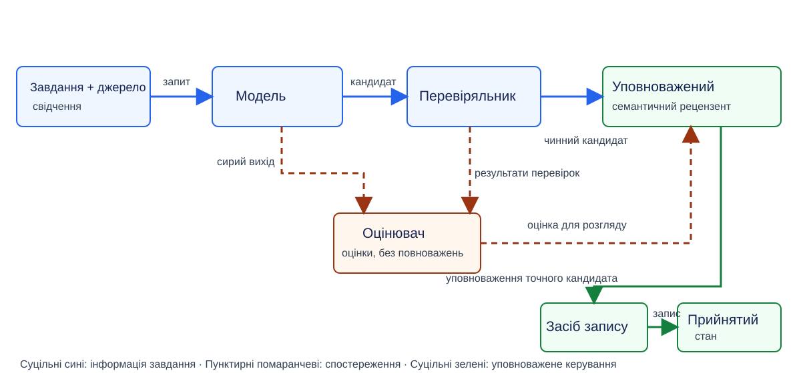
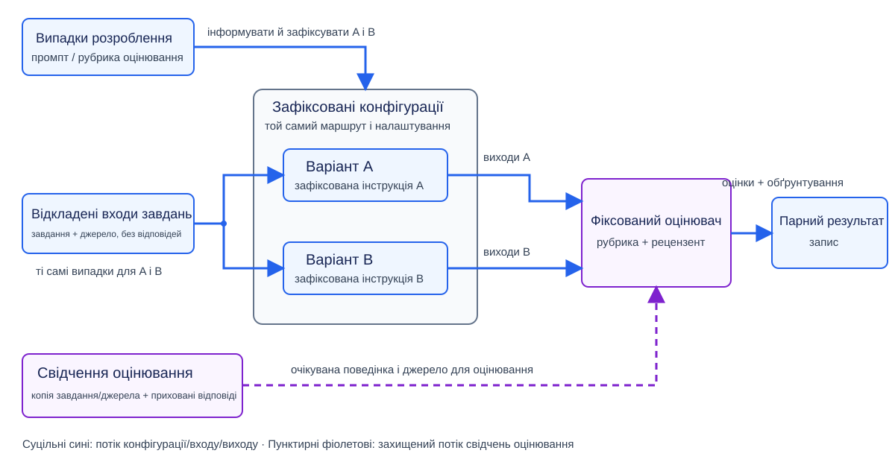
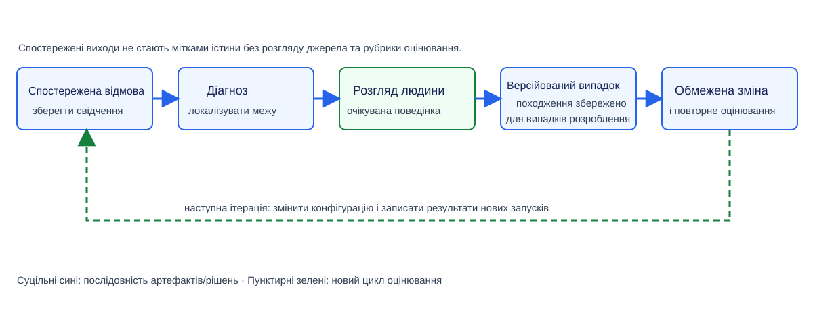

# Модуль 03: Оцінювання та проєктування експериментів — Теорія

> **Статус:** Ready for Students — англомовну теорію та український переклад затверджено викладачем 2026-10-04

## Інженерна проблема: приваблива відповідь не є доказом поліпшення

Система ШІ *(тут: навчальна система знань)* отримує таке джерельне твердження:

> *“A source baseline identifies the material against which a proposal is reviewed.”*

Система формує два **кандидатні виходи (candidate outputs)** *(тут: два кандидатні визначення поняття)*:

- **Визначення A** точно переказує джерело: *a source baseline identifies the material a proposal is reviewed against.*
- **Визначення B** коректно переказує джерело, а тоді додає твердження, якого в джерелі немає: *a source baseline automatically approves all later changes* *(сфабриковане доповнення — читач не зобов’язаний шукати в цьому твердженні окремий зміст; суть у тому, що його немає в джерелі і його не слід було генерувати).*

Обидва кандидатні визначення граматично коректні. Визначення A підкріплене джерелом і є змістово повним для запитаного визначення. Визначення B не підкріплене джерелом через сфабриковане твердження про затвердження.

Інженер коригує системну інструкцію, щоб придушити сфабриковане доповнення. Коригування спрацьовує на цьому одному вході. Але це не означає, що система поліпшилася. Скоригована інструкція керувала б кожним входом, який опрацьовує ця конфігурація в задуманій операційній області, тоді як інженер спостеріг лише один випадок. Далі наведено можливі негативні наслідки скоригованої інструкції для інших входів у цій області:

- відкидати істотний зміст із визначень, згенерованих на інших входах,
- збільшувати зусилля розгляду з боку власника знань, або
- формувати неточний вихід на іншому джерельному твердженні.

**Виправлення, що спрацьовує на одному випадку, не є доказом загального поліпшення.**

---

Модуль 02 показав, що повторний запит на визначення може дати іншу відповідь і що навіть контрольований запит до моделі може не відтворюватися повністю. Порівняння двох кандидатних визначень може виявити мінливість на цьому вході. Воно не може відповісти на ширше запитання: *чи система надійна і корисна в задуманій операційній області?*

Цей модуль переходить від огляду окремих виходів до збирання систематичних свідчень на багатьох входах, конфігураціях і повторних запусках [1, Chapters 3–4].

Модуль 01 установив межу системи, питання корисності, межу людських повноважень і збережені свідчення, потрібні для оцінювання застосунку ШІ. Модуль 02 зробив конкретними мінливість моделі, структуровані кандидатні записи, детерміноване перевіряння, семантичне приймання та свідчення повторних запусків. Модуль 03 використовує обидві передумови: оцінює корисність на різних випадках, зберігаючи вже встановлені межі свідчень і повноважень.

Системною спроможністю, яку оцінює цей модуль, є **операція пропозиції поняття з використанням моделі**, уведена в модулі 02. Її модель формує кандидатний текст, але повна операція також охоплює побудову контексту, доступ до моделі та опрацювання структурованого виходу. Тому текст називає операцію пропозиції поняття, коли йдеться про її входи, поведінку або дефекти, і називає модель, що генерує, лише коли значення має ідентичність самої моделі.

**Базова конфігурація експерименту (experiment baseline)** — це повна порівняльна альтернатива, вибрана для оцінювання запропонованої зміни, а не початкова оцінка чи значення метрики. Для операції з використанням моделі її записана конфігурація ідентифікує:

- інструкцію завдання або промпт;
- побудову контексту;
- модель і маршрут доступу;
- налаштування генерування;
- контракт виходу; та
- поведінку синтаксичного аналізатора і перевіряльника.

Якщо порівняння стосується наскрізного процесу, базова конфігурація також ідентифікує людські кроки й ресурси, потрібні для завершення завдання. Випадки для оцінювання, рубрика оцінювання, умови прийняття та правила повторів належать до спільного протоколу експерименту, який застосовують до базової й кандидатної конфігурацій; вони не є складниками самої базової конфігурації. Базова конфігурація експерименту має бути правдоподібним способом виконати те саме завдання, формувати виходи, які можна оцінити за тими самими релевантними критеріями, і давати змогу порівнювано обліковувати зусилля та вартість. Базовою конфігурацією експерименту може бути наявна конфігурація, простий метод без ШІ або процес лише з людиною; навмисно слабка альтернатива не може нею бути. Базова конфігурація експерименту відрізняється від **базового стану джерела (source baseline)** у вступному прикладі, який ідентифікує матеріал, щодо якого розглядають пропозицію.

**Кандидатна конфігурація (candidate configuration)** — це повна альтернатива, запропонована для прийняття замість базової конфігурації експерименту. Обидві альтернативи є конфігураціями; слова **базова** і **кандидатна** називають їхні різні ролі в одному порівнянні, а не є синонімами слова «конфігурація». Базова конфігурація є поточним орієнтиром порівняння, а кандидатна — запропонованою заміною. Тому кандидатну конфігурацію в поточному порівнянні не називають *кандидатною базовою конфігурацією (candidate baseline)*. Якщо кандидатну конфігурацію прийнято, у наступному порівнянні вона може стати базовою конфігурацією експерименту, але тоді її роль уже змінилася. Кандидатну конфігурацію описують через ті самі види елементів конфігурації, що й базову. Порівняння має явно визначати, який елемент або обмежена множина елементів відрізняється; усі інші релевантні елементи залишають зафіксованими або записують як неконтрольовані відмінності. У порівнянні інструкцій цього модуля варіант A є базовою конфігурацією експерименту, а варіант B — кандидатною конфігурацією. Варіант B змінює інструкцію, тоді як побудова контексту, маршрут моделі, контракт виходу, синтаксичний аналізатор і перевіряльник залишаються зафіксованими. Отже, кандидатна конфігурація відрізняється від **кандидатного виходу (candidate output)**: конфігурація є версією операції, яку оцінюють, а кандидатний вихід — однією відповіддю, сформованою цією операцією в одній спробі.

---

**Центральне запитання цього модуля таке:**

> Які свідчення обґрунтовують висновок, що система ШІ є достатньо корисною для задуманого завдання — і що запропонована зміна поліпшує виконання завдання відносно названої базової конфігурації експерименту за відповідних обмежень якості, вартості та ризику?

Щоб відповісти на це запитання, три рішення треба чітко розділяти:

1. **Оцінювання відповіді**: оцінювач — оцінювач-людина, детермінована перевірка або ШІ-оцінювач — застосовує визначену процедуру вимірювання або рубрику оцінювання, тобто письмові інструкції щодо виставлення оцінок із категоріями, поясненими на опорних прикладах, щоб установити, чи конкретний вихід задовольняє потрібні критерії.
2. **Вибір конфігурації**: команда інженерів використовує результати оцінювання на багатьох випадках, щоб вирішити, яку версію системи залишити.
3. **Уповноваження запису знань**: уповноважений рецензент вирішує, чи можна додати одне конкретне кандидатне визначення до прийнятого стану знань *(прийнята база знань у цьому прикладі)*.

Оцінка відповіді не обирає конфігурацію і не уповноважує запис знань. Рішення щодо конфігурації не визначає оцінки окремої відповіді і не уповноважує окремий запис. Уповноваження одного запису знань не підтверджує його оцінку в оцінюванні і не обирає конфігурацію системи. Тому конфігурація, яка в середньому працює добре, не скасовує рішення уповноваженого рецензента щодо окремого запису.

Наскрізний приклад також використовує роль **власника знань** для особи, якій потрібне запропоноване визначення і яка зазнає зусилля розгляду. Одна особа може діяти і як власник знань, і як уповноважений рецензент, але ролі залишаються різними: користування визначенням само по собі не надає повноважень запису, а повноваження запису не роблять оцінку оцінювання правильною.

## Результати навчання

Наведені далі результати визначають міркування, яке можна продемонструвати на новому завданні. Після завершення модуля студент має бути здатний:

1. **LO1 — Визначити об’єкт оцінювання:** вивести з мети системи та наслідків відмови властивості, що мають значення (**критерії**), визначені спостереження або підрахунки (**метрики**), опорні приклади, що пояснюють категорії рубрики оцінювання, правила рішення (**умови прийняття**) та межу системи, яку спостерігають.
2. **LO2 — Обрати метод оцінювання:** назвати, яку властивість оцінюють, який порівняльний матеріал слугує **еталоном**, хто або що діє як оцінювач, і чи оцінюють один вихід, чи пару альтернатив. Застосовувати ці незалежні вибори, не трактуючи подібність, уподобання, підкріплення джерелом і правильність як взаємозамінні властивості.
3. **LO3 — Побудувати набір даних для оцінювання:** зібрати версійовану колекцію випадків і записати, звідки походить кожен випадок; охопити типові та складні випадки; відокремити випадки для розроблення, які оглядають під час зміни системи, від відкладених випадків, зарезервованих, поки протокол порівняння зафіксовано; не допустити потрапляння зарезервованої інформації оцінювання в розроблення; і використовувати **зрізи даних**, що групують спільний ризик, та **контрольовані збурення**, що змінюють одну ознаку входу з очікуваним відношенням до результату.
4. **LO4 — Спроєктувати контрольоване порівняння:** задати доречну для рішення базову конфігурацію експерименту, гіпотезу, контрольовані умови, повтори та запис усіх спроб.
5. **LO5 — Перевірити якість оцінювача-людини та ШІ-оцінювача:** застосувати рубрику оцінювання з опорними прикладами, розв’язати розбіжність між оцінювачем-людиною та ШІ-оцінювачем і виявити систематичне уподобання (**упередженість**) або зміни поведінки між запусками чи версіями (**дрейф**) для кожного з цих виконавців оцінювання.
6. **LO6 — Інтерпретувати свідчення:** обчислювати частки з явних кількостей подій і підсумків придатних спостережень, розглядати невизначеність і критичні відмови та обґрунтовувати обмежене рішення щодо конфігурації.
7. **LO7 — Підтримувати оцінювання:** перевіряти зворотний зв’язок щодо джерельних свідчень, перетворювати підтверджені відмови на версійовані **випадки для регресійної перевірки**, що зберігають відомі відмови для пізніших перевірок, і залишати неперевірений зворотний зв’язок сигналом, а не міткою істини.

Попереднього курсу зі статистики не припускається: відношення, середні, медіани та невизначеність пояснюються там, де їх використовують. Пояснення та приклади, потрібні для модуля та його лабораторної роботи, містяться тут; посилання нижче пропонують необов’язкову додаткову глибину.

## 1. Цілі оцінювання, межі та прийняття

Цей розділ установлює, що оцінювання має допомогти команді інженерів вирішити, перш ніж команда обере **метрики**, тобто визначені вимірювання або підрахунки, або проведе експеримент. Приклади охоплюють рішення, чи кандидатна конфігурація задовольняє умови задуманого використання, чи конфігурація має пройти подальше тестування, або чи конфігурацію слід відхилити. Це інженерні рішення людини. Їх не ухвалює модель, і вони не уповноважують окреме кандидатне визначення для прийнятого стану знань.

Отже, розділ пояснює, як вивести спостережувані критерії якості, метрики, опорні приклади рубрики оцінювання, умови прийняття та межу оцінювання із задуманого завдання та наслідків відмови. Розділ складається з двох підрозділів:

- **1.1** виводить спостережувані критерії якості, їхні вимірювання, інструкції для оцінювання та умови прийняття з мети завдання й наслідків відмови.
- **1.2** визначає межі відповіді, компонента та наскрізної операції, на яких можна спостерігати результат.

Мета — навчитися пов’язувати кожен зібраний результат із явно названим інженерним рішенням і уникати тверджень, які результат не підтримує.

Оцінювання — це процедура збирання свідчень, релевантних для такого рішення. Одного агрегатного бала або позиції в таблиці лідерів недостатньо, бо він може приховати:

- які критерії якості вимірювали;
- які випадки та спроби ввійшли в обчислення;
- чи сталася критична відмова;
- яку межу системи спостерігали.

Різні твердження також потребують різних свідчень:

- **Детермінована повторна перевірка** може знову оглянути ту саму збережену відповідь і повернути той самий результат за тієї самої версії перевірки.
- **Оцінена частка відмов** мінливої операції пропозиції поняття з використанням моделі залежить від спостережених входів, запусків, оцінювача та періоду [1, Chapters 3–4].

### 1.1 Від мети до спостережуваної якості

У наскрізному прикладі навчальна система знань пропонує визначення поняття, обґрунтоване джерелами, для розгляду власником знань. Корисність цієї операції залежить не лише від вільної мови. Три дефекти мають різні наслідки:

- **Непідкріплене твердження** може забруднити прийнятий запис знань.
- **Неправильно сформована відповідь** може зупинити процес.
- **Без потреби довга відповідь** може накладати вартість розгляду.

Ці наслідки визначають критерії та прийнятні компроміси.

У таблиці 1.1 визначено терміни, потрібні для проєктування оцінювання, і наведено приклад для кожного терміна в навчальній системі знань. Вона розмежовує критерій якості, його вимірювання, інструкції для судження, матеріал випадку та правило рішення до їх спільного використання.

**Таблиця 1.1 - Терміни оцінювання та приклади для навчальної системи знань**

| Термін                                      | Значення в цьому модулі                                                                                                                                                                                                                                                                                                                                      | Приклад                                                                                                                                                                                                                                                                                                                                                          |
| --------------------------------------------------- | ---------------------------------------------------------------------------------------------------------------------------------------------------------------------------------------------------------------------------------------------------------------------------------------------------------------------------------------------------------------------------------- | ------------------------------------------------------------------------------------------------------------------------------------------------------------------------------------------------------------------------------------------------------------------------------------------------------------------------------------------------------------------------- |
| Критерій                                  | Властивість, важлива для рішення                                                                                                                                                                                                                                                                                                                     | Твердження мають бути підкріплені наданим джерелом.                                                                                                                                                                                                                                                                        |
| Метрика                                    | Визначене вимірювання або підрахунок цієї властивості                                                                                                                                                                                                                                                                            | Кількість придатних до оцінювання відповідей, що містять непідкріплене твердження, повідомлена разом із загальною кількістю придатних до оцінювання відповідей і окремим підрахунком усіх спроб. |
| Рубрика оцінювання               | Інструкції та категорії з опорними прикладами для послідовного застосування судження                                                                                                                                                                                                                  | “Прийнятне”: усі змістовні твердження підкріплені, істотний зміст збережено.                                                                                                                                                                                                                          |
| Еталон                                      | Порівняльний матеріал, зафіксований до оцінювання виходів: команда інженерів визначає потрібні значення контракту, а призначений оцінювач-людина за потреби затверджує очікувані змістові твердження | Потрібний`case_id` для точної перевірки або очікуване змістове твердження для семантичного судження.                                                                                                                                                                                    |
| Випадок для оцінювання        | Версійований запис зі стабільним ідентифікатором, який містить надане джерело й завдання як вхід операції; очікувану поведінку або підставу судження лише для оцінювача; задуману групу ризику; належність до випадків розроблення або відкладених випадків; походження. | Короткий фрагмент джерела й запит поняття разом з очікуваною поведінкою лише для оцінювача та полями ризику, належності й походження. |
| Запуск                                      | Одна спроба виконання однієї конфігурації на одному випадку                                                                                                                                                                                                                                                                  | Запит з ідентифікатором і або сирою відповіддю, або відмовою.                                                                                                                                                                                                                                                        |
| Походження                              | Записане походження та історія опрацювання артефакту оцінювання                                                                                                                                                                                                                                                         | Чи випадок авторський для курсу, зібраний із розглянутого використання, чи виведений із ранішої відмови.                                                                                                                                                                        |
| Набір даних для оцінювання | Версійована колекція випадків та їхнього походження                                                                                                                                                                                                                                                                                | Типові та складні випадки із заявленою належністю до розроблення або відкладеного набору.                                                                                                                                                                                                  |
| Умова прийняття                     | Правило рішення, прив’язане до задуманого використання та наслідків                                                                                                                                                                                                                                                   | Жодних спостережених критичних непідкріплених тверджень на призначених складних випадках плюс прийнятне зусилля розгляду; це локальна політика, а не універсальна гарантія.                                        |

Метрика може узагальнювати якість, тоді як умова прийняття вирішує, чи спостережена поведінка є достатньо корисною. Високий середній бал не може компенсувати критичну відмову, якщо правило рішення забороняє такий компроміс. Навпаки, емпірично досконалий бал на кількох вибраних випадках не встановлює нульової ймовірності відмови.

Шлях оцінювання та уповноваження використовує три окремі ролі:

- **Оцінювач-людина** оцінює згенеровані відповіді за джерелом і, якщо їх використовують, затвердженим еталоном та рубрикою оцінювання.
- **Відкалібрований ШІ-оцінювач** — це оцінювач на основі ШІ, чиї судження перевірили на розглянутих випадках порівнянням із судженнями людей, які звірили відповіді з джерелами; розділ 3 пояснює таку перевірку. Його оцінка може допомагати оцінювачеві-людині, але не вирішує, чи потрапить запропоноване визначення до прийнятих знань.
- **Уповноважений рецензент** перевіряє точного кандидата та свідчення до нього, перш ніж вирішити, чи дозволяти запис.

Одна особа може виконувати обидві людські ролі, але оцінка залишається свідченням для рішення про уповноваження, а не замінює його.

У таблиці 1.2 кожен критерій якості операції пропозиції поняття пов’язано з оцінювачем і свідченнями, одиницею спостереження, наслідком відмови та використанням під час вибору конфігурації. Читайте рядок упоперек, щоб з’ясувати, що саме вимірює критерій; рядки доповнюють, а не замінюють один одного.

У таблиці використано чотири одиниці спостереження:

- **Спроба** — це одна спроба генерування.
- **Придатна до оцінювання відповідь** — це відповідь, зміст якої можна оцінити.
- **Випадок із неоднозначними або недостатніми свідченнями** — це тестовий випадок, побудований навколо неясних або відсутніх свідчень.
- **Наскрізна операція** — це повністю завершене користувацьке завдання, включно з генеруванням, розглядом, будь-яким потрібним виправленням і уповноваженням.

**Таблиця 1.2 - Критерії, межі свідчень і використання результатів для пропозицій понять**

| Критерій                                               | Свідчення та оцінювач                                                                                                                                                                      | Що оцінюють або підраховують?                                           | Наслідок відмови                                                                                                      | Використання в рішенні                                                                                                                                                                                                                                                                                                        |
| ---------------------------------------------------------------- | --------------------------------------------------------------------------------------------------------------------------------------------------------------------------------------------------------------- | -------------------------------------------------------------------------------------------------- | -------------------------------------------------------------------------------------------------------------------------------------- | --------------------------------------------------------------------------------------------------------------------------------------------------------------------------------------------------------------------------------------------------------------------------------------------------------------------------------------------------- |
| Структурна чинність                          | Розбирач і детерміновані перевірки полів/інваріантів                                                                                                           | Спроба                                                                                     | Процес не може безпечно опрацювати кандидата                                                  | Повідомляти відмови першої спроби окремо; не рахувати структурно непридатні спроби як семантичні успіхи                                                                                                                                                 |
| Підкріплення джерелом                      | Оцінювач-людина використовує надане джерело й рубрику оцінювання; відкалібрований ШІ-оцінювач може допомагати | Придатна до оцінювання відповідь                                    | Можуть бути прийняті непідкріплені знання                                                       | Якщо оголошена політика вважає непідкріплені твердження критичними, відхилити кандидатну конфігурацію за результатами призначених випадків, а не компенсувати відмови іншими балами |
| Покриття змісту                                  | Оцінювач-людина порівнює потрібний зміст і обґрунтовану невизначеність                                                                         | Придатна до оцінювання відповідь                                    | Неповна або оманлива нотатка                                                                                | Порівнювати корисні виходи                                                                                                                                                                                                                                                                                                |
| Доречна невизначеність                    | Оцінювач-людина перевіряє, чи свідчення дозволяють упевнене твердження                                                                          | Випадок із неоднозначними/недостатніми свідченнями | Сфабрикована впевненість або непотрібна відмова                                           | Оглядати окремий зріз даних                                                                                                                                                                                                                                                                                               |
| Затримка та ресурси                           | Журнал операції з визначеними межами часу та використання                                                                                                   | Спроба                                                                                     | Затримка, споживання квоти, навантаження рецензента                                     | Порівнювати здійсненні конфігурації                                                                                                                                                                                                                                                                              |
| Завершене користувацьке завдання | Власник знань спостерігає пропозицію, виправлення та процес уповноваження                                                                    | Наскрізна операція                                                              | Зусилля розгляду або небезпечний результат попри добрий бал компонента | Вирішувати корисність застосування                                                                                                                                                                                                                                                                                |

Підкріплення джерелом є відносним до наданих свідчень. Воно **не** доводить, що саме джерело є істинним.

Критерії мають різні властивості вимірювання:

- **Структурна чинність** є детермінованим інваріантом.
- **Покриття змісту** та **доречна невизначеність** допускають градуйоване судження.
- **Підкріплення джерелом** може бути непереговорним обмеженням для конкретного використання.

Команда інженерів оголошує, які відмови блокують використання конфігурації, перш ніж інтерпретувати підсумкові бали [1, Chapter 4, “Evaluation Criteria” and “Create an Evaluation Guideline”].

### 1.2 Межі відповіді, компонента та наскрізної операції

Відповідь моделі, перевіряльник, ШІ-оцінювач, розгляд людини та уповноважена операція запису беруть участь в оцінюванні на різних межах спостереження. Цей модуль розрізняє три межі:

1. Результат **на рівні відповіді** запитує, чи одна спроба генерування є структурно чинною й задовольняє оголошені семантичні критерії придатного виходу.
2. Тест **на рівні компонента** запитує, чи, наприклад, перевіряльник відхиляє відсутнє поле або чи ШІ-оцінювач виявляє непідкріплене твердження.
3. **Наскрізне** оцінювання запитує, чи власник знань завершує задумане завдання безпечно і з розумним зусиллям.

Той самий компонент може давати свідчення більш ніж на одній межі, але межі відповідають на різні запитання [1, Chapter 4, “Evaluate All Components in a System”]. На рисунку 1.1 показано шляхи інформації завдання, оцінювання та уповноваження в одній ілюстративній операції, щоб оцінку оцінювача-людини не сплутали з дозволом на запис.

**Рисунок 1.1 - Шляхи спостереження та уповноваження під час оцінювання.** Ілюстративна, а не вичерпна операція. Суцільні сині стрілки несуть інформацію завдання. Пунктирні помаранчеві стрілки несуть сиру відповідь і результати детермінованих перевірок до оцінювача-людини, а тоді несуть консультативну оцінку оцінювача-людини до уповноваженого рецензента. Уповноважений рецензент звіряє точного кандидата з його джерелом, перш ніж вирішити, чи дозволяти запис. Суцільні зелені стрілки несуть це уповноваження точного кандидата до засобу запису та результуючий запис до прийнятого стану. Оцінювання ніколи не постачає цього уповноваження.

Розгляньмо **сконструйовані навчальні дані** для п’яти користувацьких завдань із двома спробами генерування на завдання. У кожному завданні джерело містить достатньо свідчень для повного визначення; жодне не вимагає факту, якого немає в його джерелі. У цьому прикладі оголошені семантичні критерії вимагають, щоб кожне суттєве твердження було підкріплене джерелом, потрібний зміст зберігався, а невизначеність висловлювали лише тоді, коли її вимагають свідчення. **Придатна пропозиція моделі** має пройти і структурні перевірки, і всі ці семантичні критерії. Критерій щодо невизначеності залишається частиною рубрики оцінювання, але ці п’ять завдань із достатніми свідченнями не вимірюють поведінку на випадках із недостатніми свідченнями.

Кожна спроба повертає відповідь. Із десяти відповідей дві є неправильно сформованими; серед восьми структурно чинних відповідей дві містять непідкріплені твердження й не задовольняють семантичні критерії, а решта шість задовольняють усі оголошені семантичні критерії. Отже, шість спроб дали придатні пропозиції моделі. Чотири завдання мають принаймні одну таку пропозицію. Для п’ятого завдання власник знань має написати виправлену пропозицію з джерела. Сконструйований запис передбачає, що уповноважений рецензент перевіряє кожне завдання і дозволяє запис лише підкріпленої пропозиції моделі або виправленої пропозиції, написаної людиною. За цих умов усі п’ять завдань завершуються без додавання непідкріплених тверджень до прийнятих знань.

У таблиці 1.3 порівняно частки сконструйованого процесу на рівні спроби, відповіді та завдання, щоб завершені завдання не сприймалися як успіх усіх спроб моделі. Кожен рядок називає подію, придатні для підрахунку спостереження та тлумачення. У кожному дробі число перед рискою підраховує подію інтересу, а число після риски — усі придатні спостереження; це **знаменник**.

**Таблиця 1.3 - Сконструйовані результати відповідей і завдань на різних межах спостереження**

| Вимірювання                                                                     | Чисельник / знаменник | Одиниця спостереження та інтерпретація                                                                                                          |
| -------------------------------------------------------------------------------------------- | ----------------------------------------- | ------------------------------------------------------------------------------------------------------------------------------------------------------------------------------------ |
| Частка структурного проходження                               | 8 / 10                                  | Спроби генерування; лише розбір і перевірки інваріантів                                                                            |
| Семантична прийнятність серед чинних відповідей | 6 / 8                                   | Структурно чинні відповіді; дві неправильно сформовані явно виключено                                                 |
| Частка придатних виходів                                             | 6 / 10                                  | Усі спроби генерування; неправильно сформовані та непідкріплені виходи залишаються відмовами     |
| Завдання з придатною пропозицією моделі                 | 4 / 5                                   | Користувацькі завдання, а не окремі відповіді                                                                                               |
| Завершені завдання після втручання людини             | 5 / 5                                   | Наскрізні завдання, включно з одним написаним людиною виправленням і розглядом кожного завдання |

Припустімо, що сконструйований запис розгляду також підсумовує 25 хвилин, включно з тим виправленням. Середнє зусилля розгляду людиною становить 25 хвилин, поділені на п’ять завдань, тобто п’ять хвилин на завдання. Щоб визначити, чи модель зменшила час, потрібний для завершення тих самих завдань, знадобилася б базова конфігурація експерименту лише з людиною.

**Висновок полягає в тому, що результат є змістовним лише разом із його межею спостереження.** У цьому сконструйованому записі `5 / 5` завершених завдань підтримує лише твердження, що повний процес — включно з виправленням людиною, розглядом і уповноваженням — завершив ці п’ять завдань без внесення непідкріпленого запису до прийнятих знань. Результат `5 / 5` не встановлює, що операція пропозиції поняття з використанням моделі формувала придатний вихід на кожній спробі: лише `6 / 10` спроб дали придатний вихід, і лише чотири з п’яти завдань отримали придатну пропозицію моделі. Результат також не встановлює зменшення роботи, бо базову конфігурацію експерименту лише з людиною не вимірювали.

Отже, для інженерного рішення потрібні свідчення з межі, яка відповідає його запитанню:

- **Рівень відповіді:** свідчення про якість згенерованих виходів.
- **Рівень компонента:** свідчення про роботу перевіряльника або оцінювача.
- **Наскрізний рівень:** свідчення про завершення завдання, зусилля розгляду людиною та стан прийнятих знань після повного процесу.

Свідчення з однієї межі не можуть замінити свідчення з іншої.

> **Додаткове читання:** [1], Chapter 3, “Challenges of Evaluating Foundation Models,” working-copy PDF pp. 234–239, розширює складність відкритих суджень; Chapter 4, “Evaluation Criteria” and “Design Your Evaluation Pipeline,” pp. 316–319 and 393–400, додає приклади оцінювання на рівні завдання та компонента. Робоча пагінація залежить від видання.

## 2. Вибір і поєднання методів оцінювання

Розділ 1 установив, що оцінювання має підтримувати назване інженерне рішення на названій межі спостереження. Наступна проблема — обрати, як буде отримано потрібні свідчення. Мета цього розділу — вибрати і поєднати методи оцінювання так, щоб кожен результат відповідав на задумане запитання, а не лише формував зручний бал.

Терміни на кшталт *точного*, *еталонного*, *людського* та *парного* не називають взаємовиключні альтернативи. Вони описують різні частини методу оцінювання. Наприклад, вибір оцінювача-людини ще не задає, яку властивість ця особа оцінюватиме, чи буде доступний еталонний матеріал, і чи особа оцінюватиме один вихід, чи порівнюватиме два виходи. Тому трактування цих позначок як конкуруючих альтернатив може дати свідчення, які не підтримують задумане рішення.

Щоб запобігти такій невідповідності, цей розділ описує метод оцінювання вздовж чотирьох незалежних осей:

1. **Властивість:** яку якість або поведінку оцінюють?
2. **Еталон:** чи надано розглянутий еталонний матеріал?
3. **Оцінювач:** хто або що застосовує вимірювання або судження?
4. **Форма порівняння:** чи результат оцінює один вихід, чи порівнює альтернативи?

Людина може зробити еталонне парне судження; ШІ-оцінювач може зробити безеталонне абсолютне судження. Отримані свідчення мають різні обмеження [1, Chapter 3]. Підрозділи 2.1–2.4 застосовують чотири осі до методів цього модуля:

- **2.1** розглядає точні та функціональні перевірки властивостей із явно визначеним очікуваним значенням або поведінкою, доступною для огляду.
- **2.2** відокремлює порівняння подібності від судження про підкріплення джерелом як два різні застосування осі еталона.
- **2.3** визначає людське судження за рубрикою оцінювання з категоріями, правилами призначення та граничними прикладами.
- **2.4** відрізняє абсолютне оцінювання одного виходу від парного уподобання між двома виходами.

Після вивчення розділу читач має бути здатний указати, що встановлює кожен метод, виявити, чого він не встановлює, і поєднувати взаємодоповнювальні методи, не трактуючи їхні результати як взаємозамінні.

### 2.1 Точні та функціональні перевірки

Спочатку команда інженерів називає властивість, яку треба оцінити, а тоді з’ясовує, чи має вона явно визначене очікуване значення або поведінку, яку можна перевірити. Якщо так, команда може описати точну або функціональну перевірку за чотирма осями, запровадженими вище; назви цих перевірок не замінюють самих осей. Такі перевірки не оцінюють систему ШІ як ціле і не визначають, чи відкрите пояснення є істинним або повним.

**Точна перевірка** порівнює одне спостережене значення зі значенням, якого вимагає контракт або запис випадку. Об’єкт порівняння має бути названо. Приклади охоплюють:

- **Ідентифікатор** — це значення, яке пов’язує відповідь із конкретним запитом або випадком. Якщо запис входу має ідентифікатор `case-002`, поле відповіді `case_id` має містити точно `case-002`; `case-003` ідентифікував би інший запис. Ці значення є прикладовими ідентифікаторами записів, а не номерами розділів.
- **Фіксована мітка** класифікує значення за допомогою оголошеного скінченного словника. Якщо поле `language` запису дозволяє лише `en`, `uk` або `ru`, точна перевірка може перевірити, що поле містить одну дозволену мітку. Перевірка не встановлює, що пов’язаний текст написано або перекладено правильно.
- **Машиночитний статус** — це поле контракту, точне значення якого керує поведінкою програмного забезпечення, наприклад `completed` або `failed`. Точна перевірка може перевірити потрібне написання та дозволене значення. Вона не встановлює, що базове завдання було виконано правильно.

Деякі контракти дозволяють заявлену **нормалізацію** перед порівнянням. Нормалізація усуває лише ті відмінності, які контракт визначає як нерелевантні, наприклад дозволені навколишні пробіли. Вона не повинна змінювати змістовний вміст: обрізання пробілів не може виправдати заміну потрібного ідентифікатора `case-002` на `case-003`.

Детерміновані перевірки відповідають на два різні запитання:

- **Перевірка розбору** з’ясовує, чи відповідь має оголошений синтаксис.
- **Перевірки схеми й точного значення полів** з’ясовують, чи є потрібні поля та значення.

Разом вони реалізують синтаксичний контроль і контроль детермінованих інваріантів, запроваджені в модулі 02, а не контроль семантичного прийняття. Жодна з цих перевірок не встановлює, чи підкріплені джерелом твердження в полях.

**Функціональна перевірка** оцінює виконувану поведінку, а не точний текст. В іншому завданні, не пов’язаному з наскрізним прикладом визначення поняття, засіб запуску тестів може виконати згенерований код на заданих входах і порівняти отримані виходи з очікуваними. Проходження підтримує твердження, що код поводився як очікувалося на тих тестових входах; воно не встановлює правильності для кожного можливого входу [1, Chapter 3, “Exact Evaluation” and “Functional Correctness”].

У таблиці 2.1 точну перевірку поля та функціональну перевірку коду пов’язано з властивістю, еталоном, оцінювачем і формою порівняння. Вона показує, чому сама назва перевірки не задає повного методу оцінювання. Тут вісь еталона містить очікуване значення контракту або результат тесту, зафіксовані командою інженерів, а не затверджене людиною очікуване змістове твердження. Детермінована програма перевіряє один вихід; результат перевірки не уповноважує жодного запису до прийнятих знань.

**Таблиця 2.1 - Чотири осі методу для точних і функціональних перевірок**

| Перевірка                                                                | Властивість                                                                                     | Еталон                                                                                                                        | Оцінювач                                                                                                                  | Форма порівняння                                                                                                                                                                     |
| ----------------------------------------------------------------------------------- | ------------------------------------------------------------------------------------------------------------ | ------------------------------------------------------------------------------------------------------------------------------------- | ----------------------------------------------------------------------------------------------------------------------------------- | ----------------------------------------------------------------------------------------------------------------------------------------------------------------------------------------------------- |
| Точна перевірка`case_id`                                            | Чи відповідь ідентифікує запитаний випадок                           | Потрібний`case_id`, зафіксований у записаному вході завдання або контракті | Детермінований перевіряльник порівнює значення полів                              | Одне поле відповіді щодо одного потрібного значення                                                                                                    |
| Функціональна перевірка згенерованого коду | Чи код дає очікувану поведінку на заданих тестових входах | Пари вхідних даних та очікуваних виходів, визначені для цих тестів          | Засіб запуску тестів виконує згенеровану програму й записує її виходи | Спостережувані виходи однієї згенерованої програми порівнюють з очікуваними виходами для заданих входів |

Та сама пропозиція поняття все одно проходить перевірки розбору, схеми й точних значень структурованих полів; для оцінювання змісту відкритого визначення додатково потрібні порівняння з джерелом і рубрика оцінювання з опорними прикладами. Два формулювання можуть зберігати той самий зміст, тож порівняння точних рядків може відхилити чинне перефразування. Навпаки, нечинне твердження “the source baseline automatically approves changes” може з’явитися поряд із точною копією правильної фрази. Отже, точний збіг фрагмента тексту не встановлює підкріплення джерелом або повноти змісту.

**Висновок полягає в тому, що точні та функціональні перевірки доречні лише для названого значення або поведінки з результатом, який можна перевірити.** Вони дають детерміновані свідчення про потрібні поля або тестовану поведінку. Ці перевірки доповнюють, а не замінюють порівняння з джерелом у підрозділі 2.2 і семантичну рубрику оцінювання з опорними прикладами, яку докладно розглянуто в підрозділі 2.3.

### 2.2 Еталонні порівняння та їхні межі

Цей підрозділ розмежовує дві операції з різним матеріалом для порівняння:

- **Порівняння подібності** вимірює близькість згенерованої відповіді до заздалегідь затвердженого твердження про очікуваний зміст. Це твердження є окремою підмогою для оцінювання: призначений оцінювач-людина затверджує його, а процедура оцінювання або оцінювач-людина може використати його після генерування, проте його не додають до входу операції пропозиції поняття.
- **Судження про підкріплення джерелом** перевіряє твердження відповіді щодо джерела, наданого із завданням. Джерело входить до завдання операції.

Отже, обидва матеріали можуть заповнювати вісь **еталона** в описі методу, але для різних операцій. Подібність до твердження про очікуваний зміст не замінює звіряння з джерелом, адже твердження може пропустити важливе уточнення або містити помилку.

**Лексична подібність** вимірює збіг слів і коротких послідовностей слів; **семантична подібність** оцінює близькість змісту. У цьому сконструйованому прикладі використано два різні матеріали для порівняння:

- **Джерело, надане із завданням:** “A reviewer checks supporting evidence and then authorizes a proposed change.”
- **Еталон очікуваного змісту лише для оцінювача:** “A reviewer authorizes a proposed change.” Призначений оцінювач-людина затвердив коротший запис до перегляду згенерованих відповідей, але не помітив, що в ньому пропущено перевірку свідчень.

Три сконструйовані згенеровані відповіді показують можливості й обмеження кожного порівняння:

- **Підкріплене перефразування:** “A reviewer examines the evidence before approving the change” зберігає порядок, заданий джерелом.
- **Непідкріплене твердження:** “A reviewer authorizes a proposed change without checking evidence” має багато спільних слів з еталоном, але суперечить порядку, заданому джерелом.
- **Непідкріплене заперечення:** “A reviewer never authorizes a proposed change” також має багато спільних слів з еталоном, але суперечить джерелу.

У цьому прикладі непідкріплена відповідь без перевірки свідчень містить увесь короткий еталон, а підкріплене перефразування замінює значну частину його слів. Тому порівняння за збігом слів може віддати перевагу непідкріпленій відповіді; це зіставлення показаних рядків, а не виміряний бал моделі. Відповідь зі словом “never” також відрізняється від короткого еталона лише одним вирішальним словом. Процедура порівняння змісту, яка не розпізнала б це заперечення, могла б оцінити відповідь як близьку до еталона; жодного такого бала тут не обчислено. Вимірювання подібності може допомогти знайти незвичне формулювання для подальшого огляду, але жоден вид подібності не встановлює підкріплення джерелом і не визначає прийнятність конфігурації [1, Chapter 3, “Similarity Measurements Against Reference Data”].

Для порівняння подібності в цьому прикладі задано чотири осі:

1. **Властивість:** збіг слів або оцінена близькість змісту до затвердженого еталона, а не підкріплення джерелом.
2. **Еталон:** твердження про очікуваний зміст, доступне лише оцінювачу; це не джерело, надане із завданням.
3. **Оцінювач:** задана версійована процедура порівняння обчислює вибрану міру подібності.
4. **Форма порівняння:** одну згенеровану відповідь порівнюють з еталоном і отримують міру подібності, а не рішення про запис чи парне уподобання між двома згенерованими відповідями.

Судження про підкріплення тієї самої відповіді джерелом — додаткова операція, яку також описано за чотирма осями:

1. **Властивість:** чи кожне суттєве твердження підкріплене джерелом, наданим із завданням; таке підкріплення не доводить істинності самого джерела. Повнота змісту — пов’язаний, але окремий критерій у таблиці 1.2.
2. **Еталон:** джерело, надане із завданням. Воно є матеріалом порівняння для цього судження, а не окремим твердженням про очікуваний зміст, доступним лише оцінювачу й використаним для подібності. Рубрика містить інструкції для судження, а не замінює джерело.
3. **Оцінювач:** оцінювач-людина оглядає згенеровану відповідь і надане джерело та застосовує інструкції для судження, запроваджені в таблиці 1.1 й докладніше описані в підрозділі 2.3.
4. **Форма порівняння:** одну відповідь оцінюють щодо джерела її завдання; результатом є судження про підкріплення джерелом, а не міра подібності, парне уподобання чи уповноваження запису знань.

Для відкритих визначень понять оцінювач-людина перевіряє за наданим джерелом кожну **відповідь, придатну до оцінювання**, незалежно від того, чи команда додатково обрала вимірювання подібності. Вихід, зміст якого не можна оцінити, наприклад неправильно сформовану відповідь, залишається спробою зі структурною відмовою, але не отримує судження про підкріплення джерелом; підрозділ 1.2 розмежовує ці одиниці спостереження. У сконструйованому прикладі коротке затверджене твердження пропускає перевірку свідчень, якої вимагає джерело. Тому подібність до цього твердження не встановлює, чи збережено перевірку свідчень у придатній до оцінювання відповіді: оцінювач має безпосередньо оглянути відповідь і джерело. Попереднє затвердження не робить твердження про очікуваний зміст повним, ані вимірювання подібності, ані судження про підкріплення джерелом не уповноважують запис знань.

### 2.3 Людське судження та рубрика оцінювання з опорними прикладами

Людям-оцінювачам також потрібні інструкції, доступ до свідчень і спосіб розглядати розбіжності. **Рубрика оцінювання** — це письмовий набір категорій, правил їх присвоєння та прикладів, які показують межі між ними. До початку оцінювання команда інженерів визначає категорії, правила й приклади. Оцінювач-людина застосовує рубрику до відповіді й записує одну категорію: оцінювач класифікує відповіді, а не самі категорії.

Людське судження за рубрикою можна описати за чотирма осями, запровадженими на початку розділу 2:

1. **Властивості:** підкріплення джерелом, повнота змісту й доречність невизначеності.
2. **Еталонний матеріал:** джерело, надане із завданням, і очікувана поведінка для конкретного випадку.
3. **Оцінювач:** оцінювач-людина застосовує рубрику.
4. **Форма порівняння:** оцінюють по одній відповіді; оцінювач не обирає між двома відповідями.

Рубрика дає інструкції для цих суджень, а не є окремим конкурентним методом чи джерельним документом. Оцінювач-людина може оглянути завдання, надане джерело, очікувану поведінку випадку, згенеровану відповідь і рубрику. Операція пропозиції поняття отримує завдання й джерело, але не очікувану поведінку, призначену лише для оцінювача. Це оцінювання запропонованого тексту, а не уповноваження запису до прийнятих знань.

У наскрізному прикладі навчальної системи знань використано шість категорій, визначених разом із прикладами в таблиці 2.2. Вони є проєктним рішенням для цього прикладу, а не універсальною класифікацією. Підкріплення джерелом, повнота змісту й доречність невизначеності залишаються окремими критеріями таблиці 1.2, навіть якщо для відповіді записують одну категорію.

Щоб конкретизувати межі категорій перед застосуванням рубрики до повного наскрізного прикладу, нижче наведено два сконструйовані записи завдань для різних ситуацій оцінювання. Перший із них використовує **базовий стан джерела (source baseline)** — зафіксовану версію або стан матеріалу, щодо якого розглядають пропозицію; це не конфігурація виконання експерименту.

- **Завдання на визначення базового стану джерела.** Сконструйований запис завдання містить речення-джерело “A source baseline identifies the material against which a proposal is reviewed” та запит до системи: пояснити, на який матеріал указує базовий стан джерела. Повна відповідь має зберегти зв’язок між базовим станом джерела та матеріалом, який використовують для розгляду пропозиції.
- **Завдання про строк зберігання.** Сконструйований запис завдання містить лише речення-джерело “Review records are stored in the knowledge system” та запит до системи: указати, як довго зберігають ці записи. Джерело не визначає строку, тому очікувана відповідь прямо повідомляє про відсутність цієї інформації, а не вигадує строк.

Отже, для кожного завдання явно задано очікувану відповідь: у першому треба зберегти зв’язок між базовим станом джерела та матеріалом для розгляду, а в другому — повідомити, що строк зберігання не визначено. Завдяки цьому оцінювач-людина може перевірити, яка категорія рубрики відповідає отриманій відповіді, а не вирішувати інтуїтивно, чи є вона «повною». У таблиці 2.2 кожну категорію пов’язано з прикладом фактичної відповіді та пояснено, що ця категорія означає для оцінювання пропозиції; таблиця не фіксує уповноваження запису.

**Таблиця 2.2 - Категорії семантичної рубрики з опорними прикладами для двох завдань**

| Категорія                                                             | Орієнтир і фактичний приклад                                                                                                                                                                                                                                                                                                                                                                             | Рішення для цієї пропозиції                                                                                                                                                          |
| -------------------------------------------------------------------------------- | ----------------------------------------------------------------------------------------------------------------------------------------------------------------------------------------------------------------------------------------------------------------------------------------------------------------------------------------------------------------------------------------------------------------------------------- | -------------------------------------------------------------------------------------------------------------------------------------------------------------------------------------------------------------- |
| `S` — Підкріплене і повне                                    | У завданні на визначення базового стану джерела: “The baseline identifies the material used to review a proposal.” Усі змістовні твердження підкріплені, і потрібний зв’язок збережено.                                                                                                                                     | Прийнятне за рубрикою оцінювання; перед будь-яким записом усе одно потрібен розгляд уповноваженим рецензентом |
| `I` — Підкріплене, але неповне                           | У завданні на визначення базового стану джерела: “The baseline identifies material.” Відповідь зберігає підкріплений фрагмент, але пропускає те, що робить цей матеріал релевантним: його роль у розгляді пропозиції.                                                      | Потребує доопрацювання; пропуск не є вигаданим твердженням                                                                                                |
| `U` — Непідкріплене                                              | У завданні на визначення базового стану джерела: “The baseline identifies the material a proposal is reviewed against and automatically approves later changes.” Додане твердження про затвердження не має підкріплення джерелом, навіть якщо визначення містить правильну частину. | Критична відмова підкріплення джерелом                                                                                                                                    |
| `Q` — Обґрунтована невизначеність                   | У завданні про строк зберігання: “The source does not specify a retention duration.” Відповідь ідентифікує відсутню інформацію, а не вигадує строк.                                                                                                                                                                                             | Прийнятне за рубрикою оцінювання там, де очікувана поведінка є обмеженою невизначеністю                                          |
| `R` — Непотрібна відмова або невизначеність | У завданні на визначення базового стану джерела: “I cannot provide a definition.” Жодного непідкріпленого фактичного твердження не зроблено, але відповідь не надає визначення, яке дозволяють надані свідчення.                                                          | Неприйнятне за рубрикою оцінювання; відрізняти від обґрунтованої невизначеності                                                       |
| `X` — Непридатне до оцінювання                          | Немає відповіді, нечитабельний запропонований текст або відсутнє записане джерело, потрібне для оцінювання; наявне джерело, яке не містить запитаного факту, не є відсутнім свідченням для`X`.                                                                      | Записати причину окремо; ніколи не рахувати як прийнятне                                                                                                     |

Оцінювач-людина перевіряє питання згори вниз і зупиняється, щойно правило визначає категорію. Така черговість важлива, коли відповідь має кілька недоліків: наприклад, відповідь, яка водночас є неповною і містить суттєве непідкріплене твердження, отримує `U`, а не `I`. Наведені далі чотири нумеровані перевірки утворюють процедуру вибору однієї категорії для відповіді, а не чотири етапи зміни відповіді.

1. **Чи можна оцінити відповідь?** Якщо відповідь або потрібні свідчення неможливо прочитати, присвоїти `X` і зупинитися. Якщо джерело наявне, але справді не містить запитаної інформації, відповідь усе одно можна оцінити; слід перейти до наступних перевірок, оскільки правильною категорією може бути `Q`.
2. **Чи містить відповідь суттєве непідкріплене твердження?** Якщо так, присвоїти `U` і зупинитися, навіть якщо відповідь також є неповною або містить застереження.
3. **Чи правильно відповідь ураховує наявні свідчення?** Якщо завдання вимагає повідомити про невизначеність або сформулювати обмеження і відповідь робить це правильно, присвоїти `Q` і зупинитися. Якщо свідчення дозволяють відповісти, але система відмовляється або висловлює необґрунтовану невизначеність, присвоїти `R` і зупинитися.
4. **Чи є підкріплена відповідь повною?** Для відповідей, не класифікованих вище, присвоїти `I`, якщо бракує потрібного змісту, і `S`, якщо відповідь повна. Тому розмите «невідомо», яке не називає запитаної невизначеності, отримує `I`, а не `Q`.

Перевіряльник записує структурний результат окремо від семантичного оцінювання. Якщо поле запропонованого тексту залишається читабельним, тоді як інше поле неправильно сформоване, оцінювач-людина може записати семантичну категорію для діагнозу, але структурно нечинна відповідь залишається непридатною до використання і не може ввійти до чисельника семантичного прийняття. Якщо відповідь або потрібні свідчення не можна прочитати, семантична категорія є `X`. Оцінювач-людина записує категорію, цитоване свідчення, причину та будь-які вторинні дефекти. Коди категорій не є порядковою шкалою: усереднення числових замін для `S`, `I`, `U`, `Q`, `R` і `X` не мало б обґрунтованої інтерпретації.

Категорії відповідають на різні запитання про відповідь:

- **`S` проти `I`:** чи підкріплений зміст зберігає потрібне значення.
- **`U`:** чи додає відповідь суттєве твердження, якого не підкріплює надане джерело.
- **`Q` проти `R`:** чи виправдовують наявні свідчення невизначеність або відмову.
- **`X`:** чи дозволяють відповідь і свідчення взагалі оцінити зміст.

Випадок є прийнятним за рубрикою оцінювання лише тоді, коли він отримує категорію, заявлену очікуваною поведінкою цього випадку: зазвичай `S` для випадків із достатніми свідченнями і `Q` для випадків, що вимагають обґрунтованої невизначеності або уточнення. Жодна окрема категорія не доводить, що всі інші критерії виконано або наскрізне завдання завершено.

Якщо два оцінювачі-людини не погоджуються щодо однієї відповіді, кожен зберігає запропоновану категорію, точний уривок джерела та твердження відповіді, які стали підставою судження. Потім вони зіставляють ці записи з тим самим джерелом завдання й рубрикою. Якщо джерело дозволяє розв’язати питання, оцінювачі записують узгоджену категорію й обґрунтування. Якщо неоднозначною є межа між категоріями, команда інженерів уточнює рубрику граничним прикладом і доручає повторно оцінити відповідні відповіді. Нерозв’язаний випадок залишається позначеним як спірний: йому не присвоюють категорію голосуванням більшості й не включають його до підрахунку узгоджених категорій. Цей процес стосується лише свідчень оцінювання. Уповноважений рецензент-людина окремо вирішує, чи можна записати конкретну пропозицію до прийнятих знань.

### 2.4 Абсолютне оцінювання та парне уподобання

**Абсолютне оцінювання** застосовує заявлений критерій до одного виходу, наприклад присвоює одну категорію рубрики за джерелом завдання та очікуваною поведінкою. **Парне порівняння** подає оцінювачу два виходи для одного завдання, щоб визначити, який краще відповідає названому критерію. У цьому підрозділі парне порівняння виконує людина; розділ 3 розглядає, що змінюється, коли оцінювачем є модель ШІ.

Команда інженерів визначає критерій та матеріал, доступний кожному оцінювачу, до порівняння. Порядок подання пари може вплинути на оцінювача, тому анонімні позначки двох виходів і зворотний порядок є перевіркою упередженості, а не гарантією правильності [1, Chapter 3, “Ranking Models with Comparative Evaluation”].

Ці судження мають окремі результати. У цьому прикладі команда інженерів призначає одну людину для відносного парного судження, а іншу — для оцінювання кожної відповіді за рубрикою. Після перевірки придатності пара анонімно позначених текстів A і B та запитання потрапляють до парного оцінювача-людини, лише якщо обидві відповіді придатні. Оцінювачеві-людині за рубрикою команда подає кожну відповідь окремо, джерело завдання, очікувану поведінку випадку й рубрику. Команда записує результати обох оцінювачів-людей окремо. Наступні три кроки описують хронологічну процедуру для однієї пари: перевірити придатність обох відповідей, записати відносне уподобання лише для придатної пари й зафіксувати абсолютний результат за рубрикою для кожної відповіді незалежно від придатності пари до порівняння.

1. **Перевірити придатність до порівняння.** Команда перевіряє, чи читаються обидві відповіді та потрібні для них свідчення завдання, і записує будь-яку структурну відмову. Відсутня відповідь, нечитабельний запропонований текст або відсутнє записане джерело дають `X` для відповідної відповіді за абсолютною рубрикою. Читабельна відповідь з іншим неправильно сформованим полем може отримати діагностичну семантичну категорію, але залишається непридатною до використання. Якщо хоч одна відповідь непридатна до оцінювання чи структурно нечинна, не записувати парного результату, пропустити крок 2 і перейти до кроку 3, щоб зберегти абсолютні результати для обох відповідей.
2. **Записати відносний результат лише для придатної пари.** Парний оцінювач-людина порівнює A і B за заявленим критерієм та записує перевагу A, перевагу B або нічию. Це визначає відносний порядок за критерієм, але не встановлює, чи досягає будь-яка відповідь порогу прийнятності.
3. **Окремо записати абсолютні результати.** Оцінювач-людина застосовує рубрику підрозділу 2.3 до кожної відповіді, зміст якої можна оцінити за її джерелом та очікуваною поведінкою. Команда зберігає `X` для відповіді, яку не можна оцінити, і записує категорію другої відповіді навіть тоді, коли крок 2 пропущено. Для читабельної, але структурно нечинної відповіді категорія має лише діагностичне значення: така відповідь неприйнятна. Команда записує, які відповіді є прийнятними за очікуваною поведінкою свого випадку. Якщо жодна не прийнятна, команда явно записує «жодна не прийнятна» незалежно від того, чи є парний результат. Уявна деталізація не задає порогу прийнятності.

Наприклад, якщо A нечитабельна, а B читабельна й її джерело наявне, A отримує `X`, B — власну категорію за рубрикою, а пара не отримує відносної переваги. Якщо джерело завдання відсутнє для обох відповідей, обидві отримують `X`, а відносну перевагу не записують.

Отже, серед двох непідкріплених відповідей одна може бути відносно детальнішою, але обидві залишаються `U` і неприйнятними. Ані відносна перевага, ані дві абсолютні категорії не уповноважують запис знань.

Для завдання на визначення базового стану джерела з підрозділу 2.3 відмінність видно на двох сконструйованих пропозиціях. За умовою обидві проходять однакові перевірки розбору й обов’язкових полів; наведений текст оцінюють за змістом. У наступному списку подано тексти пропозицій A і B та вказано твердження, яке їх розрізняє:

- **Пропозиція A:** “The baseline identifies the material used to review a proposal and automatically approves later changes.” Додане твердження про автоматичне затвердження відсутнє в наданому джерелі.
- **Пропозиція B:** “The baseline identifies the material used to review a proposal.” Потрібний зв’язок збережено без доданого твердження.

Затверджене твердження про очікуваний зміст, що містить речення пропозиції B, мало б багато спільних слів із пропозицією A; бала подібності тут не обчислено. У цьому сконструйованому записі команда підтверджує, що A і B придатні до порівняння. Парний оцінювач-людина бачить лише їхні тексти та запитання «Яка відповідь видається детальнішою?» і записує **перевагу A** за уявною деталізацією. Інший оцінювач-людина бачить кожну відповідь окремо разом із джерелом завдання, очікуваною поведінкою випадку та рубрикою; оцінювач-людина за рубрикою присвоює A категорію `U`, а B — `S`. Команда записує обидва результати: відносну перевагу A і прийнятність лише B за рубрикою. Уявна деталізація не усуває непідкріпленого твердження A. Лише парний метод має такі чотири осі:

1. **Властивість:** уявна деталізація, а не підкріплення джерелом.
2. **Еталон:** цьому парному оцінювачеві-людині не надають еталона; уподобання спирається на два показані тексти, а не на джерело чи очікувану відповідь.
3. **Оцінювач:** парний оцінювач-людина, якому подано лише тексти двох пропозицій і запитання про деталізацію.
4. **Форма порівняння:** A проти B для того самого завдання; якщо обидві відповіді придатні, записують перевагу A, перевагу B або нічию. Інакше парного результату немає.

Навіть парне уподобання на підставі джерела залишалося б порівнянням двох відповідей, а не уповноваженням запису будь-якої з них до прийнятих знань.

**Метод оцінювання придатний лише тоді, коли його чотири осі відповідають твердженню, яке команда інженерів має оцінити.** У цьому прикладі розбір встановлює чинність подання, подібність стосується спільних слів, категорії абсолютної рубрики оцінюють зміст кожної відповіді щодо джерела, а парне уподобання порівнює A і B за заявленим критерієм. Ці результати відповідають на різні запитання; непідкріплене твердження не можна виправдати їх усередненням. Для вибору методу слід назвати властивість, еталон, оцінювача й форму порівняння, указати межу кожного результату та поєднувати взаємодоповнювальні свідчення, не трактуючи їх як взаємозамінні.

> **Додаткове читання:** [1], Chapter 3, “Exact Evaluation,” “Functional Correctness,” and “Similarity Measurements Against Reference Data,” working-copy PDF pp. 252–266, розвиває залежні від завдання посередники; “Ranking Models with Comparative Evaluation,” pp. 295–311, дає додаткові порівняльні конструкції. Робоча пагінація залежить від видання.

## 3. ШІ-оцінювач сам є оцінюваним компонентом

Розділ 2 трактував оцінювача як одну вісь методу оцінювання. Вибір моделі ШІ для цієї ролі не встановлює, що судження вибраної моделі ШІ є правильними або придатними для задуманого рішення. Мета цього розділу — показати, як сам ШІ-оцінювач має бути специфікований, відкалібрований і контрольований, перш ніж вихід ШІ-оцінювача можна використовувати як свідчення оцінювання.

Розділ розглядає ШІ-оцінювача у три кроки:

- **3.1** ідентифікує конфігурацію ШІ-оцінювача та свідчення, які треба зберегти для кожного судження.
- **3.2** калібрує передбачення ШІ-оцінювача щодо перевірених за джерелом суджень людини.
- **3.3** розглядає упередженість, мінливість, зміни версій і захисні засоби.

Після вивчення розділу читач має бути здатний визначити обмежену роль ШІ-оцінювача, оцінити цього ШІ-оцінювача на розглянутих випадках і відрізняти свідчення ШІ-оцінювача від вибору конфігурації та уповноваження.

**ШІ-оцінювач** — це не лише назва моделі. Його конфігурація охоплює:

- модель і маршрут доступу;
- інструкцію та рубрику оцінювання;
- наданий контекст і приклади;
- налаштування генерування.

Вихід ШІ-оцінювача є спостереженням, яке треба зберегти і перевірити. Вільне обґрунтування може цитувати свідчення, які не підтримують призначену категорію [1, Chapter 3, “AI as a Judge”].

### 3.1 Входи, виходи та конфігурація

Для судження про підкріплення джерелом конфігурація ШІ-оцінювача має визначати контракт виходу. У цьому підрозділі використовується **бінарний скринінг підкріплення джерелом**: ШІ-оцінювач позначає відповідь як **непідкріплену** або **таку, що не позначена як непідкріплена**, ідентифікує твердження, відповідальні за позначку, та записує причину. ШІ-оцінювач не призначає шість категорій `S`, `I`, `U`, `Q`, `R` і `X` із таблиці 2.2. Конфігурація, яка просить ШІ-оцінювача призначати ці категорії рубрики оцінювання, має інший контракт виходу і повинна оцінюватися як така; опорні приклади категорій тоді визначають межі категорій, а бінарний скринінг використовує межу між «містить суттєве твердження, не підкріплене джерелом» і «не містить суттєвого твердження, не підкріпленого джерелом».

Для бінарного скринінгу ШІ-оцінювач отримує:

- завдання;
- джерельні свідчення;
- кандидатну відповідь;
- бінарну межу рубрики оцінювання між «містить суттєве твердження, не підкріплене джерелом» та «не містить суттєвого твердження, не підкріпленого джерелом»;
- запит ідентифікувати твердження, відповідальні за його рішення.

Запис конфігурації робить ще чотири розрізнення:

1. **Межа бінарного входу:** бінарний ШІ-оцінювач не отримує шість опорних прикладів категорій із таблиці 2.2 і від нього не вимагається призначати ці категорії.
2. **Альтернативний контракт:** якщо натомість налаштовано ШІ-оцінювача повних категорій, ця окрема конфігурація отримує релевантні опорні приклади категорій і видає одну з шести категорій.
3. **Збережений запис:** запис оцінювання зберігає:
   - повний вихід ШІ-оцінювача як один збережений об’єкт;
   - виділену позначку, відповідальні твердження та причину;
   - розкриті модель і маршрут доступу;
   - версії інструкції та рубрики оцінювання;
   - відомі налаштування генерування;
   - час або версію, потрібні для ідентифікації конфігурації ШІ-оцінювача.
4. **Розділення еталона:** коли бінарний результат означає, що відповідь не позначено як непідкріплену, збережене поле `responsible_claims` є порожнім списком, оскільки жодне непідкріплене твердження не відповідає за результат; твердження, розглянуті під час перевірки, до цього поля не вносять. Очікувана відповідь, призначена лише для оцінювача, не є входом цього скринінгу підкріплення джерелом. Її можна надати лише тоді, коли окремо оголошений метод еталонного оцінювання цього потребує. У будь-якому разі очікувана відповідь ніколи не повинна потрапляти до входу завдання моделі, яка генерує кандидатну відповідь. Приклади для кількох кроків, включені в інструкцію ШІ-оцінювача, є прикладами конфігурації; вони відрізняються від окремо розглянутого калібрувального набору і не повинні мовчки повторно використовуватися як калібрувальні свідчення.

Надсилання тексту джерела зовнішньому ШІ-оцінювачу, тобто моделі або сервісу оцінювання, який працює за межами системи, що оцінюється, має наслідки для приватності та ресурсів. Команда інженерів має перевірити, чи таке розкриття дозволене, перш ніж його використовувати.

Калібрувальний набір маркують до порівняння з ШІ-оцінювачем:

- Оцінювач-людина перевіряє джерело і застосовує рубрику оцінювання з підрозділу 2.3.
- Бінарна еталонна мітка є **непідкріпленим** для `U`.
- Мітка є **не непідкріпленим** для придатних до оцінювання `S`, `I`, `Q` або `R`.
- Відповідь `X` або структурно непридатна спроба не належить до чотирьох клітин метрик і повідомляється окремо.

Отже, чотири підрахунки використовують ті самі придатні до оцінювання, розглянуті щодо джерела спостереження для людського еталона і передбачення ШІ-оцінювача:

- **Істинно позитивним (TP)** є непідкріплений вихід, який оцінювач позначив.
- **Хибно негативним (FN)** є непідкріплений вихід, який оцінювач не позначив.
- **Хибнопозитивним (FP)** є вихід без непідкріпленого твердження, який оцінювач позначив.
- **Істинно негативним (TN)** є вихід без непідкріпленого твердження, який оцінювач не позначив.

Повнота виявлення непідкріплених виходів дорівнює `TP / (TP + FN)`. Частка хибнопозитивних спрацювань дорівнює `FP / (FP + TN)`.

Витрати не встановлюють якості оцінювача. Перед порівнянням конфігурацій команда інженерів називає порівняльного ШІ-оцінювача та заздалегідь оголошує межі хибнопозитивних спрацювань, приватності й ресурсів. Кандидатний ШІ-оцінювач є кращим за цього порівняльного оцінювача лише тоді, коли він підвищує повноту виявлення, не перевищуючи оголошених меж. Це необхідна умова скринінгу для рішення команди інженерів щодо конфігурації, а не уповноваження прийняти ШІ-оцінювача і не уповноваження записати запис знань.

### 3.2 Калібрування щодо розглянутих суджень

Невеликий калібрувальний набір для цього бінарного скринінгу підкріплення джерелом має містити підкріплені, неповні та непідкріплені відповіді разом із випадками, у яких джерельні свідчення є недостатніми або неоднозначними.

Шість сконструйованих виходів із таблиці 3.1 мають такі людські еталонні мітки:

- Одна підкріплена, одна неповна відповідь, одна відповідь на недостатні й одна на неоднозначні свідчення не містять суттєвого непідкріпленого твердження й отримують **не непідкріплене**.
- Дві непідкріплені відповіді отримують **непідкріплене**.

Їхні результати в сконструйованій матриці такі:

- вихід із початковим кандидатом, який додав твердження про автоматичне затвердження: хибно негативний;
- інший непідкріплений вихід: істинно позитивний;
- неповний вихід: хибно позитивний;
- підкріплений вихід і виходи на недостатні та неоднозначні свідчення: істинно негативні.

Еталонне судження людини розглядають разом із джерелом, а не просто створюють голосуванням. Мета ШІ-оцінювача в цьому підрозділі — бінарне завдання скринінгу, визначене в підрозділі 3.1: виявлення критичних непідкріплених тверджень, а не заміна остаточного уповноваження людини.

У таблиці 3.1 показано кожен із шести сконструйованих виходів, розглянутих щодо джерела, разом із людським еталонним судженням і передбаченням ШІ-оцінювача. Два непідкріплені виходи формують істинно позитивний та хибно негативний результати. Підкріплений, неповний виходи та виходи на недостатні й неоднозначні свідчення формують хибно позитивний та істинно негативні результати. Повні рядки виявляють пропущені непідкріплені твердження та неправильні позначки, які приховав би лише готовий підрахунок. *Позитивний клас* — «непідкріплене»; ШІ-оцінювач, який передбачає позитивний результат, позначає відповідь. Це приклад калібрування, а не виміряна якість.

**Таблиця 3.1 - Сконструйовані результати скринінгу ШІ-оцінювача та перевірені людиною мітки**

| Відповідь                                                              | Сконструйований текст відповіді                                                       | Еталон людини       | Передбачення ШІ-оцінювача      | Результат                  |
| --------------------------------------------------------------------------------- | -------------------------------------------------------------------------------------------------------------------- | --------------------------------- | ------------------------------------------------------- | ------------------------------------- |
| Підкріплене визначення                                     | “The baseline identifies the material used to review a proposal.”                                                | Не непідкріплене | Не позначає як непідкріплене | Істинно негативний |
| Неповне визначення                                             | “The baseline identifies material.”                                                                              | Не непідкріплене | Позначає як непідкріплене      | Хибно позитивний     |
| Непідкріплене твердження про затвердження | “The baseline identifies the material a proposal is reviewed against and automatically approves later changes.”  | Непідкріплене      | Не позначає як непідкріплене | Хибно негативний     |
| Непідкріплене твердження про зберігання     | “Review records are retained indefinitely.”                                                                      | Непідкріплене      | Позначає як непідкріплене      | Істинно позитивний |
| Відповідь на недостатні свідчення                 | “The source does not specify a retention duration.”                                                              | Не непідкріплене | Не позначає як непідкріплене | Істинно негативний |
| Відповідь на неоднозначні свідчення             | “The source leaves the baseline scope unresolved between the source excerpt and the entire-repository snapshot.” | Не непідкріплене | Не позначає як непідкріплене | Істинно негативний |

ШІ-оцінювач погоджується на чотирьох із шести виходів. Точність позитивних передбачень ШІ-оцінювача становить одну правильну позначку, поділену на дві позначки, або 1/2. Повнота виявлення непідкріплених виходів ШІ-оцінювачем становить одну правильну позначку, поділену на два фактично непідкріплені виходи, також 1/2. Хибно негативне є небезпечним, бо непідкріплена відповідь уникає цього скринінгу, але відсутність позначки не є повним рішенням про прийняття. Хибно позитивне неправильно стверджує непідкріплене твердження у відповіді без цього дефекту. Воно створює непотрібне розслідування того нібито дефекту; відповідь усе одно може потребувати розгляду через неповноту або іншу проблему. Сама по собі згода могла б приховати цей патерн, особливо коли критичні відмови рідкісні. Будь-яке твердження про точність позитивних передбачень або повноту виявлення мають супроводжувати визначення категорій і знаменники.

Наприклад, одним із двох непідкріплених виходів є початковий згенерований кандидат, який додає до визначення з джерела твердження «automatically approves later changes». Оцінювач-людина, який перевірив джерело, призначає людську еталонну мітку **непідкріплене**, тоді як ШІ-оцінювач не позначає твердження, міркуючи, що «baseline» передбачає затвердження. Твердження відсутнє в джерелі, тому команда інженерів записує цей самий сконструйований вихід у клітину хибно негативного результату таблиці 3.1. Оцінювач-людина, який перевірив джерело, залишається тим, хто призначає еталонну мітку. Коли людський еталон і передбачення ШІ відрізняються, команда інженерів розглядає калібрувальний запис.

1. Якщо розбіжність є помилкою передбачення ШІ, команда зберігає людську мітку і записує помилку передбачення.
2. Якщо розбіжність виявляє неясну межу джерела або рубрики, команда застосовує описану нижче процедуру розбіжності між оцінювачами-людьми.
3. Розгляд розбіжності не змінює людську еталонну мітку лише для узгодження з ШІ-оцінювачем.
4. Якщо не погоджуються два кваліфіковані оцінювачі-люди, команда інженерів перевіряє, чи вирішує питання джерело. Якщо джерело вирішує питання, команда записує узгоджену людську категорію та оновлює бінарну еталонну мітку.
5. Якщо межа категорії неоднозначна, команда переглядає рубрику з додаванням прикладу межі та повторно оцінює відповідні виходи.
6. Невирішений випадок залишається спірним і виключається з чотирьох клітин метрик, доки еталонне судження не буде встановлено.

### 3.3 Упередженість, мінливість і захисні засоби

Відмови ШІ-оцінювача можуть виникати з різних причин, і перевірка має відповідати оголошеній формі порівняння ШІ-оцінювача. Цей розділ розрізняє дві форми:

- **Парний ШІ-оцінювач** отримує два придатні виходи для того самого завдання і повертає перевагу A, перевагу B або нічию за названим критерієм. У підрозділі 2.4 таку саму форму порівняння введено для оцінювача-людини.
- **Бінарний ШІ-оцінювач підкріплення джерелом** із підрозділів 3.1–3.2 отримує одного кандидата і повертає позначку, відповідальні твердження та причину.

Позиційна перевага стосується лише парної конфігурації. Багатослівність і самоуподобання можуть впливати на обидві форми, але перевірки цих викривлень мають використовувати виходи, розглянуті мітки яких уже відомі.

У цьому підрозділі **ідентичність варіанта** означає модель, що генерує, і конфігурацію, які створили кожного кандидата. Приховування цієї ідентичності не дає ШІ-оцінювачу інформації про те, яка модель створила A або B. Вихід вважається власним для ШІ-оцінювача, коли та сама модель і релевантна конфігурація спочатку створили кандидата, а потім оцінили його.

У таблиці 3.2 названо можливі викривлення та контрольоване порівняння, яке може виявити кожне з них. Зміна результату за вказаної контрольованої умови є свідченням названого ризику; незмінний результат невеликої перевірки не доводить відсутності ризику.

**Таблиця 3.2 - Режими відмов ШІ-оцінювача та цільові перевірки**

| Причина                                                     | Застосовне завдання ШІ-оцінювача               | Можливе викривлення                                                                                                                                                                                                         | Контрольована перевірка та діагностичний результат                                                                                                                                                                                                                                                                                                                                                                                                                                                                                                                                                                                                                                         |
| -------------------------------------------------------------------- | ----------------------------------------------------------------------------- | ----------------------------------------------------------------------------------------------------------------------------------------------------------------------------------------------------------------------------------------------- | ------------------------------------------------------------------------------------------------------------------------------------------------------------------------------------------------------------------------------------------------------------------------------------------------------------------------------------------------------------------------------------------------------------------------------------------------------------------------------------------------------------------------------------------------------------------------------------------------------------------------------------------------------------------------------------------------------------------------------------------ |
| Упередженість позиції                          | Лише парне                                                         | Надає перевагу першій або другій показаній відповіді                                                                                                                                            | Подати ті самі придатні виходи A/B у зворотному порядку, не змінюючи критерій і контекст. Перевага, яка переміщується разом із позицією показу, є свідченням упередженості позиції; та сама перевага щодо змісту після перестановки є стабільною в межах цієї перевірки.                                                                                                                                                                                                                                       |
| Упередженість багатослівності          | Бінарне або парне                                            | Сприймає деталізацію як якість, навіть коли доданий зміст непідкріплений                                                                                                       | Використати розглянуті щодо джерела випадки, які зіставляють стислий підкріплений вихід із багатослівним виходом, що містить непідкріплене твердження. Відсутність позначки для багатослівного непідкріпленого виходу в бінарному завданні або перевага такого виходу в парному завданні є свідченням упередженості багатослівності. Це калібрувальні випадки, а не few-shot приклади інструкції. |
| Самоуподобання                                       | Бінарне або парне                                            | Сприятливіше оцінює виходи власної моделі або подібний стиль                                                                                                                             | Приховати ідентичність моделі, що генерує, згрупувати збережені рішення за такою моделлю і порівняти кожну групу з розглянутими людиною джерельними мітками. Сприятливіше ставлення до власних виходів ШІ-оцінювача без відповідної підтримки людського еталона є свідченням самоуподобання.                                                                                                                                                                                       |
| Неоднозначність рубрики оцінювання | Бінарне або повнокатегорійне                      | Непослідовно застосовує межу                                                                                                                                                                                        | Розглянути розбіжності між людиною і ШІ та між людьми щодо того самого джерела й опорних прикладів рубрики. Якщо межа залишається неясною, команда інженерів переглядає відповідний опорний приклад і повторно оцінює уражені виходи до використання їхніх підрахунків.                                                                                                                                                                                                                                 |
| Мінливість генерування                        | Бінарне або парне                                            | Змінює своє судження між запусками                                                                                                                                                                              | Повторити ідентичний вхід ШІ-оцінювача за тієї самої записаної конфігурації. Різні позначки, відповідальні твердження або рішення A/B/нічия є спостережуваною мінливістю між запусками; незмінні виходи є стабільними лише в межах записаних повторів.                                                                                                                                                                                                                                                                   |
| Зміна версії ШІ-оцінювача                    | Будь-яке оголошене завдання ШІ-оцінювача | Змінює патерн помилок після зміни моделі, маршруту доступу, інструкції, рубрики, прикладів, контексту або параметрів генерування | Запустити стару й нову конфігурації на тих самих збережених, розглянутих щодо джерела калібрувальних випадках. Для бінарного скринінгу порівняти підрахунки TP, FN, FP і TN та їхні оголошені обмеження; змінений патерн помилок є свідченням того, що нова конфігурація потребує нового рішення.                                                                                                                                                                                             |

Команда інженерів проєктує і запускає ці перевірки, зберігає їхні входи й виходи та порівнює рішення ШІ-оцінювача з перевіреними щодо джерела людськими еталонними судженнями з підрозділу 3.2. Оцінювачі-люди розглядають спірні межі джерела та рубрики; команда інженерів змінює конфігурацію або обмежує її задумане використання. Якщо виявлене викривлення призводить до перевищення оголошеного обмеження помилок, команда не повинна використовувати цю конфігурацію для ураженого рішення щодо скринінгу, ранжування або порівняння конфігурацій, доки усунення проблеми й повторне калібрування не повернуть її в межі обмеження. Невдала парна перевірка позиції робить непридатним це парне використання; сама по собі вона не встановлює відмову окремо відкаліброваного бінарного скринінгу. Анонімні мітки, цитування свідчень і розгляд людиною розбіжностей підтримують ці перевірки, але не усувають ризиків.

[1, Chapter 3, “AI as a Judge”; Chapter 4, “Evaluate your evaluation pipeline”] обґрунтовує потребу перевіряти мінливість і обмеження ШІ-оцінювача, а не вважати одну конфігурацію безпомилковою. З цього принципу в курсі виведено два захисні правила:

- Низьке значення temperature не гарантує детермінованої поведінки служби, тому повторні судження все одно потрібно порівнювати.
- Друга модель ШІ може поділяти навчальні дані, конструктивні упередження або патерни відмов із першою моделлю, тож згода між двома моделями не є автоматично незалежним свідченням або гарантією правильності.

**Релевантна зміна** — це зміна ідентичності ШІ-оцінювача, записаної в підрозділі 3.1: моделі ШІ-оцінювача або маршруту доступу, інструкції, рубрики, наданого контексту, прикладів, контракту виходу чи параметрів генерування, — або зміна служби чи завдання, яка може змінити судження. Повторне калібрування повторює порівняння з підрозділу 3.2 щодо перевірених людиною джерельних міток, повторно обчислює застосовні підрахунки й частки помилок та застосовує оголошені обмеження до того, як команда інженерів використає змінену конфігурацію. Збережені випадки дають змогу прямо порівняти стару і нову версії; нові розглянуті випадки також потрібні, коли змінилося задумане завдання або ситуації, що трапляються.

Бінарний ШІ-оцінювач може розмістити позначені випадки перед непозначеними для огляду людиною. Будь-який детальніший порядок пріоритету потребує окремо оголошеного контракту виходу й калібрування. Це впорядкування не уповноважує зміну знань. Оцінювання за рубрикою оцінювачем-людиною, вибір конфігурації командою інженерів і уповноваження точного кандидата уповноваженим рецензентом залишаються окремими навіть тоді, коли скринінг ШІ-оцінювача стає надійним.

**Висновок полягає в тому, що ШІ-оцінювач дає обмежені свідчення оцінювання лише після того, як названо його повну конфігурацію та завдання і виміряно його помилки щодо розглянутих суджень.** Згода або вільне обґрунтування самі по собі не встановлюють правильності. Результат цього розділу є операційним правилом: зберігати вхід і вихід ШІ-оцінювача, оцінювати хибно негативні та хибно позитивні результати для задуманого завдання скринінгу, інтерпретувати контрольовані перевірки упередженості й мінливості, повторно калібрувати після релевантної зміни та ніколи не перетворювати результат ШІ-оцінювача на повноваження вибору конфігурації або уповноваження запису.

> **Додаткове читання:** [1], Chapter 3, “AI as a Judge,” working-copy PDF pp. 271–294, розширює обмеження ШІ-оцінювача, позиційні ефекти та міркування щодо вибору моделі; Chapter 4, “Evaluate your evaluation pipeline,” pp. 407–408, пов’язує калібрування з ширшим конвеєром. Робоча пагінація залежить від видання.

## 4. Дані для оцінювання та покриття ситуацій

Розділ 3 установив, як можна перевірити ШІ-оцінювача. Навіть добре відкалібрований ШІ-оцінювач дає оманливі свідчення, коли випадки для оцінювання пропускають важливі ситуації, розкривають зарезервовані відповіді під час розроблення або рахують повторні версії однієї ситуації як ширше покриття. Мета цього розділу — спроєктувати дані для оцінювання, зміст, розділення та історія розкриття яких підтримують область задуманого твердження.

Розділ будує набір даних для оцінювання у чотири кроки:

- **4.1** визначає запис випадку: інформацію, збережену для кожного випадку для оцінювання, і розділення між входами операції пропозиції поняття та матеріалом, призначеним лише для оцінювача.
- **4.2** розрізняє типові випадки, складні випадки та зрізи даних і показує сконструйовану матрицю покриття.
- **4.3** відокремлює випадки розроблення від відкладених випадків і пояснює ризики витоку: шляхи, якими зарезервована інформація оцінювання, як-от відкладені відповіді, близькі дублікати випадків або призначені лише для оцінювача очікувані мітки, може потрапити в процес розроблення і завищити видиму якість.
- **4.4** визначає контрольовані збурення з очікуваннями інваріантності та напрямленими очікуваннями й пояснює, чому повторення того самого входу вимірює мінливість, а не ширше покриття.

Після вивчення розділу читач має бути здатний побудувати версійований набір даних для оцінювання, пояснити, які ситуації він охоплює, і назвати, які твердження його випадки не можуть підтримати.

Набір даних для оцінювання є спроєктованою вибіркою ситуацій, а не мішком привабливих прикладів. Випадки мають розкривати і типове використання, і відмови, що мають значення, з чітким розділенням між інформацією, доступною операції пропозиції поняття з використанням моделі, та інформацією, зарезервованою для оцінювача [1, Chapter 4, “Define Evaluation Methods and Data”; 2, Chapter 6, “Evaluation Methods”].

### 4.1 Випадки, еталони та очікувана поведінка

**Випадок для оцінювання (evaluation case)** — це версійований запис зі стабільним ідентифікатором. Він містить надане джерело й завдання, які разом утворюють вхід операції пропозиції поняття; призначену лише для оцінювача очікувану поведінку або підставу судження; задуману групу ризику для звітування за зрізами даних; належність до випадків розроблення або відкладених випадків; походження завдання, джерела й матеріалу лише для оцінювача, а також рецензента, який затвердив очікувану поведінку.

Команда інженерів створює запис випадку для оцінювання до його використання. Запис пов’язує одну ситуацію оцінювання з умовою, важливою для рішення, яку цей випадок має дослідити. Поля запису мають окремих власників і видимість:

- **Вхід:** запит завдання або інструкція, яку команда інженерів надасть операції пропозиції поняття.
- **Надані джерельні свідчення:** фрагмент джерела, потрібний для виконання завдання. Команда інженерів включає цей фрагмент до входу операції і записує ідентичність та версію джерела.
- **Очікувана поведінка або еталон:** специфічне для випадку твердження лише для оцінювача про те, що має зробити підкріплена відповідь. Призначений оцінювач-людина розглядає і затверджує його. Твердження може посилатися на спільну рубрику та її опорні приклади, які команда інженерів визначає для кількох випадків; спільні опорні приклади не замінюють специфічного для випадку очікування.
- **Задумана група ризику:** названа умова, яку має дослідити випадок, наприклад недостатні свідчення, неоднозначні свідчення або додане непідкріплене твердження. Команда інженерів призначає це поле, щоб пов’язані випадки пізніше можна було повідомляти як зріз; призначення мітки не доводить, що набір належно охоплює ризик.
- **Належність до розроблення або відкладеного набору:** завчасне позначення командою інженерів того, чи можна оглядати випадок під час зміни системи, чи його зарезервовано від цього процесу для пізнішого порівняння. Підрозділ 4.3 докладно визначає правила розкриття.
- **Походження:** джерело і версія завдання, джерельного та призначеного лише для оцінювання матеріалу, а також рецензент, потрібний для ідентифікації того, що саме оцінювали.

Запис випадку підтримує три подання з різною видимістю. Розділення цих подань не дає інформації, призначеній лише для оцінювання, потрапити до генерування:

- **Подання операції:** операція пропозиції поняття отримує лише вхід завдання і надані джерельні свідчення. Задумана група ризику, належність до набору, метадані походження, прихована очікувана поведінка, затверджений еталон і результат рубрики лише для оцінювача не є входами операції. Якщо реальне завдання незалежно містить один із цих фактів, запис має зазначати таке розкриття; тоді випадок не може перевіряти, чи операція самостійно зберігає розкриту умову.
- **Подання оцінювання:** під час початкового оцінювання оцінювач-людина отримує завдання, надане джерело, відповідь, очікувану поведінку або затверджений еталон і рубрику, яких потребує оголошений метод оцінювання.
- **Подання звітування та простежуваності:** команда інженерів утримує мітки групи ризику та належності до набору поза поданням оцінювання, приєднує ці мітки до результату для групового звітування і зберігає походження для простежуваності.

Очікувана поведінка виражає межу свідчень, яку має зберегти відповідь. Наступні два приклади показують, як ця межа змінюється залежно від стану джерела:

- Для випадку з недостатніми свідченнями очікувана поведінка може вимагати обмеженого твердження про те, що повноваження або інший факт відсутні в джерелі.
- Для випадку з неоднозначними свідченнями очікувана поведінка може вимагати назвати правдоподібні інтерпретації, а не вгадувати.

Сконструйований випадок для розроблення **D2** застосовує це розділення. D2 запитує, хто може затвердити пропозицію, надає фрагмент джерела, який не називає повноважень затвердження, і використовує призначене лише для оцінювача очікування «зазначити, що повноваження не визначено». Команда інженерів записує **недостатні свідчення** як приховану групу ризику та **розроблення** як належність до набору. Походження ідентифікує запис і версію джерела та призначеного оцінювача-людину, який затвердив очікування.

Із випадком можуть бути пов’язані два види збереженого виходу. Вони відрізняються способом створення, а отже й тим, що можуть установити:

- **Авторська фікстура:** вихід, навмисно написаний командою інженерів, зокрема навмисно поганий вихід, для тестування синтаксичного аналізатора або оцінювача. Авторська фікстура не є свідченням того, що модель згенерувала таку поведінку.
- **Записана жива відповідь:** збережений вихід фактичної попередньої спроби операції пропозиції поняття за записаної конфігурації та умов.

Відтворення та нове живе виведення є операціями над випадком, а не додатковими видами збереженого виходу. Вони підтримують різні твердження:

- **Відтворення:** повторно подає будь-який вид збереженого виходу до подальшого програмного забезпечення або оцінювання без виклику моделі. Відтворення може перевірити поведінку синтаксичного аналізатора й оцінювача та повторити оцінювання того самого виходу, але не може виміряти поточну якість операції з використанням моделі або живу затримку.
- **Нове живе виведення:** викликає модель через операцію пропозиції поняття за записаної поточної конфігурації та умов. Оголошений набір нових живих спроб може виміряти поточну якість відповіді та спостережувану затримку на вказаній межі; одна спроба не засвідчує майбутню поведінку.

### 4.2 Типові випадки, складні випадки та зрізи даних

Невелика матриця нижче є **сконструйованою навчальною конструкцією**, а не репрезентативною вибіркою реального користувацького трафіку. Вона показує, які ситуації охоплено і як класифіковано кожен випадок.

У таблиці 4.1 для сконструйованих випадків наведено джерельну ситуацію й очікувану поведінку, а кожен випадок класифіковано за трьома осями:

- **Поділ:** належність до розроблення або відкладеного набору з підрозділу 4.1. Випадок для розроблення можна оглядати, поки система змінюється; відкладений випадок залишається зарезервованим, поки фінальний протокол порівняння зафіксовано.
- **Роль у конструкції:** розрізнення між типовими випадками, призначеними нагадувати очікуване використання, і складними випадками, навмисно обраними, щоб розкрити важливі відмови.
- **Зріз даних:** задумана група ризику з підрозділу 4.1. Зріз групує випадки, що поділяють ризик або умову свідчень, щоб групу можна було повідомляти окремо від загального результату.

Команда інженерів призначає поділ, роль у конструкції та зріз даних. Призначений оцінювач-людина затверджує очікувану поведінку для кожного випадку.

**Таблиця 4.1 - Покриття сконструйованих випадків і очікувана поведінка**

| Випадок | Поділ             | Роль у конструкції | Зріз даних                         | Ситуація джерельних свідчень                                                                                                    | Очікувана поведінка                                                                                      |
| ---------------- | ------------------------ | ------------------------------------ | --------------------------------------------- | ----------------------------------------------------------------------------------------------------------------------------------------------------------- | ---------------------------------------------------------------------------------------------------------------------------- |
| D1             | Розроблення | Типовий                     | Достатні свідчення         | Джерело: «A source baseline identifies the material against which a proposal is reviewed»                                                        | Зберегти зв’язок базового стану джерела з матеріалом для розгляду |
| D2             | Розроблення | Складний                   | Недостатні свідчення     | Джерело не називає, хто може затверджувати                                                                            | Зазначити, що повноваження не визначено                                                  |
| H1             | Відкладений | Типовий                     | Достатні свідчення         | Окремий уривок джерела, що висловлює поняття базового стану джерела іншими словами | Зберегти зв’язок базового стану джерела з матеріалом для розгляду |
| H2             | Відкладений | Складний                   | Відволікач                        | Джерело містить нерелевантне речення про затвердження щодо іншого процесу                | Не приписувати це затвердження базовому стану джерела                       |
| H3             | Відкладений | Складний                   | Недостатні свідчення     | Джерело не називає тривалість зберігання                                                                              | Зазначити, що тривалість не визначено                                                      |
| H4             | Відкладений | Складний                   | Неоднозначні свідчення | Два правдоподібні обсяги для «baseline»                                                                                        | Назвати правдоподібні інтерпретації                                                       |

Матриця навмисно крихітна, і її слід тлумачити з урахуванням чотирьох обмежень:

- **Покриття:** набір, орієнтований на промислову експлуатацію, розширював би покриття згідно з фактичним використанням:
  - релевантні патерни трафіку;
  - мови;
  - довжини джерел;
  - рідкісні відмови;
  - перевірки походження.
- **Тлумачення трафіку:** складні випадки навмисно надмірно представляють складну поведінку, тож їхній сукупний бал не є оцінкою якості на звичайному трафіку.
- **Належність до зрізів:** кожен рядок показує один первинний зріз даних, але випадок може належати до кількох груп, коли він розкриває кілька ризиків.
- **Одиниця звітування:** результат загалом або за зрізом, порахований за окремими випадками, відрізняється від того самого результату, порахованого за спробами. Підрозділ 1.2 запровадив це розрізнення між випадком і спробою.

Повідомлення результатів зрізу поряд із загальним результатом може виявити відмову, приховану легшими випадками.

### 4.3 Свідчення розроблення та відкладені свідчення

Випадки для розроблення та відкладені випадки підпорядковуються трьом правилам розділення:

- **Розкриття під час розроблення:** випадки для розроблення можна оглядати під час зміни системи, чи йдеться про промпт, рубрику оцінювання, модель, параметр декодування або іншу деталь конфігурації. Відкладені випадки залишаються зарезервованими для фінального порівняння після фіксації протоколу.
- **Групування пов’язаних сценаріїв:** перифрази та близькі дублікати того самого джерельного сценарію мають залишатися в тому самому поділі; інакше розробник промпту може дізнатися відкладену відповідь із близької копії.
- **Допустимість різних джерел:** два випадки, які перевіряють те саме поняття через різні джерела, не є перифразами одного сценарію і можуть правомірно перебувати в різних поділах. У таблиці 4.1 D1 і H1 обидва стосуються базового стану джерела, але H1 використовує окремий уривок джерела, а не перифразу речення з D1, тож їхні різні поділи не порушують правило групування.

Розділення можуть порушити три різні механізми:

- **Забруднення публічним бенчмарком:** модель могла бачити дані для оцінювання під час навчання.
- **Локальне перенавчання промпту:** команда повторно підганяє промпт під випадки для оцінювання, оглянуті під час зміни промптів або рубрик оцінювання.
- **Витік відповіді оцінювача:** операція пропозиції поняття отримує відповідь або очікувану мітку, призначену лише для рубрики оцінювання.

Кожен механізм може завищити видиму якість, але ці механізми не тотожні. Джерело [1], Chapter 4, підтримує занепокоєння щодо публічного бенчмарка та розділення даних оцінювання. Джерело [2], Chapter 5, використовує **витік даних** для ситуацій машинного навчання, у яких інформація мітки або тесту входить до ознак моделі або процесу навчання та розроблення, включно з повторним використанням тестового поділу для налаштування. Застосування того самого принципу розділення до вибору промпту та відповідей лише для оцінювача є розширенням курсу, а не твердженням, що редагування промпту перенавчає модель.

Якщо відкладений результат спричиняє ще одну ревізію, він став зворотним зв’язком розроблення для цієї ревізії. Треба чесно повідомити повторне використання і зібрати справді небачені випадки, перш ніж називати наступне порівняння фінальним. Випадок є справді небаченим, коли його не оглядали під час цієї ревізії і він не є перифразою чи близьким дублікатом випадку, який став зворотним зв’язком розроблення. Версіюйте зміст випадку, затверджений еталон і його рецензента та належність до поділу, щоб начебто однакові бали мовчки не посилалися на різні набори.

### 4.4 Збурення та повторний вхід

**Контрольоване збурення** змінює одну ознаку входу з очікуваним відношенням до результату. Заміна “identifies the material against which a proposal is reviewed” вірною перифразою має залишити підкріплене поняття непорушеним: очікування інваріантності. Вилучення речення, яке встановлює повноваження затверджувати, має змістити правильну відповідь до невизначеності: напрямлене очікування. Додавання нерелевантного тексту про затвердження щодо іншого процесу, як у випадку H2, також має залишити зв’язок базового стану джерела незмінним і не прив’язаним до відволікача: очікування інваріантності. Змінена відповідь не є поганою сама по собі; вона погана, коли зміна порушує заявлене очікування. Якщо відповідь прив’язує відволікач до базового стану джерела, вона порушує очікування інваріантності, і збурення виявило відмову, для пошуку якої його було спроєктовано.

Повторення випадку знову запускає той самий вхід, щоб спостерігати мінливість між запусками; воно не додає нової джерельної ситуації. Наприклад, повторення H2 тричі зондувало б мінливість на H2, не додаючи трьох незалежних джерельних ситуацій і не розширюючи покриття сценаріїв. Це інше проєктне рішення, ніж звичайні дві спроби на випадок, які вже використано в підрозділі 1.2: три повтори одного випадку дають сильніший сигнал мінливості для цього одного випадку, але все одно охоплюють лише H2, тоді як дві спроби на випадок застосовують те саме правило запису до кожного випадку. Записуйте ідентифікатори запусків, щоб не сплутати повторні спостереження з незалежними свідченнями.

**Висновок полягає в тому, що область твердження оцінювання визначається конструкцією випадків, розділенням та історією розкриття, а не лише кількістю записаних відповідей.** Типові випадки підтримують свідчення про очікуване використання, складні випадки та зрізи даних розкривають названі ризики, контрольовані збурення перевіряють заявлені відношення, а повторні запуски розглядають мінливість генерування на тій самій ситуації.

Результат цього розділу є правилом конструкції даних:

* тримати пов’язані випадки разом,
* переміщувати оглянуті випадки до використання в розробленні або регресійній перевірці,
* резервувати справді небачені свідчення для фінального порівняння і
* ніколи не трактувати повторні виходи як незалежне покриття сценаріїв.

> **Додаткове читання:** [1], Chapter 4, “Data contamination with public benchmarks” and “Define Evaluation Methods and Data,” working-copy PDF pp. 388–392 and 400–407, додає міркування щодо бенчмарків і вибірки; [2], Chapter 5, “Data Leakage,” pp. 171–175, and Chapter 6, “Evaluation Methods,” pp. 220–228, дає приклади витоку та зрізів даних. Робоча пагінація залежить від видання.

## 5. Базові конфігурації та контрольовані експерименти

Розділ 4 установив, які випадки можна використовувати і яке покриття вони дають. Наступна проблема — порівняти конфігурації, не приписуючи кожну спостережену різницю факторові, який команда інженерів мала намір змінити. Мета цього розділу — спроєктувати контрольоване порівняння з доречною для рішення базовою конфігурацією експерименту, перевірюваною гіпотезою, заявленими контролями та повним записом спроб і відмов.

Розділ проєктує контрольоване порівняння у три кроки:

- **5.1** формулює запитання рішення та альтернативи, які порівнюють.
- **5.2** формулює гіпотезу та відокремлює задуманий фактор від фіксованих і неповністю контрольованих умов.
- **5.3** визначає правила повтору, повторної спроби, відмови та ведення запису.

Після вивчення розділу читач має бути здатний указати, що порівняння може приписати задуманому факторові, що залишається різницею на рівні конфігурації, і які свідчення треба зберегти для пізнішого огляду.

Перед визначенням порівняння наведене далі нагадування закріплює терміни та їхні ролі в наскрізному прикладі:

- **Конфігурація (configuration)** — це повний спосіб виконати завдання. Для цієї операції з використанням моделі вона охоплює промпт, побудову контексту, модель і маршрут доступу, налаштування генерування, контракт виходу, синтаксичний аналізатор і перевіряльник.
- **Базова конфігурація експерименту (experiment baseline)** — це конфігурація, яка є поточним орієнтиром порівняння. У наскрізному прикладі нею є **варіант A**. Надана для нього інструкція вимагає відповісти на завдання щодо наданого джерела й повернути один об’єкт JSON рівно з полями `case_id` і однопараграфним `proposed_text`. Вона явно не вимагає обмежувати кожне твердження наданим джерелом або повідомляти, що запитана інформація відсутня чи неоднозначна.
- **Кандидатна конфігурація (candidate configuration)** — це повна запропонована заміна. У наскрізному прикладі нею є **варіант B**. B зберігає завдання A, маршрут моделі, побудову контексту, налаштування генерування, двопольовий контракт виходу, синтаксичний аналізатор і перевіряльник. Він змінює одну властивість інструкції: додатково вимагає прив’язувати твердження до джерела та прямо повідомляти, коли надане джерело не встановлює запитаного факту. Отже, B є кандидатною конфігурацією, а не *кандидатною базовою конфігурацією (candidate baseline)*.
- **Модель, яку розглядають (model under consideration)**, є лише можливим складником конфігурації. Її поєднання з іншими заявленими елементами утворює повну конфігурацію; сама модель не стає ні базовою, ні кандидатною конфігурацією.
- **Кандидатний вихід (candidate output)** — це одна відповідь, сформована в одній спробі. Він не стає конфігурацією, базовою конфігурацією експерименту або прийнятим знанням.
- **Базовий стан джерела (source baseline)** — це зафіксована версія або стан джерела, щодо якого розглядають матеріал. Він не стає базовою конфігурацією експерименту, оскільки є джерельним матеріалом, а не способом виконати завдання.
- **Спільний протокол експерименту (shared experiment protocol)** — це спільний апарат оцінювання, застосований до обох конфігурацій. Він охоплює випадки для оцінювання та очікувану поведінку лише для оцінювача, рубрику оцінювання, умови прийняття, політику повторів і призначеного оцінювача. Ці елементи однаково оцінюють обидві конфігурації та не є частиною жодної з них.

Ролі можуть змінюватися лише між порівняннями. Якщо варіант B прийнято, та сама повна конфігурація може стати базовою конфігурацією експерименту в наступному експерименті. Проте в поточному порівнянні A залишається базовою конфігурацією експерименту, а B — кандидатною конфігурацією. Спільний протокол експерименту залишається поза обома конфігураціями.

**Таблиця 5.1 - Конфігурація проти спільного протоколу експерименту**

|                                | **Конфігурація** (варіант A або варіант B)                                                                                                                                                                                                                                                                                                           | **Спільний протокол експерименту**                                                                                                                                                                                                                                                                                                                                       |
| -------------------------------- | ----------------------------------------------------------------------------------------------------------------------------------------------------------------------------------------------------------------------------------------------------------------------------------------------------------------------------------------------------------------------------------- | ------------------------------------------------------------------------------------------------------------------------------------------------------------------------------------------------------------------------------------------------------------------------------------------------------------------------------------------------------------------------------------------------------ |
| Роль                       | Як система виконує завдання і формує відповідь                                                                                                                                                                                                                                                                                            | Як оцінюють і порівнюють обидві альтернативи                                                                                                                                                                                                                                                                                                                  |
| Належить               | Рівно одній стороні порівняння (A або B)                                                                                                                                                                                                                                                                                                            | Однаково обом сторонам                                                                                                                                                                                                                                                                                                                                                           |
| Типовий склад      | Промпт/інструкція, побудова контексту, модель і маршрут доступу, налаштування генерування, контракт виходу, синтаксичний аналізатор, перевіряльник; для наскрізної роботи також людські кроки й ресурси | Випадки для оцінювання, рубрика оцінювання, умови прийняття, політика повторів; якщо використовують — інструкції ШІ-оцінювача та модель ШІ-оцінювача; ідентичність оцінювача та редакція набору правил оцінювання |
| Що означає зміна | Інший спосіб виконати завдання                                                                                                                                                                                                                                                                                                                         | Інший спосіб судити або відбирати ту саму пару конфігурацій                                                                                                                                                                                                                                                                                       |
| Не плутати з         | Спільним набором правил оцінювання або набором випадків                                                                                                                                                                                                                                                                          | Промптом, моделлю чи іншими елементами конфігурації A або B                                                                                                                                                                                                                                                                                            |

Отже, експеримент порівнює правдоподібні повні способи виконати те саме завдання за заявленим протоколом. Базовою конфігурацією експерименту може бути наявна конфігурація з підтримкою моделі, проста евристика видобування без ШІ або процес лише з людиною. Вона має бути змістовною для рішення й забезпечувати порівнянний облік виходу та зусилля; навмисно марна протилежна сторона перебільшує поліпшення [2, Chapter 6, “Baselines”]. Результати публічних бенчмарків можуть звузити множину моделей для локального оцінювання, але загальний рейтинг бенчмарка не встановлює придатності повної конфігурації для завдання визначення поняття, обґрунтованого джерелами [1, Chapter 4, “Navigate Public Benchmarks”].

### 5.1 Запитання рішення та альтернативи

Рішення тут полягає в тому, чи одне додане до B правило роботи зі свідченнями поліпшує пропозиції, обґрунтовані джерелами, порівняно з наявною інструкцією A. У конкретному прикладі A може відповісти на запит про строк зберігання, навіть якщо надане джерело такого строку не визначає, оскільки A вимагає лише відповіді в заданій структурі JSON із двома полями: `case_id` і `proposed_text`. B отримує той самий запит і джерело, але має використовувати лише надане джерело й повідомити, що строк зберігання не встановлено, коли цього факту немає. Отже, задуманою відмінністю є правило роботи зі свідченнями, а не завдання, модель, маршрут, контекст, структура виходу, синтаксичний аналізатор, перевіряльник, рубрика оцінювання або випадки. Рубрика оцінювання та призначена лише для оцінювача очікувана поведінка або затверджене твердження значення залишаються в поданні оцінювання й ніколи не входять до входу операції пропозиції поняття. B може зменшити непідкріплені твердження, але збільшити довжину, затримку або непотрібні відмови. Це компроміс, який треба виміряти, а не припустити.

### 5.2 Гіпотеза та контрольовані умови

Протокол, установлений до перегляду фінальних результатів, дає змогу перевірити конкретне причинне твердження: чи можна пояснити спостережену різницю між A і B однією задуманою зміною — доданим правилом роботи зі свідченнями, — а не іншою відмінністю між конфігураціями або неконтрольованою умовою. Тому в таблиці 5.2 наведено гіпотезу, задуманий фактор, зафіксовані умови, не повністю контрольовані умови та процедуру порівняння варіантів A і B. Якщо релевантні умови залишаються порівнянними, свідчення можуть підтримувати обмежений висновок про вплив зміни інструкції. Якщо вони не залишаються порівнянними, свідчення підтримують лише порівняння повних конфігурацій, а не висновок, що спостережену різницю спричинила саме зміна інструкції.

**Таблиця 5.2 - Протокол контрольованого порівняння інструкцій A і B**

| Елемент протоколу                | Заявлене трактування                                                                                                                                                                                                                                                                                                                                                                                                                                                                                                                                                                                                  |
| -------------------------------------------------- | ------------------------------------------------------------------------------------------------------------------------------------------------------------------------------------------------------------------------------------------------------------------------------------------------------------------------------------------------------------------------------------------------------------------------------------------------------------------------------------------------------------------------------------------------------------------------------------------------------------------------------------------ |
| Гіпотеза                                 | B зменшує непідкріплені твердження на відкладених випадках, не втрачаючи необхідного змісту і не перевищуючи обраних меж розгляду/затримки.                                                                                                                                                                                                                                                                                                                                                                       |
| Задуманий фактор                  | Текст інструкції A проти B; обидва версійовано до виконання на відкладеному наборі.                                                                                                                                                                                                                                                                                                                                                                                                                                                                                  |
| Зафіксовано                           | Ті самі входи випадків і джерело, контракт виходу, маршрут моделі/доступу як спостережено, рубрика оцінювання та інструкції оцінювача-людини й обмежена політика повторів. Кожна запланована спроба залишається в записі в порядку запланованих спроб; результати запланованих спроб і результати після повторних спроб повідомляють окремо. |
| Не повністю контрольовано | Зміни на боці постачальника, стохастичне генерування, мережева затримка, недокументоване маршрутизування та мінливість людського судження; записувати те, що спостережуване.                                                                                                                                                                                                                                                                                                        |
| Порівняння                             | Для кожного випадку порівнювати результат A з результатом B, отриманим на тому самому випадку; повідомляти окремі спроби та зрізи даних; оцінювати критичні відмови перед загальним підсумком.                                                                                                                                                                                                                                                                            |

На рисунку 5.1 показано шляхи входів відкладених завдань та очікуваних відповідей, призначених лише оцінювачу; їх розділення пояснює, чому операція пропозиції поняття не повинна отримувати приховані відповіді. Якщо між варіантами змінюється будь-який фактор, крім заявленого задуманого фактора, свідчення підтримують **порівняння конфігурацій (configuration comparison)**, а не причинне твердження лише про задуманий фактор. Вибір моделі використовує той самий протокол із моделлю як задуманим фактором. У цьому розділі **офлайн-порівняння** запускає обидві конфігурації на тих самих підготовлених випадках для оцінювання — у кожному вже збережено завдання і джерело, використані в експерименті — і оцінює кожну відповідь окремо за спільною рубрикою. **Офлайн** означає, що порівняння не використовує завдань, які надходять від реальних користувачів, поки система вже їх обслуговує. Запуск кожної конфігурації на тому самому випадку робить два результати порівнянними без того, щоб просити оцінювача обрати одну відповідь замість іншої; тому порівняння відмінне від **парного порівняння**, визначеного в підрозділі 2.4. Виробничий **експеримент A/B** натомість випадково призначає завдання реальних користувачів альтернативам, поки система вже їх обслуговує, і вимірює реальні результати з відповідними запобіжниками. Запуск A і B на тому самому підготовленому випадку для оцінювання з тією самою моделлю і протоколом є офлайн-порівнянням, а не виробничим експериментом A/B [2, Chapter 9, “Test in Production” and “A/B Testing”].

**Рисунок 5.1 - Контрольоване порівняння та відокремлення відкладених відповідей.** Ілюстративний потік експерименту. Випадки для розроблення інформують зафіксовану групу конфігурацій; кожен варіант містить свою зафіксовану інструкцію. Відкладені входи завдань надходять до обох варіантів. Окремий вигляд оцінювання постачає ті самі свідчення завдання/джерела плюс приховані очікувані відповіді лише фіксованому оцінювачеві-людині. Обидва шляхи виходу входять до того оцінювача-людини, чиї бали та причини входять до парного запису. Запис зберігає спроби, розбіжності, зрізи даних і відмови; шляху прихованої відповіді в генерування немає.

### 5.3 Повтори, відмови та записи експерименту

Перед проведенням порівняння треба окремо встановити два скінченні бюджети:

- **Спроби на випадок:** спроба — це заплановане генерування для випадку. Кожну заплановану спробу зберігають і повідомляють у порядку запланованих спроб: як першу, другу і так далі.
- **Повторні спроби на випадок:** повторна спроба — це відновлювальне генерування, дозволене лише після невдалої спроби, як-от неправильно сформований вихід, тайм-аут або помилка квоти. Кожна повторна спроба витрачає одну одиницю бюджету цього випадку.

Два бюджети складаються. Випадок, запланований на дві спроби, може додатково витратити одиниці повторних спроб, коли одна з тих спроб невдала, але бюджет повторних спроб ніколи не витрачається на успішну спробу і ніколи не перетворює заплановану спробу на повторну.

Повторна спроба може поліпшити остаточне завершення, але споживає час і ресурси. Результати запланованих спроб і результати після повторних спроб слід повідомляти окремо; результат після повторної спроби — це будь-яке відновлювальне генерування, що послідувало за невдалою спробою. Не можна вибирати найкращу з кількох відповідей так, ніби вона була єдиною відповіддю.

Запис експерименту потребує достатньої деталізації, щоб переобчислити та кваліфікувати його твердження. Його поля мають різні ролі:

1. **Намір:** мета, гіпотеза, умови прийняття, версія набору випадків, визначення поділу та зрізів даних.
2. **Конфігурації:** інструкції базової конфігурації експерименту та кандидата, побудова джерельного контексту, контракт виходу, спостережена ідентичність моделі/доступу та доступні налаштування генерування.
3. **Виконання:** ідентифікатори запуску, спроби та повторної спроби, сирий вихід або помилка, часові позначки, межа часу та свідчення використання або квоти там, де доступні.
4. **Оцінювання:** версія перевіряльника, ідентичності/версії рубрики оцінювання та оцінювача, мітки на випадок, цитування свідчень і рішення щодо розбіжностей.

Недоступні деталі моделі, використання токенів або грошові витрати є **невідомими**, а не нулем і не уявними. Збережену відповідь можна повторно оцінити та перевірити за ідентифікованою версією рубрики оцінювання, хоча оцінювачі-люди або ШІ-оцінювачі все одно можуть не погоджуватися; повторне генерування тієї самої відповіді через віддалену ймовірнісну службу не гарантоване. Збереження сирих виходів і спроб з помилками уможливлює пізніші виправлення оцінювання без переписування історії [2, Chapter 6, “Experiment Tracking and Versioning”].

**Висновок полягає в тому, що контрольований експеримент підтримує лише порівняння, визначене його зафіксованим протоколом і спостереженими умовами.** Різницю можна пояснювати задуманим фактором лише тоді, коли інші релевантні умови залишаються порівнянними; інакше свідчення підтримують ширше порівняння конфігурацій. Результат цього розділу є правилом проєктування експерименту: обрати доречну для рішення базову конфігурацію з порівнянними межами завдання, оцінювання, зусиль і вартості; до фінального оцінювання записати гіпотезу та визначити, які умови мають бути однаковими для A і B — зокрема випадки, джерело, модель і маршрут доступу, контракт виходу, рубрика оцінювання та політика повторів, — а які умови неможливо повністю контролювати, але потрібно спостерігати; зберегти кожну заплановану спробу й кожну повторну спробу; окремо повідомляти про повторні спроби; та обмежувати кожен причинний висновок факторами, які фактично залишали незмінними або спостерігали.

> **Додаткове читання:** [2], Chapter 6, “Experiment Tracking and Versioning” and “Baselines,” working-copy PDF pp. 199–203 and 217–220, додає практики відстеження та типи базових конфігурацій; Chapter 9, “Test in Production,” pp. 335–338, розширює розрізнення офлайн/онлайн. [1], Chapter 4, “Model Selection Workflow,” “Navigate Public Benchmarks,” and “Iterate,” pp. 356–358, 377–392, and 408–409, розширює попередній відбір моделей та ітерацію. Не використовувати числову інтерпретацію p-значення в уривку [2] про A/B-тестування. Робоча пагінація залежить від видання.

## 6. Інтерпретація результатів і ухвалення рішень

Розділ 5 визначив протокол і запис, потрібні для контрольованого порівняння двох повних конфігурацій: **базової конфігурації експерименту** та **кандидатної конфігурації**. У наскрізному прикладі цими конфігураціями є **варіант A** і **варіант B**. Після того як таке порівняння проведено, його підрахунки та бали все одно самі по собі не обирають жодної з конфігурацій. Мета цього розділу — установити, як спостереження на рівні випадку для варіантів A і B треба повідомляти та інтерпретувати, перш ніж вони зможуть підтримати **обмежене рішення щодо конфігурації**, не приховуючи відмов, не перебільшуючи невизначеності та не ігноруючи обмежень навантаження й ресурсів.

Розділ інтерпретує записані результати цього порівняння у три кроки:

- **6.1** пояснює звітування на рівні випадку та агрегатне звітування для варіантів A і B і п’ять послідовних підрахунків, які звіт має повідомляти для кожної конфігурації — кожен наступний є частиною попереднього.
- **6.2** розділяє вибіркову, генераційну та оцінювальну невизначеність, що обмежують те, що ці підрахунки встановлюють про будь-яку з конфігурацій.
- **6.3** поєднує свідчення якості з ресурсами, критичними відмовами та зафіксованими умовами прийняття і формулює **обмежене рішення щодо конфігурації**, яке підтримують свідчення для базової конфігурації експерименту та кандидатної конфігурації.

Після вивчення розділу читач має бути здатний визначити, які спостереження належать до кожного обчислення для варіанта A і для варіанта B, виявити, що залишається невизначеним, і назвати, яке обмежене рішення щодо конфігурації повідомлені свідчення можуть обґрунтувати для оціненого використання:

- прийняти кандидатну конфігурацію (варіант B);
- зберегти базову конфігурацію експерименту (варіант A);
- відхилити обидві конфігурації;
- або шукати більше свідчень.

Це те саме інженерне рішення щодо конфігурації, уведене на початку модуля. Воно обмежене оціненим використанням і не уповноважує окрему пропозицію поняття для прийнятого стану.

Результати стають свідченнями лише тоді, коли звіт показує для названої конфігурації та межі спостереження кількість подій, повну множину спостережень, придатних для обчислення, і трактування відмов. У цьому розділі **частка (rate)** — це названа пропорція, якою підсумовують, як часто визначена подія трапляється серед визначеної множини придатних спостережень однієї конфігурації за спільним протоколом експерименту. Кількість таких подій є **чисельником**; підсумок придатних спостережень є **знаменником**. Обидва числа мають називати ту саму межу спостереження. «Три чинні відповіді з чотирьох спроб операцій» відрізняється від «трьох прийнятних відповідей із трьох чинних відповідей», бо знаменники рахують різні множини спостережень.

Треба окремо повідомляти п’ять послідовних підрахунків для базової конфігурації експерименту і для кандидатної конфігурації. Починають від усіх запланованих спроб і звужують до відповідей, які приймає рубрика. Кожен наступний підрахунок є частиною попереднього:

1. **Спроби операцій:** усі заплановані спроби, включно з тайм-аутами, помилками квоти та неправильно сформованим виходом.
2. **Повернуті відповіді:** спроби операцій, що дали тіло відповіді. Тайм-аут або помилка квоти рахуються як спроба, але не як повернута відповідь.
3. **Структурно чинні відповіді:** повернуті відповіді, які розбираються та задовольняють контракт виходу.
4. **Придатні до оцінювання відповіді:** структурно чинні відповіді, у яких наявні потрібні свідчення. Відповідь без джерела чи свідчення очікуваної поведінки, потрібного для оцінювання, тут виключається.
5. **Прийняті за рубрикою оцінювання відповіді:** придатні до оцінювання відповіді, які рубрика приймає.

Кожен результат конфігурації рахують на кожному кроці, якому він іще відповідає. Останній досягнутий крок показує, де результат випадає з наступного вужчого підрахунку, тому жоден результат не пропускається мовчки.

**Частка прийнятих за рубрикою** конфігурації — це кількість її прийнятих відповідей над кількістю її придатних до оцінювання відповідей. **Частка повернення** конфігурації — це кількість її повернутих відповідей над кількістю її спроб операцій.

Розгляньмо такий сконструйований приклад із десятьма запланованими спробами однієї конфігурації:

- **10** запланованих спроб загалом.
- **1** завершується тайм-аутом і тому не дає тіла відповіді.
- **1** повертає неправильно сформоване тіло.
- **9 / 10** відповідей повернуто: усі спроби, крім тайм-ауту.
- **8 / 9** повернутих відповідей є структурно чинними: неправильно сформоване тіло виключено.
- **7 / 8** структурно чинних відповідей є придатними до оцінювання: одній чинній відповіді бракує свідчень, потрібних для оцінювання.
- **6 / 7** придатних до оцінювання відповідей прийнято за рубрикою.

Тому звіт наводить ці частки разом для цієї конфігурації, а не лише найвужчий дріб:

- прийнято за рубрикою: **6 / 7** придатних до оцінювання відповідей;
- структурно чинні серед повернутих: **8 / 9**;
- повернуті серед спроб операцій: **9 / 10**.

Ті самі п’ять послідовних підрахунків обчислюють окремо для другої конфігурації в порівнянні. Сирий **підрахунок помилок** рахує явні відмови операції або перевірки. **Підрахунок тіл відповідей** рахує тіла відповідей серед спроб без їх оцінювання. Згенерована відповідь може бути неправильно сформованою, а чинна відповідь може бути непридатною до оцінювання через відсутні свідчення [1, Chapter 4; 2, Chapter 6].

### 6.1 Свідчення на рівні випадку та агрегатні свідчення

У розділі 5 **офлайн-порівняння** визначено так. **Офлайн** означає, що порівняння проводять на підготовлених випадках для оцінювання — у кожному вже збережено завдання і джерело для експерименту, — а не на завданнях, які надходять від реальних користувачів, поки система вже їх обслуговує. У цій процедурі:

- обидві повні конфігурації запускають на тих самих підготовлених випадках для оцінювання;
- кожну відповідь окремо оцінюють за спільною рубрикою;
- потім результати зіставляють за випадком.

Це не виробничий експеримент A/B, який випадково призначав би завдання реальних користувачів альтернативам, поки система вже їх обслуговує, і вимірював би реальні результати. Це також не **парне порівняння** з підрозділу 2.4, у якому оцінювач обирає, який із двох виходів кращий.

Отже, за таким офлайн-порівнянням кожен відкладений випадок запускають один раз під базовою конфігурацією експерименту (варіант A) і один раз під кандидатною конфігурацією (варіант B). Для кожного такого випадку записати сирі результати та абсолютні категорії рубрики оцінювання обох конфігурацій перед агрегуванням.

Числові вимірювання і категорії рубрики потребують різних підсумків.

Для числових вимірювань на кшталт затримки, коли межа часу узгоджена між порівнюваними спробами, можна використовувати два підсумки:

- **Середнє** — звичайне арифметичне середнє: додати виміряні значення й поділити на те, скільки їх є. Для затримок `2 с`, `3 с` і `7 с` середнє дорівнює `(2 + 3 + 7) / 3 = 4 с`.
- **Медіана** — середнє значення після того, як виміряні значення виписано від найменшого до найбільшого. Якщо значень непарна кількість, беруть одне значення посередині: для `2 с`, `3 с`, `7 с` медіана дорівнює `3 с`. Якщо значень парна кількість, беруть два середні значення і усереднюють їх: для `2 с`, `3 с`, `4 с`, `10 с` медіана дорівнює `(3 + 4) / 2 = 3.5 с`.

Медіану менше тягне одне екстремальне значення, ніж середнє. У прикладі з чотирма значеннями середнє дорівнює `4.75 с`, а медіана лишається `3.5 с` попри викид `10 с`. Отже, ці підсумки належать до затримки та подібних числових вимірювань конфігурації.

Результати рубрики — інше. Мітки `S`, `I`, `U`, `Q`, `R` і `X` — це назви класів однієї відповіді, а не величини, які можна додавати. Їх підсумовують уже введеними послідовними підрахунками та частками для кожної конфігурації — наприклад, скільки придатних до оцінювання відповідей отримали кожну категорію, — а не заміною міток цифрами і усередненням цих цифр.

Перш ніж обчислювати частки, середні або медіани для конфігурації, треба заявити, як трактуватимуть відсутні або неповні спостереження. Далі наведено правила за замовчуванням для цього модуля:

- Тайм-аут рахується як спроба операції цієї конфігурації і тому лишається в знаменнику частки повернення цієї конфігурації. Він не дав жодної придатної до оцінювання відповіді, тож його виключають із часток придатних і прийнятих за рубрикою. Він усе одно з’являється у звіті поруч із тими частками, тому не може тихо зникнути з підсумку якості.
- Відсутнє вимірювання затримки позначають як невідоме, а не як нуль. Середнє та медіану обчислюють лише за значеннями затримки, які фактично виміряли.
- Затримка — це час на одному названому інтервалі, наприклад від початку спроби до моменту повернення відповіді. Два значення затримки можна порівнювати лише тоді, коли обидва виміряні на тому самому інтервалі. Якщо одну спробу виміряли від надсилання запиту до першого токена, а іншу — від надсилання запиту до повної відповіді, це різні величини; їхні середнє чи медіану змішувати не можна. Кілька вимірювань часу також не встановлюють надійної найгіршої затримки або **хвостової затримки**, тобто затримки серед найповільніших операцій.
- Якщо для двох відповідей на одному випадку додатково записують окреме судження парного уподобання з підрозділу 2.4, нічию в уподобанні повідомляють як нічию, а не як півперемоги, якщо цю конвенцію явно не було заявлено. Такий результат уподобання залишається відмінним від абсолютних категорій рубрики варіантів A і B.

Послідовні підрахунки та частки вище кажуть, скільки спроб конфігурації повернулися, розібралися, стали придатними до оцінювання або були прийняті. Вони не кажуть, які саме дефекти з’явилися. Для діагностики додатково ведіть **контрольний список відмов** для кожної відповіді. Цей список окремий від двох інших уже введених записів:

- єдиної категорії рубрики цієї відповіді (`S`, `I`, `U`, `Q`, `R` або `X`);
- п’яти послідовних підрахунків конфігурації (спроби операцій, повернуті відповіді, структурно чинні відповіді, придатні до оцінювання відповіді, прийняті за рубрикою відповіді).

Позначте кожен дефект, який застосовується; одна відповідь може мати кілька позначок одночасно:

- **Синтаксична помилка** — відповідь, що не розбирається або не задовольняє контракт виходу.
- **Непідкріплене твердження** — твердження, яке джерело не підтримує.
- **Пропущений зміст** — необхідний зміст, якого бракує.
- **Неправильно відкалібрована впевненість** — впевненість або невпевненість, якої свідчення не виправдовують, включно з вигаданою впевненістю або непотрібною відмовою, як описує критерій невизначеності в підрозділі 2.3.
- **Розбіжність оцінювачів** — суперечка між оцінювачами, яку записують для вирішення, а не трактують як дефект згенерованого виходу.
- **Помилка процесу** — операційна відмова, як-от тайм-аут або помилка квоти.

Приклад: одна відповідь може бути синтаксичною помилкою і водночас містити непідкріплене твердження. Обидві позначки лишаються на цій відповіді. Частки як і раніше рахують спробу один раз за вже заявленими правилами; контрольний список лише пояснює, що пішло не так.

### 6.2 Мінливість і невизначеність

Три джерела невизначеності потребують різних свідчень:

1. **Вибіркова невизначеність** — спостерігали лише деякі випадки для оцінювання із задуманої сукупності ситуацій.
2. **Мінливість генерування** — той самий випадок для оцінювання може дати різні відповіді між запусками за однієї фіксованої конфігурації.
3. **Мінливість оцінювача** — різні люди-оцінювачі, різні запуски ШІ-оцінювача або різні названі редакції спільного набору правил оцінювання можуть по-різному судити ту саму збережену відповідь.

Тут **вибірка** означає відбір випадків із задуманої сукупності, а не вибір токенів під час генерування. **Невизначеність** означає межі того, що спостереження встановлюють про базову конфігурацію експерименту або кандидатну конфігурацію, а не категорії відповідей `Q` або `R` із підрозділу 2.3. Ті самі три джерела детальніше:

1. **Вибіркова невизначеність** виникає тому, що спостерігали лише деякі випадки для оцінювання із задуманої сукупності ситуацій. Свідчення про неї потребують додаткових незалежно відібраних випадків із тієї сукупності; нова вибірка випадків може дати іншу оцінку якості навіть тоді, коли використовують ту саму конфігурацію та того самого оцінювача.
2. **Мінливість генерування** виникає, коли той самий випадок для оцінювання формує різні відповіді між запусками. Свідчення про неї потребують повторного генерування на тому самому випадку за тією самою названою конфігурацією — базовою конфігурацією експерименту або кандидатною конфігурацією — із зафіксованими промптом, моделлю і маршрутом доступу та налаштуваннями генерування.
3. **Мінливість оцінювача** виникає, коли різні люди-оцінювачі, повторні запуски ШІ-оцінювача або різні названі редакції спільного набору правил оцінювання призначають різні судження тій самій збереженій відповіді. Спільний набір правил оцінювання належить до **спільного протоколу експерименту**, а не до варіанта A чи варіанта B: до нього входять рубрика і, якщо її використовують, інструкції ШІ-оцінювача та модель ШІ-оцінювача. Названа редакція — це зміна цього набору, наприклад змінена рубрика, змінений промпт ШІ-оцінювача або інша модель ШІ-оцінювача, а не «версія людини». Свідчення про мінливість оцінювача потребують повторного оцінювання цієї відповіді із записом, хто або що її оцінював і яку названу редакцію набору правил використано. Це мінливість серед **оцінювачів**, які ставлять оцінку відповіді, а не серед **уповноваженого рецензента**, який вирішує, чи може кандидат увійти до прийнятого знання.

Повторення одного випадку для оцінювання під однією конфігурацією зменшує незнання про мінливість між запусками на цьому випадку під цією конфігурацією, але не додає нових незалежних випадків із задуманої сукупності.

Більша кількість незалежних типових випадків для оцінювання може зміцнити описове порівняння; більша упереджена вибірка все одно може вводити в оману. Спостереження різноманітних ситуацій допомагає не пропустити важливі види випадків, але сама різноманітність не доводить надійності. Повторні виходи на одному випадку під однією конфігурацією лишаються прив’язаними до цього одного випадку, тож рахування їх як багатьох незалежних нових випадків перебільшує, скільки відомо.

Тому невеликий навчальний набір, включно з підібраними вручну випадками H1–H4 із таблиці 4.1, підтримує прозоре **описове порівняння** базової конфігурації експерименту та кандидатної конфігурації на спостережених випадках. Він не підтримує точного твердження про надійність у сукупності для будь-якої з конфігурацій. Лабораторна робота 03 використовує ту саму описову межу: спроєктований набір не трактують як вибірку сукупності для формального статистичного висновку.

Спостережене поліпшення кандидатної конфігурації відносно базової конфігурації експерименту на цьому наборі не є універсальним рейтингом моделі. Відсутність чіткої різниці між варіантами A і B не є доказом еквівалентності. Нуль спостережених критичних відмов будь-якої конфігурації на малому наборі є причиною продовжувати перевірку, а не свідченням нульової ймовірності відмови. Навіть коли одна конфігурація є кращою на цьому наборі, рейтинг може змінитися на інших випадках для оцінювання — наприклад, коли джерела тонші, більш неоднозначні або взяті з іншої родини документів, — або коли ті самі відповіді судить інший оцінювач [1, Chapter 4, визначення розміру набору даних; 2, Chapter 6, оцінювання на основі зрізів даних].

Формальні методи довірчих інтервалів із математичної статистики виходять за обов’язковий обсяг цього модуля і не використовуються в лабораторній роботі 03.

> **Додаткове читання:** [3], Section 1.3.5.2, “Confidence Limits for the Mean,” пояснює значення рівня довіри в сенсі повторної вибірки та розбирає числовий приклад інтервалу для середнього. Вебвидання не має стабільних номерів сторінок.

### 6.3 Якість, ресурси та критичні відмови

**Умови прийняття (acceptance conditions)** визначають, що має виконуватися, щоб команда інженерів могла прийняти кандидатну конфігурацію (варіант B) або зберегти базову конфігурацію експерименту (варіант A) для оцінюваного використання — операції пропозиції поняття з використанням моделі в навчальній системі. Ці умови виводять із трьох конкретних входів, а не з універсального відсотка, вигаданого для кожного завдання:

- **Куди йдуть виходи.** Прийнята відповідь стає пропозицією визначення, яку читає власник знань і яку уповноважений рецензент може записати в прийняте знання. Помилкове визначення, записане в прийняте знання, нічим не відрізняється за виглядом від перевіреного: той, хто читає його пізніше, не знає про помилку, тож довіряє йому і спирається на нього як на істинне.
- **Що спричиняє дефектний вихід.** Непідкріплене твердження, прийняте в знання, дає власнику знань твердження, якого джерело не підтримує. Коли команда оголошує такий дефект **критичною відмовою**, ця відмова є блокувальною помилкою: одна критична відмова блокує рішення, навіть коли загальна частка прийнятих відповідей цієї конфігурації вища, ніж у другої.
- **Як обидві конфігурації поводяться до фінального порівняння.** Підрозділ 4.1 поділив версійований набір для оцінювання на дві частини. **Випадки розроблення (development cases)** — D1 і D2 в наскрізному прикладі — можна оглядати й запускати, поки команда ще змінює систему. **Відкладені випадки (held-out cases)** — H1–H4 — залишаються зарезервованими й недоторканими до зафіксованого порівняння варіантів A і B. Команда використовує випадки розроблення, щоб спробувати різні редакції тексту інструкції кандидатної конфігурації та спостерігати отримані частки покриття змісту, критичні відмови й затримку; на цій підставі вона обирає числовий поріг для частки покриття змісту і фіксує цей поріг як межу умови прийняття **до** того, як виконують фінальне відкладене оцінювання.

Зміна зафіксованого порога частки покриття змісту після перегляду фінального відкладеного результату вимагає повідомити зміну та отримати свіжі свідчення зі справді небачених випадків, як визначає підрозділ 4.3. Лише ці свіжі свідчення можуть підтримати нове фінальне твердження, що кандидатна конфігурація (варіант B) задовольняє умови прийняття проти базової конфігурації експерименту (варіант A).

Поруч із якістю порівнюють для обох конфігурацій:

- зусилля людського розгляду — час, який уповноважений рецензент і власник знань витрачають на одну пропозицію;
- затримку за тією самою межею часу;
- доступні свідчення використання токенів або використання квоти.

Маршрут моделі з безкоштовним доступом усе одно споживає потужність; грошова вартість залишається невідомою без свідчень.

Порівняння варіантів A і B вимірює кожну конфігурацію за п’ятьма вимірами:

- частка покриття змісту з таблиці 1.2 — частка придатних до оцінювання відповідей, що зберігають увесь потрібний зміст за оголошеним критерієм;
- частка критичних відмов, як-от непідкріплені твердження;
- затримка за тією самою межею часу;
- зусилля людського розгляду на одну пропозицію;
- використання токенів або вплив квоти, коли свідчення наявні.

Базова конфігурація експерименту (варіант A) або кандидатна конфігурація (варіант B) є **домінованою**, коли інша конфігурація не гірша на кожному з цих виміряних вимірів і краща принаймні на одному з них.

Два правила обмежують будь-яке твердження про домінування:

- Домінування можна стверджувати лише за виміряними вимірами. Якщо релевантний вимір, як-от грошова вартість, невідомий, порівняння не може встановити домінування, якщо заявлене правило рішення явно не виключає цей вимір для оцінюваного використання; невідоме не є свідченням рівності.
- Жоден вимір не може компенсувати блокувальну критичну відмову. Якщо варіант B поліпшує частку покриття змісту, але потребує більше часу, ніж варіант A, за тієї самої межі часу, це справжній компроміс між якістю та затримкою; розв’язувати його треба за зафіксованими умовами прийняття та наслідками, а не усередненням вимірів.

Отримане обмежене рішення щодо конфігурації є одним із чотирьох результатів. **Блокувальна умова** тут — це зафіксована умова прийняття, яку порушує критична відмова; у наскрізному прикладі це будь-яке непідкріплене твердження (`U`) у фінальних відкладених результатах:

- прийняти кандидатну конфігурацію (варіант B), лише якщо вона задовольняє кожну блокувальну умову і її виміряні переваги над базовою конфігурацією експерименту виправдовують компроміси;
- зберегти базову конфігурацію експерименту (варіант A), якщо варіант B не виправдовує зміни, а варіант A залишається прийнятним;
- відхилити обидві конфігурації, якщо кожна порушує блокувальну умову;
- шукати більше свідчень, коли релевантне вимірювання, порівняння варіантів A і B або невизначеність залишаються нерозв’язаними.

Рішення залишається обмеженим оцінюваним використанням: операцією пропозиції поняття з використанням моделі в навчальній системі, на випадках для оцінювання, подібних до спостережених. Рішення не переноситься на інші завдання, не є універсальним рейтингом моделей, не є уповноваженням на розгортання і не затверджує конкретну пропозицію поняття для прийнятого стану.

**Висновок полягає в тому, що зведені частки та підрахунки, обчислені за всіма спробами — п’ять послідовних підрахунків і частки з підрозділу 6.1 — можуть підтримати обмежене рішення щодо конфігурації лише тоді, коли для базової конфігурації експерименту і для кандидатної конфігурації залишаються видимими:**

- підраховані події та їхні знаменники, як їх повідомляють п’ять послідовних підрахунків;
- відмови, включно з кожною критичною відмовою;
- залишкова невизначеність у трьох формах підрозділу 6.2;
- операційні обмеження: зусилля розгляду, затримка та свідчення використання токенів або квоти.

Три межі обмежують те, що такий зведений підсумок може встановити:

- вищe середнє не може скасувати заборонену критичну відмову;
- мала вибірка не може встановити універсальну надійність;
- нерозв’язане вимірювання ресурсів не можна трактувати як нуль.

Підібрані вручну випадки H1–H4 підтримують лише описове порівняння, а не твердження про надійність у сукупності.

Результат цього розділу — правило інтерпретації, яке застосовують, коли доступні свідчення порівняння з розділу 5:

- порівняти спостереження для варіантів A і B із зафіксованими умовами прийняття;
- назвати залишкову невизначеність і компроміси;
- обмежити будь-яке пізніше рішення щодо конфігурації оцінюваним використанням: операцією пропозиції поняття з використанням моделі на випадках для оцінювання, подібних до спостережених, — а не іншими завданнями і не виробничим розгортанням.

Цей розділ установлює правило інтерпретації; застосування цього правила до записаних свідчень усе одно потребує окремого інженерного рішення і не уповноважує окремий запис знань.

> **Додаткове читання:** [1], Chapter 4, “Cost and Latency” and evaluation-data discussion, working-copy PDF pp. 351–355 and 404–407, розширює міркування щодо ресурсів і вибірки; [2], Chapter 6, “Slice-based evaluation,” pp. 224–228, розвиває аналіз підгруп. Робоча пагінація залежить від видання.

## 7. Зворотний зв’язок, аналіз помилок і регресійна перевірка

Розділ 6 установив, як свідчення з контрольованого порівняння базової конфігурації експерименту та кандидатної конфігурації мають виявляти та повідомляти відмову відносно умови прийняття. Пізніше для однієї з цих конфігурацій може надійти один із двох видів спостережених сигналів:

- **відмова, спостережена під час оцінювання**, — несприятливе судження за рубрикою (`I`, `U`, `R` або `X`), призначене відповіді, яку названа конфігурація сформувала на випадку для оцінювання, або операційна помилка під час цієї спроби; серед цих суджень `U` фіксує критичну відмову через непідкріплене твердження;
- **сигнал зворотного зв’язку ззовні оцінювання** — редагування користувача, виправлення або скарга щодо вже сформованого виходу.

Жоден із цих видів сигналів не ідентифікує правильну зміну конфігурації і не надає автоматично надійної очікуваної відповіді. Мета цього розділу — перетворити обидва види на розглянуті свідчення регресійної перевірки, не перетворюючи неперевірений сигнал на істину і не використовуючи оглянутий випадок як свіжі фінальні свідчення для наступного порівняння варіантів A і B.

**Регресійна перевірка (regression check)** — це процедура, яка запускає змінену конфігурацію на версійованих випадках для регресійної перевірки та зіставляє результати з розглянутою очікуваною поведінкою кожного випадку. Вона підтверджує дві речі: що відома розглянута вада лишається виправленою і що зміна не зламала іншу розглянуту поведінку. Регресійна перевірка є свідченням розроблення для наступної зміни конфігурації; вона не є свіжими відкладеними свідченнями для фінального порівняння варіантів A і B.

Розділ перетворює спостережені відмови та зворотний зв’язок на розглянуті свідчення регресії у два кроки:

- **7.1** простежує відмову названої конфігурації через збереження, діагноз, розгляд, версіювання та повторне оцінювання щодо релевантної базової конфігурації експерименту.
- **7.2** пояснює, чому і явні виправлення, і виведена поведінка користувача потребують перевірки та належного опрацювання даних, і визначає, що потрібно записувати, коли повна конфігурація або спільний протокол експерименту змінюється і випадки оцінюють знову.

Після вивчення розділу читач має бути здатний вирішити, чи сигнал представляє дефект операції пропозиції поняття з використанням моделі за названою конфігурацією, дефект оцінювача або еталона, чи нерозв’язане запитання. Для підтвердженого дефекту конфігурації або людського процесу читач також має бути здатний пояснити, як розглянутий вміст стає версійованим випадком для регресійної перевірки серед випадків розроблення і як пізніша регресійна перевірка записує результат, отриманий кожною названою конфігурацією на цьому випадку.

Несприятливе судження за рубрикою (`I`, `U`, `R` або `X`), призначене відповіді, ідентифікує спробу, яку потрібно розслідувати; воно не ідентифікує, що саме змінювати в базовій конфігурації експерименту чи в кандидатній конфігурації. Цю спробу потрібно простежити через джерельні свідчення, побудову контексту, генерування, синтаксичний аналізатор і перевіряльник, оцінювача та людський процес — ті самі елементи конфігурації, названі в розділі 5. Якщо джерело пропустило запитаний факт, модель, що каже “unknown”, може бути правильною за цією конфігурацією; зміна лише промпту кандидатної конфігурації, щоб змусити впевнену відповідь, створила б саме той дефект, який тест має виявити.

### 7.1 Від спостереженого сигналу до регресійної перевірки

Ця процедура починається після збереження одного з двох видів сигналів, уведених вище: відмови, спостереженої під час оцінювання, або сигналу зворотного зв’язку ззовні оцінювання. Її перша мета — не змінити конфігурацію, а визначити, де розташований дефект. Лише підтверджений дефект названої конфігурації або людського процесу переходить до розгляду очікуваної поведінки та створення версійованого випадку для регресійної перевірки. Дефект оцінювача, еталона або рубрики оцінювання проходить окремий шлях виправлення, а нерозв’язане запитання зупиняє процедуру до появи додаткових свідчень. Після створення випадку для регресійної перевірки інженерна команда може змінити один обмежений елемент конфігурації та виконати регресійну перевірку. Відмова, виявлена цією перевіркою, повертається як нове спостереження на початок процедури; саме це повернення перетворює процедуру на цикл поліпшення.

Наведені далі п’ять хронологічних кроків називають відповідального виконавця, вхід і вихід, а також гілку, яка продовжує або зупиняє процедуру:

1. **Спостерігати та зберегти:** інженерна команда приймає як вхід несприятливе судження за рубрикою, призначене відповіді, операційну помилку або сигнал зворотного зв’язку і записує незмінний запис спостереження, що містить джерело, відповідь або відмову, названу конфігурацію, яка сформувала спробу, — базову конфігурацію експерименту (варіант A) або кандидатну конфігурацію (варіант B) — разом з елементами конфігурації, потрібними за розділом 5, вихід оцінювача та призначену категорію рубрики оцінювання, ідентичність запуску, початкову належність до поділу та історію розкриття. Цей крок завжди переходить до діагностики; він ще не уповноважує зміну жодної з конфігурацій і не уповноважує запис знань.
2. **Діагностувати:** інженерна команда простежує збережений запис спостереження через джерельні свідчення, побудову контексту, генерування, синтаксичний аналізатор і перевіряльник, оцінювача та людський процес. На підставі цього простеження інженерна команда записує один із трьох результатів діагностики:

   1. **Дефект названої конфігурації або людського процесу.** Випадок переходить до кроку 3 для розгляду очікуваної поведінки людиною.
   2. **Дефект у специфічній для випадку очікуваній поведінці/еталоні, оцінювачі або рубриці оцінювання.** Випадок проходить відповідний шлях виправлення та повторного оцінювання з підрозділу 2.3 зі збереженням початкового запису, після чого ця процедура зміни конфігурації зупиняється. Якщо виправлене повторне оцінювання усе ще виявляє дефект названої конфігурації або людського процесу, ця знахідка входить у крок 1 як нове спостереження, пов’язане з початковим.
   3. **Нерозв’язана межа.** Випадок залишається спірним, не входить до узгоджених підрахунків, а процедура зупиняється, доки нові свідчення не розв’яжуть питання.
3. **Розглянути очікувану поведінку:** для підтвердженого дефекту названої конфігурації або людського процесу призначений оцінювач-людина з підрозділу 4.1 бере збережене джерело та діагноз, підтверджує, що джерело обґрунтовує, призначає або підтверджує очікувану категорію рубрики оцінювання та схвалює специфічну для випадку очікувану поведінку. Перед повторним використанням інженерна команда або вилучає приватний чи чутливий матеріал із повторно використовуваної копії, або записує обмеження оброблення, що забороняє таке повторне використання. Схвалення створює розглянутий вміст випадку для версіювання; відхилення або нерозв’язані свідчення повертають випадок до кроку 2 замість створення регресійного випадку.
4. **Версіювати випадок для регресійної перевірки:** куратор випадків — інженерна роль, незалежна від розроблення кандидатної конфігурації, — додає новий ідентифікатор і версію випадку для регресійної перевірки до версійованого набору випадків розроблення, зберігаючи вхід, розглянуту очікувану поведінку, початкову й очікувану категорії рубрики оцінювання, зв’язок походження з незмінним спостереженням та історію розкриття. Куратор не редагує на місці жодного початкового запису випадку, належності до випадків розроблення або відкладених випадків, сирого результату чи оцінювання. Оглянутий вміст і тісно пов’язані сценарії є свідченнями розроблення/регресійної перевірки для наступної зміни конфігурації, а не свіжими відкладеними свідченнями для фінального порівняння варіантів A і B. Успішно збережена версія переходить до кроку 5; якщо відомості про походження, розкриття або оброблення неповні, версіювання зупиняється, доки запис не буде повним.
5. **Змінити та повторно оцінити:** інженерна команда змінює один обмежений елемент кандидатної конфігурації — наприклад лише промпт — і виконує нове живе виведення на версійованих випадках для регресійної перевірки і за переглянутою кандидатною конфігурацією, і за релевантною базовою конфігурацією експерименту. Повторне відтворення збереженої відповіді може повторно перевірити оцінювача, але не може перевірити змінену кандидатну конфігурацію. Для кожного запуску кожної названої конфігурації на кожному випадку для регресійної перевірки команда записує сформований вихід або відмову, судження за рубрикою оцінювання, версію випадку, ідентичність повної конфігурації та ідентичність оцінювача. Якщо випадок для регресійної перевірки тепер відповідає розглянутій очікуваній поведінці за переглянутою кандидатною конфігурацією й деінде не з’явилася блокувальна регресія щодо базової конфігурації експерименту, переглянута кандидатна конфігурація (варіант B) може перейти до нового порівняння з базовою конфігурацією експерименту (варіант A). Для цього порівняння використовують окремо зарезервовані свіжі відкладені випадки та спільний протокол експерименту, визначений у розділі 5. Інакше нова відмова повертається до кроку 1 зі своїм незмінним записом. Якщо політика повторів вимагає кількох спроб, команда записує кожну обов’язкову спробу й оцінює конфігурації за всіма цими результатами; не можна повторювати запуск конфігурації до появи сприятливого виходу та відкидати невдалі спроби.

Для нового фінального твердження про базову конфігурацію експерименту та кандидатну конфігурацію отримати небачені випадки окремо і тримати їхні очікувані відповіді та результати поза розробленням кандидатної конфігурації та рубрики оцінювання, доки новий протокол порівняння не зафіксовано. Перейменована або перифразована версія оглянутої відмови не відновлює того розділення. Особа, призначена відповідальною за курацію випадків, що працює незалежно від розроблення кандидатної конфігурації, може резервувати майбутні випадки, перш ніж розробники цієї конфігурації їх оглянуть. Той куратор зберігає межу розкриття і тримає пов’язані сценарії згрупованими, але не вирішує, чи прийнято базову конфігурацію експерименту, кандидатну конфігурацію або запис знань. На рисунку 7.1 показано, як розглянута відмова стає версійованим випадком для регресійної перевірки, тоді як свіжі випадки для наступного фінального порівняння слід зарезервувати окремо.

**Рисунок 7.1 - Цикл перетворення розглянутої відмови на регресійний випадок.** Ілюстративний цикл зворотного зв’язку. Суцільні стрілки переносять незмінне спостереження, записаний результат діагностики, схвалену очікувану поведінку, версійований випадок для регресійної перевірки і новий запис результату; стрілка повернення починає наступну ітерацію зміни та регресійної перевірки. Оцінювання людиною контролює просування до очікуваної поведінки. Спірний діагноз або неповне походження зупиняє шлях, а успішна регресійна перевірка може продовжитися лише до окремо зарезервованого свіжого відкладеного порівняння базової конфігурації експерименту та кандидатної конфігурації.

### 7.2 Зворотний зв’язок є сигналом, а не міткою істини

У наскрізному прикладі сформоване визначення помилково додає, що наступні пропозиції схвалюють автоматично, хоча джерело не підкріплює цього твердження. Користувач або рецензент може відповісти: «Джерело не стверджує, що пропозиції схвалюють автоматично». Це явне виправлення вказує на можливе непідкріплене твердження в конкретному виході, тому інженерна команда має зіставити виправлення зі збереженим джерелом. Виведений сигнал, наприклад редагування або ігнорування пропозиції користувачем, натомість може відображати уподобання, брак часу або помилку в інтерфейсі завдання. Ані явне виправлення, ані виведений сигнал безпосередньо не стають схваленою міткою оцінювання або очікуваною поведінкою. Людські виправлення також можуть бути помилковими або непослідовними. Потрібно розглянути джерело, отримати згоду або забезпечити належне опрацювання даних користувача та зберегти початковий контекст зворотного зв’язку, перш ніж перетворювати зворотний зв’язок на випадок для оцінювання [1, Chapter 10, “User Feedback” and “Feedback Limitations”].

Коли змінюється будь-який елемент повної конфігурації — або коли змінюються набір випадків, рубрика оцінювання, оцінювач-людина чи ШІ-оцінювач, — результат кожного нового запуску оцінювання потрібно записати окремо. Кожний запис містить:

- ідентифікатор і версію випадку;
- сформований вихід або спостережену відмову;
- повну конфігурацію операції з використанням моделі: промпт, побудову контексту, модель і маршрут доступу, налаштування генерування, контракт виходу, синтаксичний аналізатор і перевіряльник;
- побудову джерельного контексту;
- версію рубрики оцінювання та судження, призначене за цією рубрикою;
- ідентичність і версію оцінювача-людини або ШІ-оцінювача, який сформував судження.

Один такий запис описує один запуск однієї конфігурації на одному випадку. Сам випадок для регресійної перевірки окремо залишається у версійованому наборі випадків розроблення.

Коли змінюється будь-який елемент кандидатної конфігурації, інженерна команда перевіряє цю зміну так:

1. Повторно виконує операцію пропозиції поняття на тих самих придатних випадках: один раз за базовою конфігурацією експерименту й один раз за зміненою кандидатною конфігурацією, щоб кожна конфігурація сформувала новий кандидатний вихід для кожного випадку.
2. Зберігає виходи обох конфігурацій.
3. Застосовує одну спільну версію оцінювача до цих виходів, щоб судження за рубрикою оцінювання були порівнянними.

Коли змінюється сам оцінювач, кандидатні виходи залишаються незмінними, а відрізняється лише версія оцінювача. Так відокремлюють зміну судження за рубрикою від зміни поведінки базової конфігурації експерименту або кандидатної конфігурації. Тому інженерна команда:

1. застосовує стару й нову версії оцінювача до тих самих збережених кандидатних виходів;
2. зберігає обидва судження;
3. повторно виконує операцію пропозиції поняття за базовою конфігурацією експерименту та кандидатною конфігурацією лише тоді, коли також змінився елемент однієї з цих конфігурацій; інакше для цього порівняння оцінювачів достатньо збережених кандидатних виходів.

Офлайн-порівняння підтримує твердження лише про куровані випадки для оцінювання. Якщо пізніше стають доступними свідчення реального використання, інженерна команда має перевірити, чи відрізняються від курованих випадків завдання, які надходять від реальних користувачів під час обслуговування системою, і фактичні зусилля людини, потрібні для розгляду сформованих пропозицій. Ці пізніші свідчення розглядають окремо; вони не замінюють виконання операції пропозиції поняття за обома порівнюваними повними конфігураціями на тих самих придатних випадках для офлайн-порівняння.

**Висновок полягає в тому, що зворотний зв’язок стає свідченням регресійної перевірки лише після таких перевірок:**

- інженерна команда визначає, про що повідомляє зворотний зв’язок, і перевіряє повідомлену проблему за збереженим джерелом;
- інженерна команда зберігає відомості про те, хто або що сформувало зворотний зв’язок, як можна опрацьовувати дані користувача та якого кандидатного виходу або відмови стосується зворотний зв’язок;
- призначений оцінювач-людина схвалює очікувану поведінку для випадку.

Підтверджена відмова та тісно пов’язані сценарії стають матеріалом розроблення або регресійної перевірки для наступної зміни конфігурації. Вони знову не стають небаченими фінальними свідченнями для порівняння базової конфігурації експерименту та кандидатної конфігурації.

Правило поліпшення з цього розділу має п’ять кроків:

1. Зберегти сигнал, який розпочав процедуру: несприятливе судження за рубрикою, операційну помилку або сигнал зворотного зв’язку. Разом із ним зберегти джерело, кандидатний вихід або відмову та повну ідентичність конфігурації, яка сформувала спробу: базової конфігурації експерименту (варіант A) або кандидатної конфігурації (варіант B).
2. Діагностувати, чи належить дефект цій конфігурації, людському процесу, оцінювачу, еталону або рубриці оцінювання, чи залишається нерозв’язаним.
3. Для підтвердженого дефекту конфігурації або людського процесу призначений оцінювач-людина розглядає і схвалює специфічну для випадку очікувану поведінку.
4. Додати розглянутий вміст як версійований випадок для регресійної перевірки до випадків розроблення зі збереженням його походження та історії розкриття.
5. Окремо отримати зарезервовані свіжі відкладені випадки для наступного фінального порівняння варіантів A і B за спільним протоколом експерименту з розділу 5.

> **Додаткове читання:** [1], Chapter 10, “User Feedback,” “Extracting Conversational Feedback,” and “Feedback Limitations,” working-copy PDF pp. 894–901 and 921–925, досліджує інтерпретацію та упередженість; Chapter 4, “Iterate,” pp. 408–409, пов’язує огляд відмов із повторним оцінюванням. Робоча пагінація залежить від видання.

## 8. Зв’язок із лабораторною роботою 03 і модулем 04

Лабораторна робота 03 застосовує розділи 1–7 у виконаному порівнянні базової конфігурації експерименту та кандидатної конфігурації. Студент розробляє одну обмежену зміну кандидатної конфігурації на основі свідчень розроблення, фіксує спільний протокол експерименту, виконує обидві конфігурації на відкладених випадках, застосовує рубрику оцінювання, повідомляє послідовні підрахунки й відмови, ухвалює одне обмежене рішення щодо конфігурації та зберігає одну розглянуту відмову як випадок для регресійної перевірки. Ці свідчення не уповноважують розгортання або запис конкретного кандидатного виходу до прийнятих знань.

Модуль 04 запроваджує операцію векторного пошуку та порівнює повні конфігурації цієї операції. Випадок для оцінювання векторного пошуку записує текстовий запит як завдання і версійовану канонічну колекцію знань як доступний операції базовий стан джерела. Очікуваний результат лише для оцінювача ідентифікує записи понять або фрагменти джерел, які призначений рецензент визнав релевантними до цього запиту. Для кожного очікуваного елемента зазначено, яку частину запиту він підкріплює та які записи-відволікачі не можна повертати або розташовувати вище за релевантний матеріал. Випадок також зберігає зріз даних, належність до випадків розроблення або відкладених випадків, походження та рецензента. Операція векторного пошуку не створює джерельну інформацію. Її кандидатний вихід — це впорядкований список записів понять або фрагментів джерел, вибраних із зафіксованого базового стану джерела.

У наступних модулях оцінювання системи штучного інтелекту, яка використовує векторний пошук, поділяється на три окремі завдання:

1. **Оцінити конфігурацію пошуку:** установити, чи містить її впорядкований кандидатний вихід релевантні записи, потрібні для кожного випадку для оцінювання.
2. **Оцінити пізнішу операцію генерування:** коли розглянуті знайдені фрагменти стають наданим джерельним входом, установити, чи підкріплена цими фрагментами згенерована кандидатна відповідь і чи зберігає вона потрібний зміст.
3. **Оцінити наскрізний процес:** установити, чи завершує завдання користувача повний шлях від запиту користувача через пошук, генерування та потрібний людський розгляд.

Успішний наскрізний результат сам по собі не доводить, що кожен компонент працював правильно.

## 9. Карта розділів щодо джерел

У таблиці 9.1 для кожного розділу наведено джерельну підставу та внесок матеріалу курсу; це карта походження, а не обов’язкове домашнє завдання. Опорні приклади рубрики оцінювання та межа уповноваження є оригінальним навчальним синтезом, а посилання підтримують загальні принципи. Повне правило повноважень, потрібне для цього модуля, викладено в розділах 1–8. Для пізнішої реалізації проєкту надані [функціональний бриф](../../training-project/requirements/SYSTEM_BRIEF.md) і [базова лінія вимог](../../training-project/requirements/REQUIREMENTS_BASELINE.md) дають простежуваність проєктного контракту; читання цих файлів не потрібне для розуміння цієї теоретичної карти, і вони не замінюють правило повноважень, викладене вище.

**Таблиця 9.1 - Джерельні підстави розділів і авторський внесок курсу**

| Розділ  | Підстава джерела та внесок                                                                                                                                                                                                                                                                                                                                                                                                                                                                                                                                                                                                                     |
| --------------- | ----------------------------------------------------------------------------------------------------------------------------------------------------------------------------------------------------------------------------------------------------------------------------------------------------------------------------------------------------------------------------------------------------------------------------------------------------------------------------------------------------------------------------------------------------------------------------------------------------------------------------------------------------------------------- |
| Вступ; 1 | [1], Chapters 3–4: виклики відкритого оцінювання, цілі, компоненти, настанови. Синтез курсу: пропозиція проти конфігурації проти уповноваженої зміни.                                                                                                                                                                                                                                                                                                                                                                                                 |
| 2             | [1], Chapter 3: точні/функціональні перевірки, подібність і порівняльне оцінювання. Синтез курсу: незалежні осі методу та рубрика оцінювання понять з опорними прикладами.                                                                                                                                                                                                                                                                                                                                                        |
| 3             | [1], Chapter 3, “AI as a Judge,” і Chapter 4, перевірка конвеєра оцінювання. Синтез курсу: сконструйована таблиця плутанини та межа повноважень.                                                                                                                                                                                                                                                                                                                                                                                                                              |
| 4             | [1], Chapter 4: забруднення бенчмарка та розділення даних для оцінювання; [2], Chapter 5: витік даних машинного навчання та повторне використання тестового набору, і Chapter 6: зрізи. Синтез курсу застосовує принцип розділення до вибору промпту та відповідей лише для оцінювача, не трактуючи редагування промпту як навчання моделі.                                                                     |
| 5             | [2], Chapter 6, базові конфігурації та відстеження експериментів, і Chapter 9, тестування в промисловій експлуатації; [1], Chapter 4, вибір моделі. Синтез курсу: парний протокол інструкцій.                                                                                                                                                                                                                                                                                                                                            |
| 6             | [1], Chapter 3, “From comparative performance to absolute performance,” і Chapter 4, вартість/затримка та дані для оцінювання; [2], Chapter 6, оцінювання на основі зрізів даних; [3], Section 1.3.5.2, інтерпретація рівня довіри та фактори, що впливають на ширину інтервалу. Синтез курсу застосовує розрізнення до згрупованих відповідей моделі, не виводячи інтервал сукупності зі сконструйованих випадків. |
| 7             | [1], Chapter 10, зворотний зв’язок, і Chapter 4, ітерація. Синтез курсу: повноваження розгляду перед регресійною перевіркою.                                                                                                                                                                                                                                                                                                                                                                                                                                                        |
| 8             | Оригінальний місток до лабораторної роботи та модуля 04. Розділ 1.2 модуля 03 дає межі спостереження для компонента, відповіді та наскрізного завершення; модуль 02 дає розрізнення структурної чинності й людських повноважень.                                                                                                                                                                                                                                                |

## Джерела

Наведені далі джерела дають походження та необов’язкові шляхи глибшого вивчення; потрібне міркування викладено вище. Рисунки 1.1, 5.1 і 7.1 є оригінальними діаграмами курсу, а не рисунками, взятими з цих джерел.

1. Chip Huyen. *AI Engineering: Building Applications with Foundation Models*. First edition, O'Reilly Media, 2025. Chapters 3–4 and selected Chapter 10 sections. [Варіанти законного доступу та офіційний супровід](../../references/READING_LIST.md).
2. Chip Huyen. *Designing Machine Learning Systems: An Iterative Process for Production-Ready Applications*. O'Reilly Media, 2022. Chapters 5–6 and selected Chapter 9 sections. [Варіанти законного доступу та офіційний супровід](../../references/READING_LIST.md). Модуль не використовує числову інтерпретацію p-значення зі згаданого обговорення A/B-тестування.
3. NIST/SEMATECH. *e-Handbook of Statistical Methods*. Section 1.3.5.2, [“Confidence Limits for the Mean”](https://www.itl.nist.gov/div898/handbook/eda/section3/eda352.htm). Web edition, accessed 23 September 2026. Необов’язкове спеціалізоване додаткове читання про довірчі інтервали; не є вимогою цього модуля чи лабораторної роботи 03, і жодну формулу з того розділу не застосовано до сконструйованого набору випадків.
